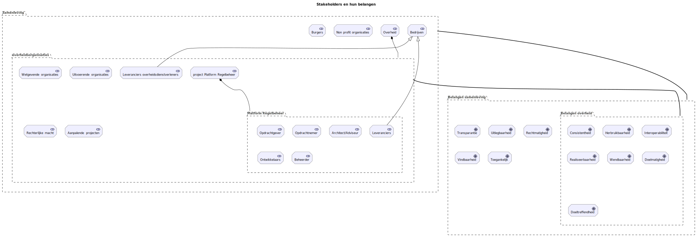

# Platform Regelbeheer
## Op basis van regels.overheid.nl en de Leidraad Regelbeheer

**Status**
Concept 0.1
Datum 30-01-2025

(Nog af te stemmen met alle stakeholders)

TODO: plaatje

# Inhoud

# 1 Inhoudsopgave

* [2 Managementsamenvatting](#managementsamenvatting)

* [3 Inleiding](#inleiding)

  *  [3.1 Aanleiding en doelstelling](#aanleiding-en-doelstelling)

  *  [3.2 De verandering](#de-verandering)

  *  [3.3 Stakeholders](#stakeholders)

  *  [3.4 Relaties met andere ontwikkelingen](#relaties-met-andere-ontwikkelingen)

* [4 Visualisatie en visie](#visualisatie-en-visie)

  * [4.1 Huidige situatie](#huidige-situatie)

  * [4.2 Platform Regelbeheer, een essentiële generieke Digitale Bouwsteen](#platform-regelbeheer-een-essentiële-generieke-digitale-bouwsteen)

* [5 Beschrijving per laag](#beschrijving-per-laag)

  *  [5.1 Overzicht](#overzicht)

  *  [5.2 Grondslagen](#grondslagen)

  *  [5.3 Organisatie](#organisatie)

  *  [5.4 Informatie](#informatie)

  *  [5.5 Applicaties](#applicaties)

  *  [5.6 Fysieke infrastructuur](#fysieke-infrastructuur)

* [6 Standaarden](#standaarden)

* [7 Privacy en Informatiebeveiliging](#privacy-en-informatiebeveiliging)

  *  [7.1 Privacy](#privacy)

  *  [7.2 Informatiebeveiliging](#informatiebeveiliging)

* [8 Beheer](#beheer)

* [9 Beslispunten](#beslispunten)

  *  [9.1 Definitie begrippen Regelbeheer, Regel en Regeltaal](#definitie-begrippen-regelbeheer-regel-en-regeltaal)

* [Bijlage A. Vragen en antwoorden](#bijlage-a.-vragen-en-antwoorden)

* [Bijlage B. Betrokkenen](#bijlage-b.-betrokkenen)

* [Bijlage C. Bronnen](#bijlage-c.-bronnen)

# 2 Managementsamenvatting

# 3 Inleiding

## 3.1 Aanleiding en doelstelling

Dit document beschrijft een doelarchitectuur voor een platform waar
overheden de informatie kunnen vinden om effectief samen te kunnen
werken aan goed regelbeheer (zie 9.1 voor de [definitie van regelbeheer](#definitie-begrippen-regelbeheer-regel-en-regeltaal)),
hetgeen het doel is van het project Platform Regelbeheer. De doelgroep
van dit document wordt uiteindelijk gevormd door alle stakeholders bij
de beoogde oplossing die worden genoemd in hoofdstuk [3.3 Stakeholders](#stakeholders). Dit document
fungeert daarbij als de Project Start Architectuur zoals die voor alle
overheidsprojecten dient te worden opgesteld en is daarmee een van de
deliverables in het project Platform Regelbeheer.

## 3.2 De verandering

Het project Platform Regelbeheer werkt het werkende concept van
regels.overheid.nl en de Leidraad Regelbeheer verder uit tot een
werkende eerste versie van een passende bouwsteen waarmee overheden de
handvatten krijgen om samen te kunnen werken aan het meer precies
afspreken van toepasbare “regels” ten behoeve van een meer rechtmatige,
consistente, uitlegbare en wendbare uitvoering van dienstverlening zoals
vastgelegd in juridisch bindende afspraken (wet- en regelgeving, beleid
etc.). Deze bouwsteen noemen we binnen dit document het Platform
Regelbeheer.

## 3.3 Stakeholders

Stakeholders en hun belangen bij het beoogde platform alsook hun
bijdrage aan de architectuur ervan worden hieronder grofweg weergegeven
in tabel 1.

<table>
<colgroup>
<col style="width: 25%" />
<col style="width: 25%" />
<col style="width: 27%" />
<col style="width: 22%" />
</colgroup>
<thead>
<tr>
<th><strong>Stakeholder</strong></th>
<th><strong>Functie / Rol</strong></th>
<th><strong>Belang in resultaat</strong></th>
<th><strong>Bijdrage aan de architectuur</strong></th>
</tr>
</thead>
<tbody>
<tr>
<th>Burgers en Bedrijven</th>
<td>Indirecte gebruikers</td>
<td>
Uitlegbaarheid, Transparantie (Access), Consistentie,

Vindbaarheid (Findable),

Rechtmatigheid
</td>
<td>Toetsen, feedback geven (indirect)</td>
</tr>
<tr>
<th>Wetgevende organisaties (zoals Ministeries) (experts in regelbeheer,
juridisch, architectuur etc.)</th>
<td>Participerend in beheer van regels via platform Regelbeheer,
aangaande de formalisatie van wetgeving en standaardisatie in
regels</td>
<td>
Alle belangen van Burgers en bedrijven maar ook:

Herbruikbaarheid (Reusable)

Interoperabiliteit (Interoperable)
</td>
<td>Toetsen, feedback geven</td>
</tr>
<tr>
<th>Uitvoeringsorganisaties (zoals Gemeentes of de Belastingdienst)
(experts in regelbeheer, juridisch, architectuur etc.)</th>
<td>Participerend in beheer van regels via platform Regelbeheer,
aangaande de formalisatie van beleid en standaardisatie in regels</td>
<td>Zelfde als Wetgevende organisaties</td>
<td>Toetsen, feedback geven</td>
</tr>
<tr>
<th>Leveranciers (voor oplossingen op basis van het platform
Regelbeheer, niet voor het platform Regelbeheer zelf)</th>
<td>Indirect als leveranciers van deeloplossingen waarmee andere
stakeholders op basis van het platform Regelbeheer het regelbeheer
kunnen doen.</td>
<td>Indirect zelfde als Wetgevende organisaties maar met name de
realiseerbaarheid van de compatibiliteit van hetgeen ze kunnen leveren,
waarbij interoperabiliteit een grote rol heeft terwijl dit wel in hun
businesspropositie moet blijven passen</td>
<td>Toetsen, feedback geven</td>
</tr>
<tr>
<th></th>
<td></td>
<td></td>
<td></td>
</tr>
<tr>
<th><strong>Stakeholders van project Platform Regelbeheer
zelf:</strong></th>
<td></td>
<td></td>
<td></td>
</tr>
<tr>
<th>Opdrachtgever</th>
<td>Opdrachtgever (OG)</td>
<td>Realisatie, outcome</td>
<td>Toetsen, feedback geven, vaststellen</td>
</tr>
<tr>
<th>Opdrachtnemer</th>
<td>Projectleider (PL)</td>
<td>Uitvoerbaarheid project</td>
<td>Monitoren</td>
</tr>
<tr>
<th>Architect / Adviseur</th>
<td></td>
<td>Oplossing die alle belangen van alle stakeholders behartigd</td>
<td>Opstellen</td>
</tr>
<tr>
<th>Ontwikkelaars</th>
<td></td>
<td>Realiseerbaarheid, Kwaliteit</td>
<td>Toetsen, feedback geven</td>
</tr>
<tr>
<th>Beheerder</th>
<td></td>
<td>Beheermogelijkheden</td>
<td>Toetsen feedback geven</td>
</tr>
<tr>
<th>Aanpalende projecten (zie [3.4](#relaties-met-andere-ontwikkelingen))</th>
<td></td>
<td>Realiseerbaarheid (van aanpassing op impact)</td>
<td>Toetsen feedback geven</td>
</tr>
<tr>
<th>Leveranciers mbt platform regelbeheer zelf</th>
<td></td>
<td></td>
<td></td>
</tr>
</tbody>
</table>

*Tabel 1, stakeholderbelangen overzicht*

Het project bouwt voort op een al bestaand werkend conceptplatform en
een vastgestelde leidraad en architectuur en bevat zodoende bij aanvang
van het project reeds een beschrijving van de oplossing en is zodoende
meer al gelijk een Solution Architectuur die met stakeholders getoetst
en met hun feedback verbeterd kan worden door architecten en adviseurs
binnen het project. Dit document gebruikt vooralsnog voornamelijk
Archimate visualisaties van de in dit document opgenomen
(architectuur)afspraken waarmee het Platform Regelbeheer als oplossing
beschreven wordt. Dit zal dan echter niet direct toetsbaar zijn door
veel benoemde stakeholders zonder nadere uitleg of alternatieve
visualisatie (hetgeen gaandeweg ook nog toegevoegd kan worden).

De belangen van stakeholders op dit algemene niveau samengenomen vallen
overigens geheel samen met de kwaliteitsdoelen van de NORA alsook het
FAIR (Findable, Accessible, Interoperable, Reusable) principe hetgeen
ook voor data wordt gehanteerd. Dit zal nader in dit document worden
uitgelegd.

## 3.4 Relaties met andere ontwikkelingen

Gelijktijdig aan het project Platform Regelbeheer zijn er andere
relevante ontwikkelingen waar dit project een groot verband mee heeft
met name omdat het project uiteindelijk een nieuwe landelijke bouwsteen
binnen de GDI beoogd:

- Doorontwikkeling van de GDI (volgens ADO2030 architectuur)

- Doorontwikkeling van en transitie naar TOOI en indirect daarmee zaken
  uit het ISA2 EU programma, met name standaardisatie rond het
  beschrijven van diensten

- Doorontwikkeling NORA op het gebied van het dienstverleningsconcept en
  bovenstaande ontwikkelingen.

- Werkagenda Waardengedreven Digitaliseren

- Nieuwe toekomstige visie van kabinet

Veel programma’s en projecten hebben van doen met het delen van data of
inzicht geven in het gebruik van data. Die data verworden pas gegevens
(en veelal persoonsgegevens) in de context van geformaliseerde regels.
Het bestaan van gegevens zit dus al bevat in regels en worden ook
verwerkt met die regels en kunnen dan misschien ook beter daaruit
geïmpliceerd gaan worden. Evenzo vormen de regels bij elkaar ook
algoritmen. Het op deze schaal toepassen en combineren van regels is
overigens zelfs ook een vorm van Artificiële Intelligentie (Symbolic
AI), ook al worden er hier vooralsnog geen technieken als LLM’s
gebruikt. Met de komst van Large Reasoning Models kan dit in de toekomst
veranderen al is het als hulp bij regelbeheer door mensen. Een doel van
goed regelbeheer is verder het uitlegbaar maken van dienstverlening. Dit
betreft ook alles daaromtrent richting burgers. Zodoende zal er als
vanzelf ook een verband ontstaan met projecten:

- Gegevens Bij Besluiten

- Algoritmeregister

- Federatieve Data Stelsel (IBDS)

- NLWallet (EiDAS 2)

- Alles rond de AI Act

- Informatie op overheid.nl

- Gebruikercentraal waaronder ook Omnichannel strategie

- Persoonlijke Digitaal Regelingenoverzicht

- Standaardisatie rond regelbeheer op EU niveau (nu nog via GovTech4All
  project Digicampus)

- Open Overheid

En dit is geen uitputtende lijst. Het is zaak om deze grote
verbondenheid (regels van alle dienstverlening hebben al gauw een
relatie met alles) met vele andere ontwikkelingen binnen de overheid
niet de ontwikkeling van een platform Regelbeheer in de weg te laten
zitten om op tijd bij ontwikkelingen die ook elders binnen de EU
plaatsvinden bij te blijven. Het helpt wel om continu zoveel mogelijk
aansluiting te zoeken (hetgeen bij de totstandkoming van het
regels.overheid.nl concept ook al betracht is). Een passende strategie
hierbij is om met name ook deze projecten waar mogelijk als stakeholder
mee te nemen in de ontwikkeling van het Platform Regelbeheer maar de
ontwikkeling ervan niet door te laten stagneren.

Een andere belangrijke keuze hierbij is dat het Platform Regelbeheer
eigenlijk alleen bestaat uit het bieden van algemene informatie,
waaronder ook over geschikte tooling en standaardisatie rond
Regelbeheer. Het project behelst geen platform waarin officieel te
hanteren regels zelf opgeslagen en beheert worden; dit blijft de
verantwoording van stakeholders zelf. Het Platform Regelbeheer wijst
alleen de weg om dit op een goede manier te doen en monitort of dit
gebeurd, en maakt regels vindbaar. Dit maakt een geleidelijke transitie
mogelijk en maakt het project van het platform zelf een heel stuk minder
risicovol en daarmee meer realiseerbaar in een zich continu veranderende
digitale infrastructuur.

# 4 Visualisatie en visie

## 4.1 Huidige situatie

Veel overheden maken al lange tijd voor zichzelf “regels” al dan niet in
de vorm van werkinstructies of binnen Rules Based Management Systemen
voor het uitvoeren van afspraken zoals vastgelegd in wetgeving en
beleid. Regels hebben dan ook een nauw verband met wetgeving en beleid.
Het opstellen en beheren van deze regels wordt echter vooral binnen de
grenzen van een organisatie gedaan en vaak ook alleen nog in een
ontwerpfase. Het is dan achteraf soms ook niet meer goed herleidbaar
waarom regels precies zijn opgesteld zoals ze zijn opgesteld. Regels
worden vooral ook alleen benut voor de uitvoering van het afhandelen van
aanvragen en meer gelimiteerd ook voor het bieden van uitlegbaarheid en
toetsbaarheid aan burgers. Er is echter veel meer mogelijk wanneer
regels openlijk gedeeld zouden worden net zoals dat ook voor wet- en
regelgeving al gebeurd. Regels zijn ook te zien als afspraken die
officieel gepubliceerd en ook transparant dienen te zijn voor burgers.

## 4.2 Platform Regelbeheer, een essentiële generieke Digitale Bouwsteen

TODO : maak plaatje (Archimate)

*Figuur 1, Platform Regelbeheer in context*

Het project Platform Regelbeheer bouwt voort op het concept van
regels.overheid.nl (reeds een werkend concept platform voor regelbeheer
in opbouw) en de Leidraad regelbeheer die door de NORA expertisegroep
Regelbeheer[^1] eerder is opgesteld. Zie
<https://regels.overheid.nl/regelbeheer> voor de uitleg daarvan.

Uitgangspunten in de genoemde leidraad zijn: **Rechtmatigheid**,
**Consistentie**, **Uitlegbaarheid** en **Wendbaarheid**. Hierbij was
reeds voorzien dat diverse stakeholders organisatiegrens overstijgend
moeten kunnen samenwerken ten behoeve van het beheren van regels. Op die
manier kan in een multidisciplinair team gewerkt worden waarbij er
gelijktijdig twee zogenoemde zichtlijnen in overweging worden gehouden:
van wet naar loket, en feedback op de wet.

Het project Platform Regelbeheer brengt dit een stap verder door
volledige alignment te vinden met de stand van zaken en ontwikkelingen
binnen de architectuur van het geheel van de overheidsdienstverlening in
Nederland en daarmee ook binnen de EU en probeert daarbij de oplossing
te schetsen die de belangen van alle stakeholders bij een dergelijk
platform behartigt.

Met name worden afspraken zoals vastgelegd in wet-, regelgeving en
beleid maar dus ook regels eigenlijk altijd in relatie tot diensten
beschreven en uitgewerkt, en wordt binnen de NORA het
dienstverleningsconcept uitgewerkt waarin de genoemde zichtlijnen ook
terugkomen als capability (passend bij het USM procesmodel[^2]). Van wet
naar loket gaat namelijk over het meer precies verder “afspreken” van
wetgeving en beleid in natuurlijke taal richting meer geformaliseerde
regels die door machines gehanteerd kunnen worden zodanig dat diensten
voor een groot deel geautomatiseerd geoperationaliseerd kunnen worden op
een juiste wijze. Daarbij hoort niet alleen het uitvoeren van regels,
maar ook de ondersteuning voor de aansluiting op processen voor het
kunnen herstellen, veranderen en verbeteren van ook de regels en hoe
deze uitgelegd worden. En de zichtlijn feedback op de wet gaat dus over
het “verbeteren” van een dienst als capability (hetgeen ook een rol
speelt bij het “herstellen” en “veranderen” van verleende diensten).
Regels spelen dus ook een rol bij de andere capabilities in deze context
(uitvoeren, herstellen en wijzigen), hetgeen in de Leidraad overigens
wel ook terug te vinden is in de definitie van regelbeheer.

Goede ondersteuning van organisatiegrens overstijgend regelbeheer is
essentieel bij een doelmatige en doeltreffende operationalisatie van
(overheids)diensten in een digitale overheid. Vanuit de Wet Open
Overheid en de Wet Hergebruik Overheidsinformatie kan ook geïmpliceerd
en geëxtrapoleerd worden dat alle informatie rond regelbeheer inclusief
de regels zelf als open data ook zo interoperabel en herbruikbaar
mogelijk moeten worden gedeeld. Dit is wat een Platform Regelbeheer als
weergegeven in figuur 1 mogelijk maken moet.

# 5 Beschrijving per laag

## 5.1 Overzicht

TODO Archimate samengevat totaaloverzicht

## 5.2 Grondslagen

TODO Archimate grondslagen laag

**Context voor Platform Regelbeheer:**

Algemene Wet Bestuursrecht

Wet Open Overheid =\> TOOI, alles rond regels is open data en moet dat
ook worden (muv persoonsgegevens)

Wet Hergebruik Overheidsinformatie =\> standaarden interoperabiliteit

AVG =\> platform is volledig open publieke informatie, muv evt
accountinformatie

AI Verordening =\> high risk AI system conformity nodig

Archiefwet =\> MDTO

Wet Digitale Overheid : muv de verplichte conformiteit aan digitale
toegankelijkheids standaard en standaard rond het gebruik van HTTP en
HTTPS protocollen niet direct relevant aangezien het Platform
Regelbeheer geen persoonsgegevens verwerkt of publieke services biedt
waarvoor ingelogd hoeft te worden.

De voor het niveau van deze architectuur relevante standaarden die door
Forum Standaardisatie worden aangewezen zijn met name de standaarden die
in behandeling zijn:

NL-SBB (impliceert de aanbevolen standaarden RDF, SKOS)

TOOI (opvolger van OWMS, impliceert NL-SBB, de PTLO standaarden zoals
ECLI, JCDR, BWB en gaat zich conformeren aan de europese CPSV-AP
standaard)

MDTO (https://www.nationaalarchief.nl/archiveren/mdto)

NL-SBB wordt ook door de NORA aanbevolen voor het vastleggen van kennis
binnen de Nederlandse overheid.

**Platform Regelbeheer gaat ook over de standaardisatie rond
Regelbeheer:**

- Technologie agnostisch vocabulaire/standaardisatie mbt regelbeheer en
  regelsets als extensie bij CPSV-AP in de context van TOOI / MDTO

- Bijpassende doorontwikkeling Leidraad regelbeheer (richtinggevende
  kennis) met oog voor de NORA, WDO, AI verordening etc.

NB zie hoofdstuk 5.4 voor meer informatie hierover.

## 5.3 Organisatie

TODO Archimate organisatie laag

Stakeholders als in hoofdstuk 3.3 met hun belangen. Meer uitgewerkt, ook
mbt beheerprocessen voor hetgeen het Platform Regelbeheer zelf biedt.

Ook in beeld brengen : het (diverse) gebruik van regels buiten het
Platform Regelbeheer maar wel conform standaardisatie van het platform

- On the Edge binnen client side apps bij burgers voor advies,
  bewustwording en voorbereiding nog los van de operatie van uitvoerende
  organisaties (muv regelbeheer).

- Binnen de operatie aan de kant van uitvoerders (met name afhandeling
  aanvragen)

- In relatie met gegevenswallets

- In onderzoek (CBS, wetenschap, Euromod)

## 5.4 Informatie

TODO Archimate informatie laag

- **Standaard voor definitie van Regelbeheer begrippen waaronder
  “regelbeheer”, “regel” en “regeltaal”** : conform de leidraad
  Regelbeheer. Een regeltaal is hierbij de wijze van hoe een logisch
  contruct is vastgelegd en geïnterpreteerd dient te worden. Het komt
  voor dat meerdere (standaarden voor) regeltalen gecombineerd worden
  binnen regeldefinities.

- **Standaard voor definitie van regelsets tbv organisatiegrens
  overstijgend regelbeheer**: elke officieel gepubliceerde en
  refereerbare juridische bron van afspraken vormt ook de basis en
  context voor een losstaande en refereerbare regelset bestaande uit een
  set van “regels” op basis van een door het Platform Regelbeheer
  erkende regeltaal. Relatie met TOOI leggen

- **Standaard voor het kunnen refereren aan regelsets tbv
  organisatieoverstijgend regelbeheer**: de referentie van de
  onderliggende juridisch bindende bron van afspraken met een extra
  aanduiding vormt de referentie aan de regelset. Relatie met TOOI
  leggen.

- **Standaard voor organisatiegrens overschrijdende interoperabiliteit
  van regeltalen**: begrippen in regels in regelsets moeten kunnen
  verwijzen naar de definities ervan in andere regelsets. Ook begrippen
  binnen regels dienen hiervoor refereerbaar te zijn. De standaard moet
  het kunnen ontdubbelen van dubbelingen van begripdefinities via
  ontologie ondersteunen. De regelset bepaald hierbij een lokale
  encapsulerende scope. Relatie met TOOI leggen.

- **Standaard voor organisatiegrens overschrijdende interoperabiliteit
  van gegevens gebruikt bij regels (en daarmee besluiten).** Link met
  EiDAS (denk ook aan NLWallet en Company Passport project KVK)

- **Standaard voor het koppelen van regelsets aan diensten in de
  dienstencatalogus**: NB dit gebeurt idealiter impliciet via wetgeving

- **Standaard voor het metadateren van regelsets mbt het gebruik ervan**
  : regelsets (in de context van een dienst) leggen mogelijk ook
  informatie vast over hoe en waar ze gebruikt kunnen worden. Denk aan:
  online voorbeeld API voor testdoeleinden, gebruikte regeltaal

- **Standaard voor het metadateren van regelsets mbt het beheer ervan**
  : regelsets (in de context van een dienst) leggen niet alleen de
  regels vast en daarmee hoe ze worden uitgevoerd maar ook hoe ze
  afgesproken, herstelt, veranderd en verbeterd worden. NB rond elke
  regelset is mogelijk ook een aparte subdienst te leveren binnen de
  overheid. Onder een dienst zijn vaak meerdere regelsets van toepassing
  van ook verschillende eindverantwoordelijke uitvoerende organisaties,
  die elk zo hun eigen ondersteuning bieden voor hun eigen deel in het
  geheel.

- **Standaard voor het metadateren van regelsets mbt uitlegbaarheid** :
  we gebruiken hiervoor NL-SBB en inhoudelijk ook de nodige leidraden.

- **Standaard voor het officieel publiceren van regelsets en regeltalen
  tbv organisatiegrensoverstijgend regelbeheer** Dit bepaald ook of een
  regelset via het platform regelbeheer te vinden is.

- **Standaard voor visualisatie van regels(ets) :** het gebruik van UML
  / Archimate voor het visualiseren van regels(ets) (wellicht via NL-SBB
  en of wellicht MIM)

- **Algemene kennis van regelbeheer (waaronder bovenstaande standaarden)
  en bijpassende tooling met voorbeelden**

## 5.5 Applicaties

TODO Archimate applicatie laag

- Website onder redactie voor het online kunnen ontsluiten van kennis
  als beginpunt voor alles regelbeheer waaronder publicatie en uitleg
  over de standaarden benoemd in de informatielaag, maar ook nieuws,
  agenda, blog, algemene publicaties onder de aandacht brengen.

- Zoekservices voor regels die structurering aanhoudt in sets van regels
  obv UPL en wetgeving volgens de standaarden benoemd in de
  informatielaag

  - Zoeken van specifieke (begrippen binnen) regels(ets) binnen het
    geheel van alle decentraal gepubliceerde regelsets aan de hand van
    keywords, of drill down bread crumb navigatie vanuit
    dienstencatalogus niveau of specifieke categoriserende metadata
    (denk aan Levensgebeurtenissen). Hiermee kunnen ook dubbelingen
    opgespoord worden die via ontologieafspraken kunnen worden
    ontdubbeld. Hierbij kunnen allerlei views op zoekresultaten geboden
    worden (van sterk samengevat tot gedetaileerd). Hiermee kunnen ook
    eerder gemiste nieuw te leggen links tussen regelsets opgespoord
    worden.

- Hulpservices voor regelbeheer:

  - Meting van goede regelbeheer conformiteit van uitwerking van
    diensten

  - Issuing service voor ondertekening vanuit Platform Regelbeheer van
    regelsets mbt gemeten conformiteit.

  - Visualisatie van regels(ets)

  - Genereren van boilerplate regelset repositories met documentatie
    voor gebruik in eigen code repositories waar die er officieel nog
    niet lijken te bestaan (voor elke juriconnect bron onder een dienst
    in de dienstencatalogus zou een regelset gedefinieerd moeten zijn)

- Etalage van tooling en voorbeelden tbv regelbeheer.

> *NB hier is reeds meer van al opgesteld denk ik bij het ontwerp van
> regels.overheid.nl?*

## 5.6 Fysieke infrastructuur

TODO Archimate infrastructuur laag

Met name een schaalbare robuuste veilige webserver.

# 6 Standaarden

Alle voor het platform Regelbeheer relevante standaarden zijn al
geïdentificeerd in de grondslagen laag (zie hoofdstuk 5.1), alsook in
navolging daarop in de informatie laag de standaarden die het Platform
Regelbeheer zelf vaststelt (zie hoofdstuk 5.4).

# 7 Privacy en Informatiebeveiliging

## 7.1 Privacy

Regels, alsook alle metadata daaromtrent zijn geen persoonsgegevens en
dienen gewoon transparant openbaar gepubliceerd te worden. Het Platform
Regelbeheer bevat dan ook alleen publiekelijk vrij verkrijgbare
informatie.

(NB dit is analoog aan open source ontwikkeling op bijvoorbeeld github
waar alle discussies openbaar zijn)

## 7.2 Informatiebeveiliging

Platform Regelbeheer mag niet een schakel vormen binnen de
beschikbaarheid van diensten waar het regels van beheert. Mocht het
platform onverhoopt offline gaan dan dienen diensten op basis van regels
gewoon online te blijven en alles doorgang te kunnen hebben. het
platform verwijst vooral ook naar echte bronnen van informatie dan dat
het zelf de eerste bron is.. (?)

# 8 Beheer

Wat wordt de beheerpartij voor de website regels.overheid.nl ?

# 9 Beslispunten

## 9.1 Definitie begrippen Regelbeheer, Regel en Regeltaal

In de leidraad Regelbeheer van de expertisegroep regelbeheer wordt
regelbeheer gedefinieerd als:

***Regelbeheer** is het "geheel aan methoden, technieken, hulpmiddelen
en voorschriften om regels te ontwerpen, analyseren, valideren,
verifiëren, uit te rollen, uit te voeren, te beheren en te
evalueren."*[^3]

*In plaats van de term 'Regelbeheer' wordt ook wel gesproken over
'Regelbeheersing', 'Business Rules Management (BRM)', 'Kennisgebaseerd
Werken' of 'Regelgestuurd werken'.*

Maar dan is het wel ook nodig het begrip “regel” in deze context te
definieren. De leidraad doet dit gelukkig ook en definieert deze als:

*"Een logisch of rekenkundig construct dat is gebaseerd op wet- en
regelgeving of beleid en rechtstreeks sturing geeft aan de primaire taak
van een uitvoeringsorganisatie"*

Voortschrijdend inzicht levert echter op dat wet- en regelgeving of
beleid in alle gevallen gaat over afspraken en dat regels ook deels
gebaseerd moeten kunnen worden op andere vormen van afspraken dan wet-
en regelgeving of beleid zoals standaarden, architectuur, of misschien
ook gewoon wel persoonlijke afspraken die juridisch bindend zijn.
Derhalve definiëren we in dit document het begrip “**regel**” als volgt:

*"Een logisch of rekenkundig construct dat is gebaseerd op juridisch
bindende afspraken en rechtstreeks sturing geeft aan de primaire taak
van een uitvoeringsorganisatie"*

*“De taal waarmee een logisch of rekenkundig contruct uitgedrukt kan
worden en die het een formele semantiek geeft”* noemen we een
“**regeltaal**”.

NB het daadwerkelijk doen van regelbeheer zelf en de
verantwoordelijkheid daarvoor is niet onderdeel van het Platform
Regelbeheer al biedt het zoveel mogelijk doelgerichte kennis hiervoor en
ook wat algemene services die hierbij helpen kunnen.

De achilleshiel van het werken onder architectuur is een veelheid van
afwijkingen die vervolgens jaren blijven bestaan en uit zicht
verdwijnen. Daarom is het van belang dat er een verantwoordelijke is
voor het beoordelen, goed- dan wel afkeuren en blijvend monitoren van
bewuste afwijkingen op de architectuur. Er kunnen valide redenen zijn om
afwijkingen toe te staan; niet om ze jarenlang te laten bestaan…

Geef een opsomming van de punten waarvan de stakeholders aangeven dat
daar besluitvorming over nodig is en licht per punt kort toe welke
discussie speelt.

Punten die afwijken van de aangegeven kaders en
(referentie)architecturen moeten daar deel van uitmaken.

Geef voor die punten aan welke functie of welk gremium op termijn het
besluit zal nemen om de afwijking op te laten heffen.

En hier kan je ook alle overige relevante vraagstukken benoemen.

# Bijlage A. Vragen en antwoorden

Deze bijlage bevat een overzicht van vragen en onduidelijkheden die we
‘dagelijks’ tegenkomen in ons werk en waar deze in het document zijn
beantwoord.

| Vraag | Plaats in de architectuur | Toelichting |
|----|----|----|
| Wat valt onder regelbeheer, en wat niet? | Zie opmerking bij einde hoofdstuk 9.1 |  |
| Wat is een regeltaal? | Zie definitie hoofdstuk 9.1 |  |
| Wát moet over een regel worden vastgelegd en waarom? | Zie lijst metadata standaarden in hoofdstuk 5.3 |  |
| Hóe leggen we dit vast? | Zie lijst metadata standaarden in hoofdstuk 5.3 |  |
| Welke internationale en nationale standaarden en kaders worden toegepast, en waarom? | Zie hoofdstukken 5.1 en 5.3 |  |
| Welke principes liggen aan het regelbeheer ten grondslag? | De principes in de NORA, de leidraad regelbeheer en FAIR (Findable, Accessible, Interoperable en Reusable). Zie hoofdstukken 3 en 4 |  |
| Welke functies heeft het platform regels.overheid.nl, en voor welke stakeholders? | Zie hoofdstuk 3.3 voor stakeholders en hoofdstuk 5.4 voor functies |  |
| Welke rollen hebben de verschillende organisaties in het regelbeheer, nu en in de toekomst? | TODO .. uitwerken in 5.1 |  |
| Hoe is de samenwerking tussen deze partijen vormgegeven? | TODO | Dat is niet direct onderdeel van het platform regelbeheer zelf, maar wordt wel begeleid vanuit standaardisatie, kennisdeling en tooling |

# Bijlage B. Betrokkenen

Geef hier aan wie vanuit zijn of haar functie heeft meegewerkt aan de
totstandkoming van deze PSA.

| Naam             | Organisatie | Functie / Rol       |
|------------------|-------------|---------------------|
| Bas Kaptijn      | ICTU        | Adviseur/ Architect |
| Auke Bloembergen | ICTU        |                     |
| Steven Gort      | ICTU        | Adviseur/ Architect |
|                  |             |                     |

# Bijlage C. Bronnen

- …

[^1]: https://www.noraonline.nl/wiki/Expertisegroep_Regelbeheer

[^2]: https://usmwiki.com/index.php/Process_model/nl

[^3]: Zoet, M., de Haan, E., & Smit, K. (2014). Van Wetsanalyse tot
    Producten en Diensten voor Burgers en Bedrijven. Utrecht, Hogeschool
    Utrecht.
