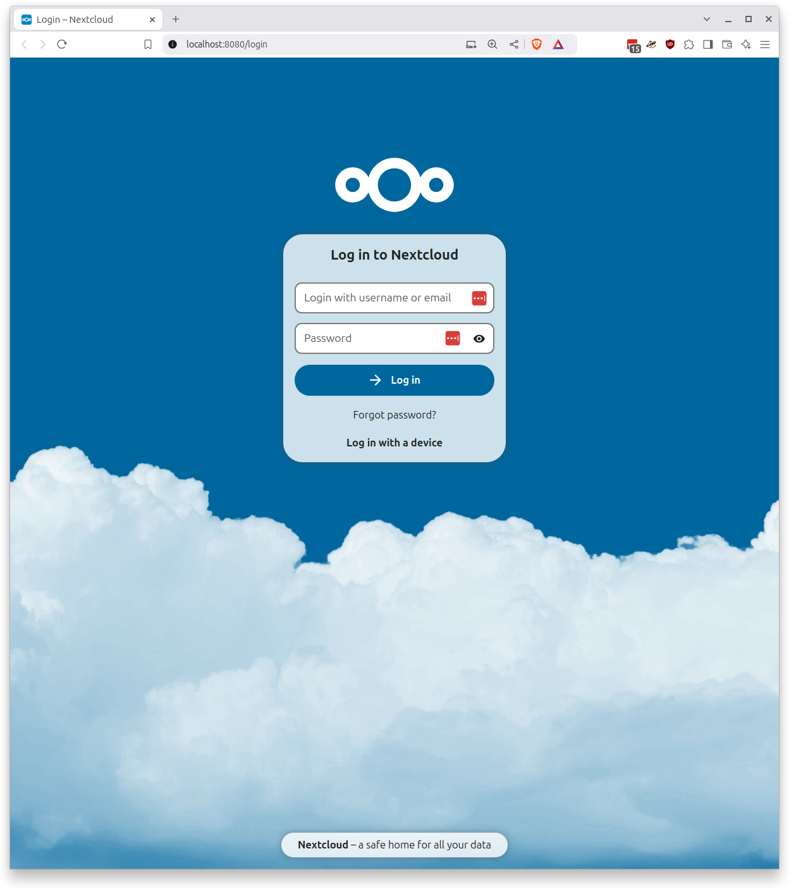
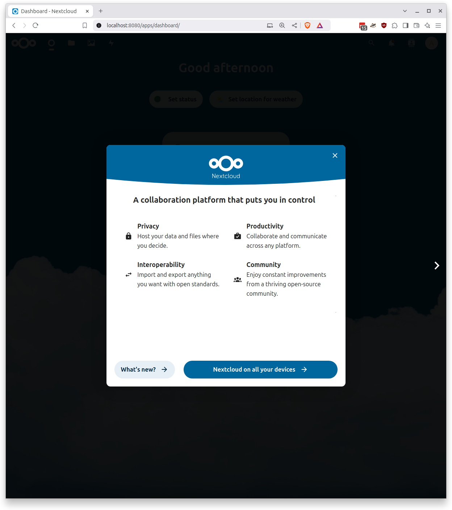
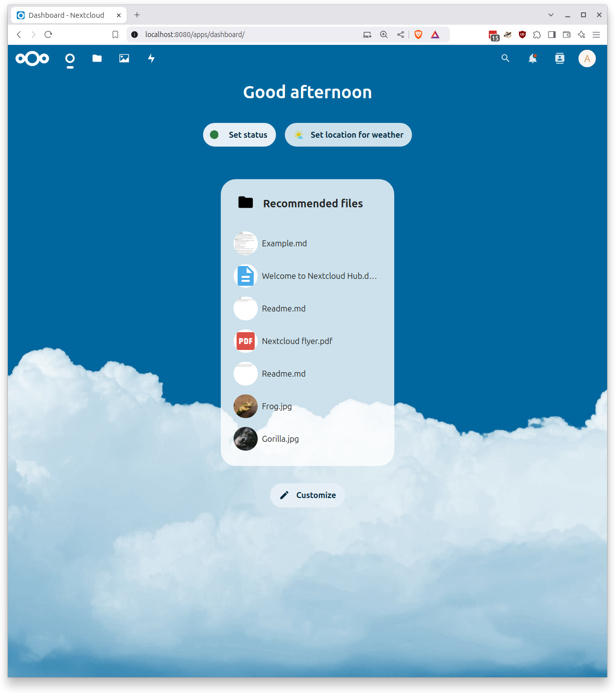

# Wat is OpenCatalogi?

Een federatieve catalogus ‘OpenCatalogi’, passend in het nieuwe informatielandschap Common Ground. Het concept OpenCatalogi biedt overzicht per gekozen (individuele) gemeente en geaggregeerde informatie van deelnemende gemeenten. Elke deelnemende gemeente installeert de OpenCatalogi software ten behoeve van vulling van het individuele deel. Gemeenten gebruiken de publicatiefunctie van het individuele deel om herbruikbare en uitwisselbare onderdelen te publiceren zodat dit inzichtelijk wordt voor andere deelnemers van OpenCatalogi.

[Lees verder hier](https://github.com/OpenCatalogi)

# Relatie met regels.overheid.nl

De gedachte bij het beschikbaar (helpen) stellen van gevalideerde regelspecificaties via regels.overheidnl is dat óók regels.overheid.nl een bronhouder is in het federatief stelsel dat OpenCatalogi beoogt te faciliteren.

Om dat te beproeven en nader te verkennen is er een [project](https://github.com/orgs/OpenCatalogi/projects/7) aangemaakt in de git omgeving van OpenCatalogi en houden we hier voorlopig een log bij van de gevolgde stappen, bevindingen, gemaakte besluiten, conclusies(s) en/of anderszins.

# LOG boek

## Installeren OpenCatalogi op localhost

### Nextcloud

De eerste stap is het installeren van een beproefde OpenCatalogi stack die regels.overheid.nl van gemeente Rotterdam mocht ontvangen. Het omvat een `docker-compose.yml` met alle benodigde onderdelen.

```
volumes:
  nextcloud:
  apps:
  db:
  config:

services:
  portal:
    image: acatonl/woo-ui-develop
    ports:
    - "8081:80"

  catalog:
    image: ghcr.io/opencatalogi/web-app:dev
    ports:
    - "8082:8080"

  woo:
    image: ghcr.io/conductionnl/woo-website:dev
    ports:
    - "8083:8080"

  db:
    image: mariadb:10.6
    restart: always
    command: --transaction-isolation=READ-COMMITTED --log-bin=binlog --binlog-format=ROW --skip_networking=0 --skip-grant-tables
    volumes:
      - db:/var/lib/mysql
    ports:
    - "3306:3306"
    environment:
      - MYSQL_ROOT_PASSWORD=admin
      - MYSQL_PASSWORD=admin
      - MYSQL_DATABASE=nextcloud
      - MYSQL_USER=nextcloud
      - MARIADB_ALLOW_EMPTY_ROOT_PASSWORD=yes
      - MYSQL_TCP_PORT=3306
      - MARIADB_AUTO_UPGRADE=1
      - MYSQL_UNIX_PORT=/run/mysqld/mysqld.sock
      - MARIADB_MYSQL_LOCALHOST_USER=true
    expose:
      - 3306
      
  nextcloud:
    user: root
    container_name: nextcloud
    image: nextcloud
    restart: always
    ports:
      - 8080:80
    links:
      - db
    volumes:
      - nextcloud:/var/www/html:rw
      - ./custom_apps:/var/www/html/custom_apps
    environment:
      - MYSQL_PASSWORD=admin
      - MYSQL_DATABASE=nextcloud
      - MYSQL_USER=nextcloud
      - MYSQL_HOST=db
      - NEXTCLOUD_ADMIN_USER=admin
      - NEXTCLOUD_ADMIN_PASSWORD=admin
      - TZ=Europe/Amsterdam

```

Maak een directory aan op `localhost`, kopieer voornoemde `docker-compose.yml` in deze directory en start met `docker compose up -d --build`.

Openen `localhost:8080` in een browser toont:



Inloggen met de `admin/admin` credentials. Dit zijn de `NEXTCLOUD_ADMIN_USER/PASSWORD` environment variables die in de `docker-compose.yml` staan.

Als dat goed gaat dan verschijnt de homepage van de Nextcloud omgeving zodra je de eerste pagina skipped.




### OpenCatalogi apps installeren

In nextcloud zelf kunnen we nu de apps openconnector, opencatalogi en openregisters ophalen uit de appstore. Selecteer daarvoor de **+ Apps** optie onder je proiel.


Na enige tijd verschijnt de Discover pagina. Selecteer **Organization** en zoek daar de **Open Register** app. Klik **Download and enable** om deze toe te voegen.
Bevestig je keuze met de `admin` credentials van even eerder.


Selecteer nu **Integration** en herhaal deze stappen voor de **Open Connector** én **OpenCatalogi** apps. Hieronder is de install van **OpenCatalogi** in beeld.


Na installatie zie je op de homepage de iconen van **Register**, **Connector** en **Catalogi** naast elkaar staan bovenaan rechts.


### OpenCatalogi apps configureren

