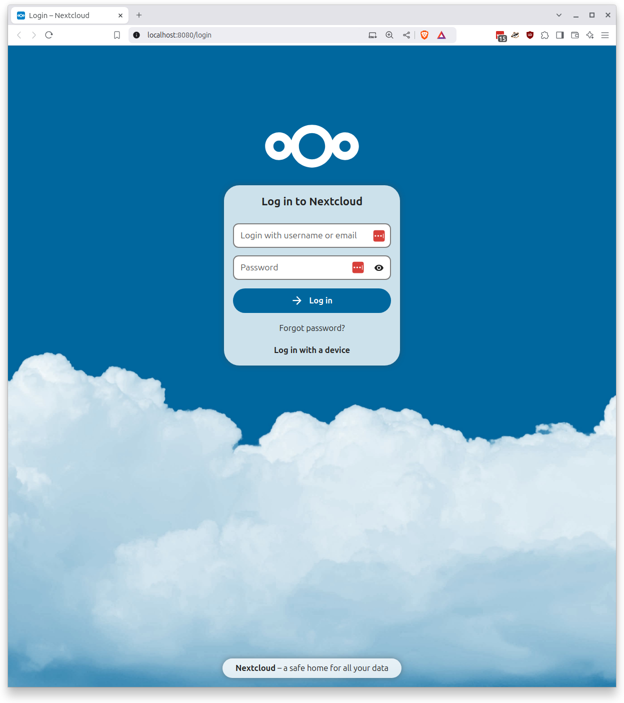
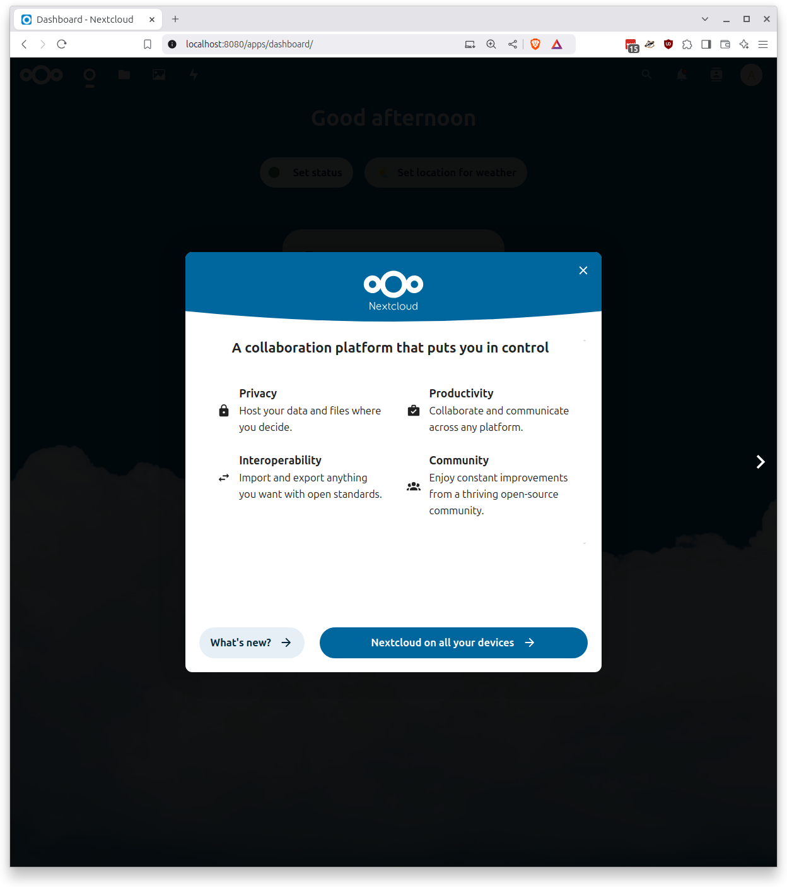
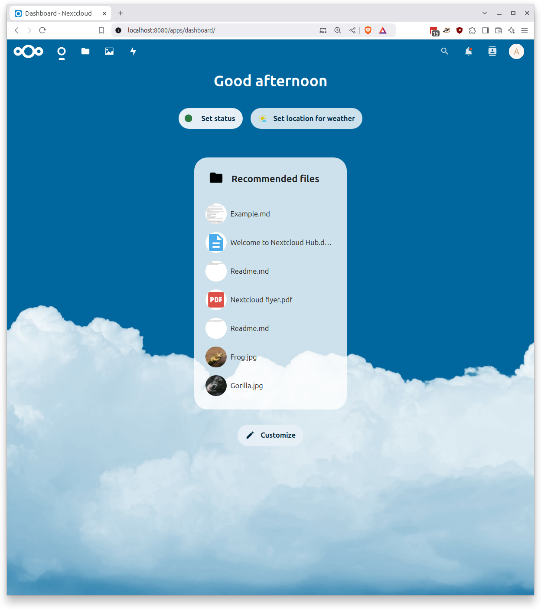

## Nextcloud

De eerste stap is het installeren van een beproefde OpenCatalogi stack die regels.overheid.nl van gemeente Rotterdam mocht ontvangen. Het omvat een `docker-compose.yml` met alle benodigde onderdelen.

```
volumes:
  nextcloud:
  apps:
  db:
  config:

services:
  portal:
    image: acatonl/woo-ui-develop
    ports:
    - "8081:80"

  catalog:
    image: ghcr.io/opencatalogi/web-app:dev
    ports:
    - "8082:8080"

  woo:
    image: ghcr.io/conductionnl/woo-website:dev
    ports:
    - "8083:8080"

  db:
    image: mariadb:10.6
    restart: always
    command: --transaction-isolation=READ-COMMITTED --log-bin=binlog --binlog-format=ROW --skip_networking=0 --skip-grant-tables
    volumes:
      - db:/var/lib/mysql
    ports:
    - "3306:3306"
    environment:
      - MYSQL_ROOT_PASSWORD=admin
      - MYSQL_PASSWORD=admin
      - MYSQL_DATABASE=nextcloud
      - MYSQL_USER=nextcloud
      - MARIADB_ALLOW_EMPTY_ROOT_PASSWORD=yes
      - MYSQL_TCP_PORT=3306
      - MARIADB_AUTO_UPGRADE=1
      - MYSQL_UNIX_PORT=/run/mysqld/mysqld.sock
      - MARIADB_MYSQL_LOCALHOST_USER=true
    expose:
      - 3306
      
  nextcloud:
    user: root
    container_name: nextcloud
    image: nextcloud
    restart: always
    ports:
      - 8080:80
    links:
      - db
    volumes:
      - nextcloud:/var/www/html:rw
      - ./custom_apps:/var/www/html/custom_apps
    environment:
      - MYSQL_PASSWORD=admin
      - MYSQL_DATABASE=nextcloud
      - MYSQL_USER=nextcloud
      - MYSQL_HOST=db
      - NEXTCLOUD_ADMIN_USER=admin
      - NEXTCLOUD_ADMIN_PASSWORD=admin
      - TZ=Europe/Amsterdam

```

Maak een directory aan op `localhost`, kopieer voornoemde `docker-compose.yml` in deze directory en start met `docker compose up -d --build`.

Openen `localhost:8080` in een browser toont:



Inloggen met de `admin/admin` credentials. Dit zijn de `NEXTCLOUD_ADMIN_USER/PASSWORD` environment variables die in de `docker-compose.yml` staan.

Als dat goed gaat dan verschijnt de homepage van de Nextcloud omgeving zodra je de eerste pagina skipped.



