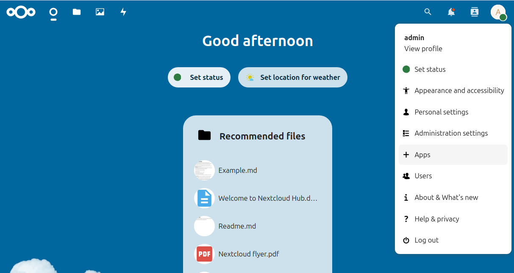

In nextcloud zelf kunnen we nu de apps openconnector, opencatalogi en openregisters ophalen uit de appstore. Selecteer daarvoor de **+ Apps** optie onder je proiel.

Na enige tijd verschijnt de Discover pagina. Selecteer **Organization** en zoek daar de **Open Register** app. Klik **Download and enable** om deze toe te voegen.
Bevestig je keuze met de `admin` credentials van even eerder.

Selecteer nu **Integration** en herhaal deze stappen voor de **Open Connector** én **OpenCatalogi** apps. Hieronder is de install van **OpenCatalogi** in beeld.

Na installatie zie je op de homepage de iconen van **Register**, **Connector** en **Catalogi** naast elkaar staan bovenaan rechts.

