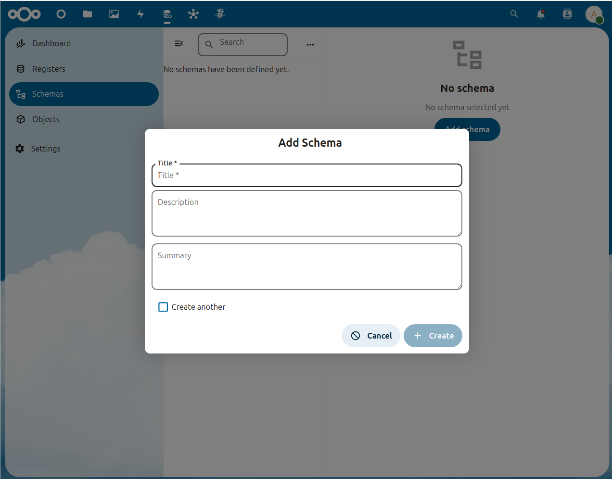
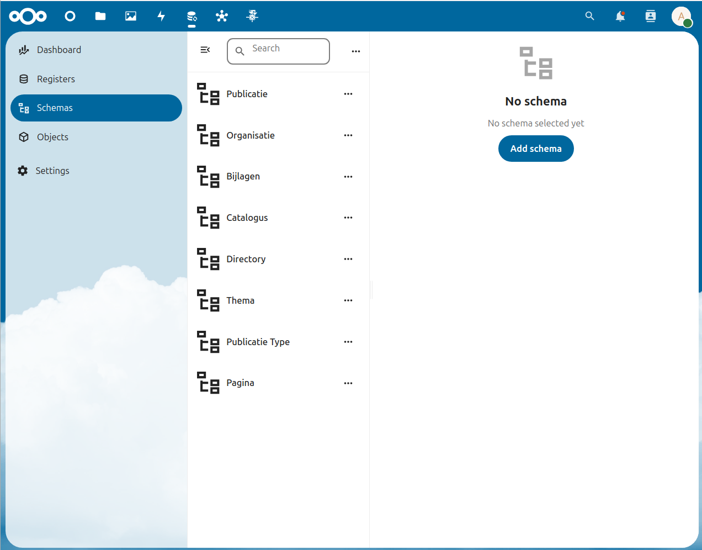
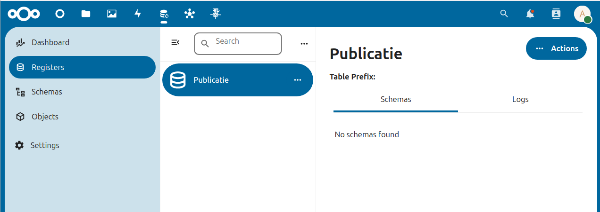
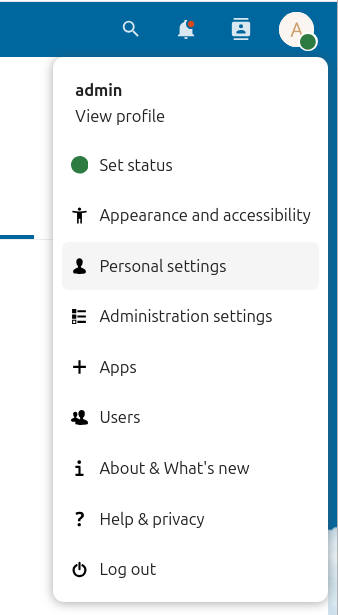
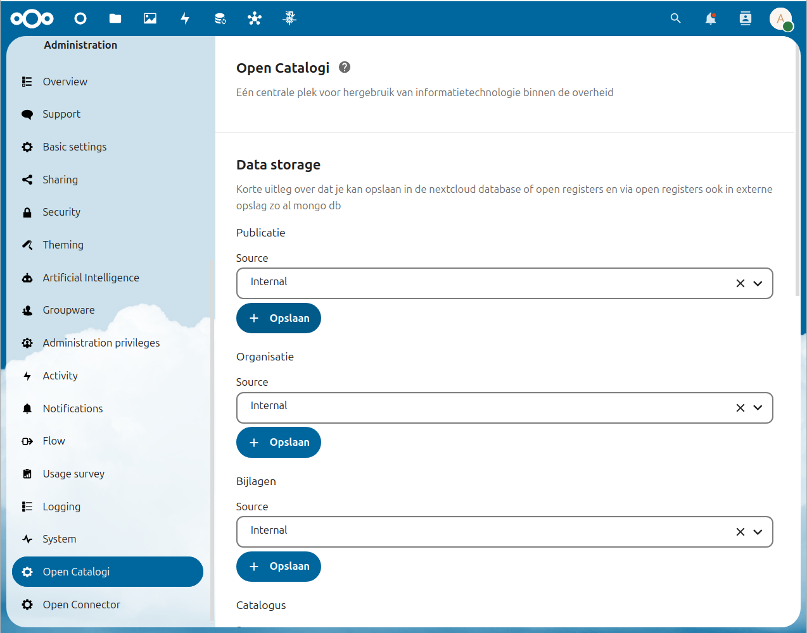

## Schema's

Selecteer de app (Open) Register en maak de volgende schema's aan via **Schemas** -> **Add schema**:
- Publicatie
- Organisatie
- Bijlagen
- Catalogus
- Directory
- Thema
- Publicatie Type
- Pagina

Het eindresultaat ziet er dan zo uit.

## Register

Maak daarna een register Publicatie aan via **Registers** -> **Add Register**

:::tip
Let op: laat Source en Schema vooralsnog leeg!
:::

Het eindresultaat ziet er dan zo uit.

## Database

Ga nu naar naar opencatalogi app via **Personal settings** -> **Open Catalogi** waarin je moet instellen dat we deze schema's in de Mariadb database willen opslaan.

