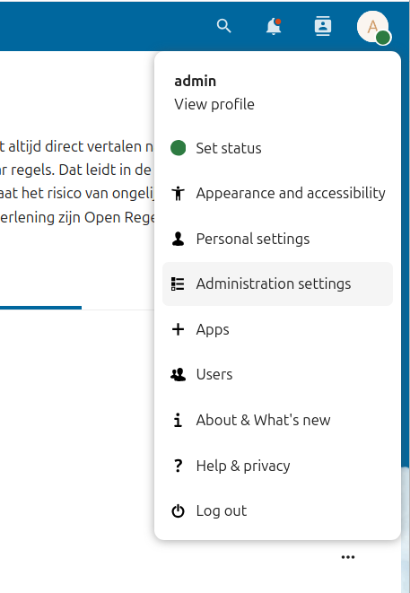

## Schema's

Selecteer de app (Open) Register en maak de volgende schema's aan via **Schemas** -> **Add schema**:
- Publicatie
- Organisatie
- Bijlagen
- Catalogus
- Directory
- Thema
- Publicatie Type
- Pagina
- Menu

Het eindresultaat ziet er dan zo uit.

## Register

Maak daarna een nieuw register aan via **Registers** -> **Add Register**

:::tip
Let op: laat dat je Schema niet leeg laat! Anders kan je dit Register niet toevoegen aan de Data storage verderop.
:::

Het eindresultaat ziet er dan zo uit.

## Database

Ga nu naar naar opencatalogi app via **Administration settings** -> **Open Catalogi** waarin je moet instellen dat we deze schema's in de Mariadb database willen opslaan.

Let er goed op dat elk geselecteerde **Schema** in de dropdown overeenkomt met het gevraagde **Type**. Test commit tekst.

