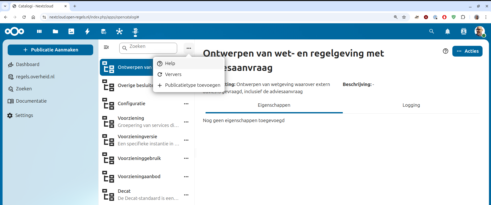
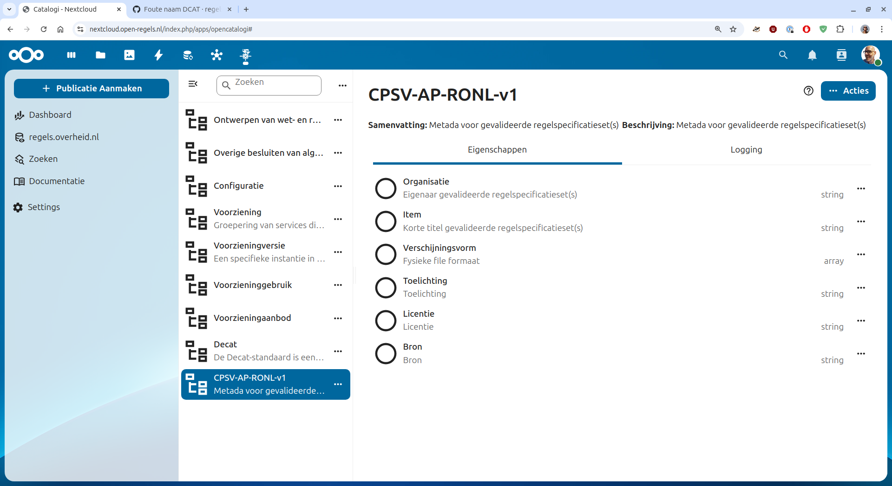
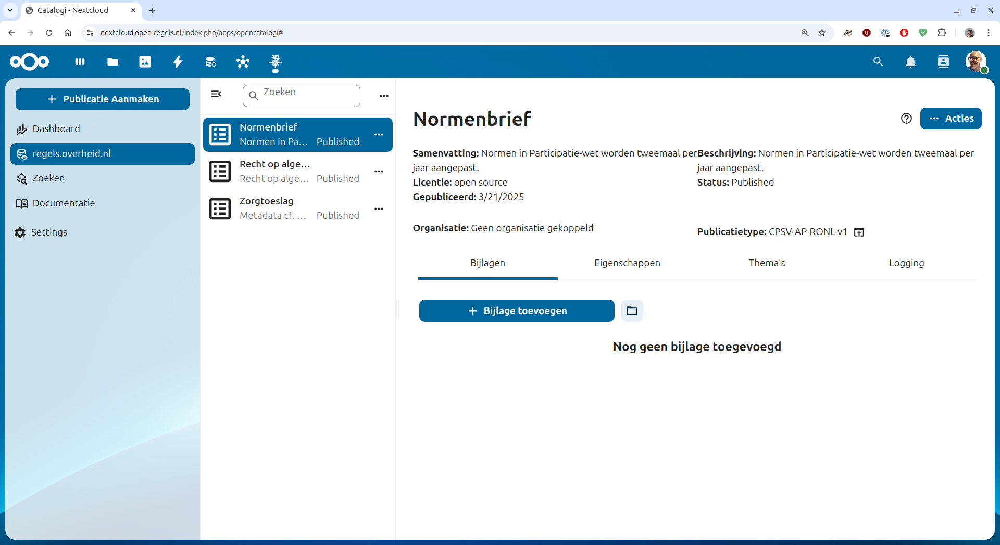

## Voorbeeld

Om registreren van uiteenlopende bronnen goed te begrijpen beginnen we met onderstaande drie voorbeelden.

| Organisatie | Item | Verschijningsvorm | Toelichting | Bron | Licentie |
|---|---|---|---|---|---|
| SZW | Normenbrief | pdf | Normen in Participatie-wet worden tweemaal per jaar aangepast. | [file](https://open.overheid.nl/documenten/8190261f-76df-4451-8f4d-befefcfcd55e/file) | open source |
| Rotterdam | Recht op algemene bijstand | Excel worksheet | Versie 23 (ID: 2) Avola Decision tables. Zip bevat html file en bijbehorende css files met als inhoud alle beslistabellen van Recht op algemene bijstand. | [zip](https://regels.dexcat.nl/sites/default/files/open-data/recht-op-algemene-bijstand-versie-23-avola-decision-gemeente-rotterdam-.zip) | closed source |
| Dienst Toeslagen | Zorgtoeslag | Terse RDF Triple Language (Turtle) | Metadata cf. CPSV-AP-RONL voor één persoons-huishouden zorgtoeslag | [file](https://github.com/MinBZK/regels.overheid.nl/blob/main/apps/register/CPSV-AP-RONL/Zorgtoeslag/zorgtoeslag-CPSV-AP-RONL.ttl) | open source |

## Publicatietype aanmaken

Open Catalogi heeft een bestaande lijst Publicatietypes. Voor regels.overheid.nl voegen we daar een eigen Publicatietype aan toe, waarbij we vooralsnog de beoogde standaard [CPSV-AP-RONL (hier heet ie nog DCAT-AP-RONL)](https://regels.overheid.nl/standaarden/dcat-ap-ronl) volgen.

Strikt genomen gaat het vooralsnog om een aantal eigenschppen die (nog) niet in de Open Catalogi DCAT (let op de foute naam in figuur hieronder) Publcatietype voorkomen.

## Publicatie toevoegen

Nu het CPSV-AP-RONL-v1 Publicatieype aanwezig is kunnen we voornoemde voorbeelden toevoegen. Dat is voor alledrie gedaan. Ter illustratie een schermafdruk met de voorbeelden aanwezig.

Hierna illustreren we stap voor stap het toevoegen van de [Heusdenpas](https://github.com/MinBZK/regels.overheid.nl/issues/725) waarbij we de gekende [5 lagen van common ground](https://www.gemmaonline.nl/wiki/Thema-architectuur_Common_Ground) volgen.