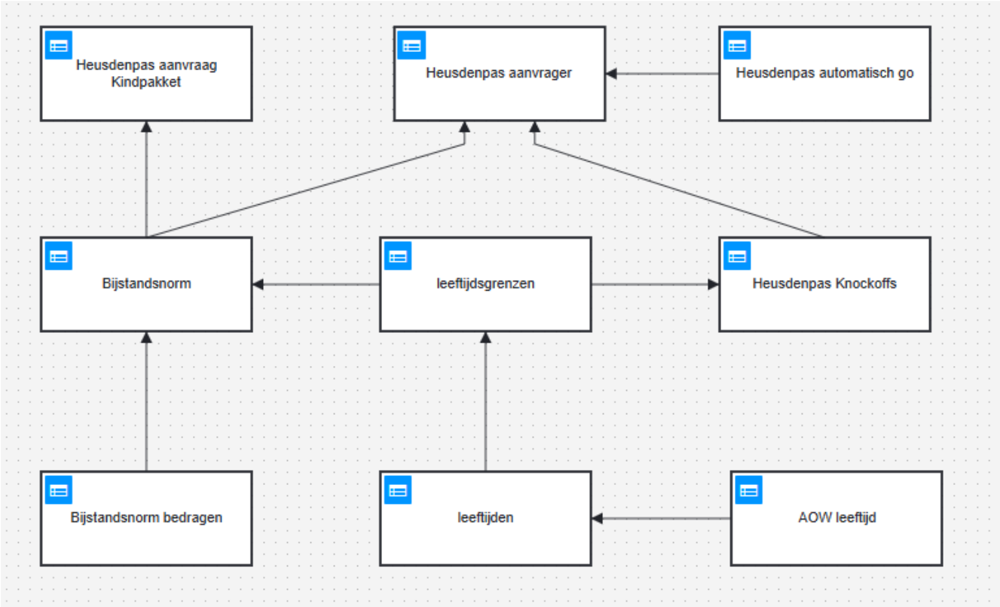

## Generieke functie

De gemeente Heusden wil een geautomatiseerd aanvraagproces voor de HeusdenPas mogelijk maken. Hiervoor zullen de gereedschappen van [Stichting Financieel Paspoort](https://financieelpaspoort.nl/) worden uitgebreid. het betreft [Voorzieningen.nl](https://voorzieningen.nl/) en de app FP
.
Dit geautomatiseerde proces ondersteunt de burger met het digitaal verzamelen van de noodzakelijke persoonlijke gegevens en het inzetten daarvan voor de beoordeling en aanvraag van de Heusdenpas. De aanvraag wordt door de burger geautomatiseerd aangereikt aan de gemeente, die deze aanvraag direct kan verwerken.

Voor dat doel is een user story geformuleerd:
> Als FP wil ik generieke functie(s) voor het vaststellen van de bijstandsnorm én nadere criteria voor het verlenen van de Heusdenpas.

Uitwerking is in [dit issue](https://github.com/MinBZK/regels.overheid.nl/issues/725) beschikbaar. Relevante uitleg DRM is hieronder opgenomen.

## DRM
De DRM is opgebouwd uit een aantal bouwblokken:
- Heusdenpas aanvrager: het verwerken van de aanvraag
- Heusdenpas aanvraag Kindpakket: De aanvraag namens het kind
- Heusdenpas automatisch go: het vangen van de automatische goedkeuringscriteria
- Heusdenpas Knockoffs: het vangen voor de criteria voor een automatische nee voor het verkrijgen van de Heusdenpas
- Bijstandsnorm: het berekenen van de drempelinkomen voor het verkrijgen van de Heusdenpas
  - De Bijstandsnorm bedragen: de drempelwaarden voor de verschillende gezinssamenstellingen
  - leeftijdsgrenzen: het vaststellen van de leeftijdsintervallen van de aanvrager en partner; bijvoorbeeld ouder dan 21 en onder de AOW leeftijd
  - leeftijden: vaststellen van de leeftijd van de aanvrager en partner
  - AOW leeftijd: vaststellen van de AOW leeftijd bij (het jaar van) de aanvraag



### WIP

:::info
Voor de nadere uitwerking is een [issue](https://github.com/orgs/OpenCatalogi/projects/7?pane=issue&itemId=107620304&issue=OpenCatalogi%7C.github%7C411) aangemaakt in het corresponderende project bij de Open Catalogi organisatie.
:::

## Camunda 8

Implementatie geslaagd in self hosted camunda 8 op https://camundadev.open-regels.nl/operate/login

Te evalueren met onderstaande `evaluate-bijstandsnorm.js` Node.JS script

```
const { ZBClient } = require('zeebe-node');

// Enable debugging
process.env.ZEEBE_NODE_LOG_LEVEL = 'debug';

const zbc = new ZBClient('zeebedev.open-regels.nl:8443', {
  useTLS: true
});

async function evaluateDecision() {
  console.log('Connecting to Zeebe...');

  try {
    console.log('Sending decision evaluation request...');

    const result = await zbc.evaluateDecision({
      decisionId: 'Bijstandsnorm',
      variables: {
        geboortedatumAanvrager: '1987-12-03',
        aanvragerAlleenstaand: false,
        geboortedatumPartner: '1968-04-15',
        dagVanAanvraag: '2025-03-25',
        aanvragerHeeftKinderen: false
      },
    });

    console.log('✅ Decision Evaluation Result:');
    console.dir(result, { depth: null });
  } catch (err) {
    console.error('❌ Error evaluating decision:', err.message);
    if (err.details) {
      console.error('Details:', err.details);
    }
  } finally {
    console.log('Closing Zeebe connection...');
    await zbc.close();
    console.log('Connection closed.');
  }
}

evaluateDecision();
```
Run met `$ node evaluate-bijstandsnorm.js` levert de gewenste output op.

## Operaton

:::info
Vanwege bericht G4 dat men switched naar [Operaton](https://operaton.org/download), een fork van Camunda 7, wordt nog uitgezocht of en hoe de DRD Heusdenpas kan worden deployed in Operaton, dat inmiddels operationeel is op https://operatondev.open-regels.nl/operaton/app/welcome/default/#!/login
:::