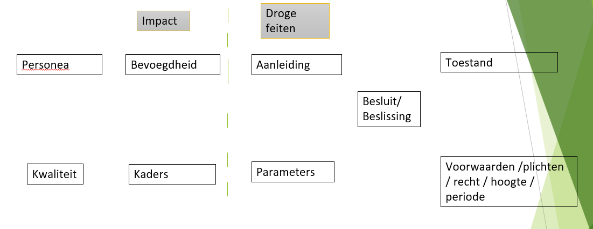
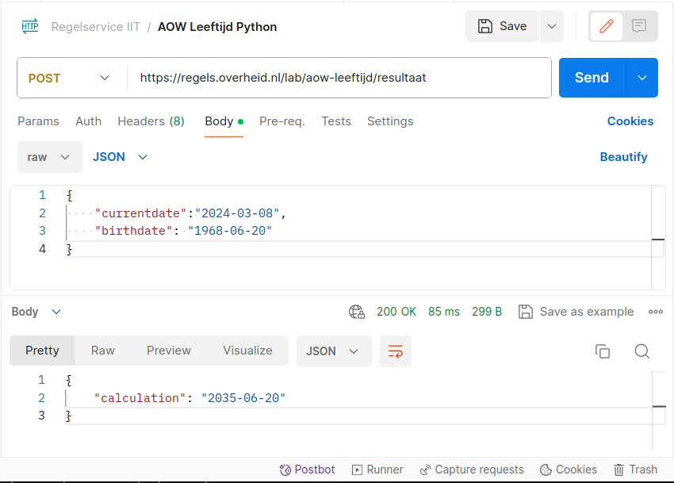

Ter illustratie van de Concordia Legal methode zoals die wordt gebruikt om de kennis in MyCalrityPal te bouwen, ontsluiten we een micro service: de bepaling van de AOW leeftijd.

De AOW leeftijd, wanneer ga je met pensioen, is van belang voor arbeidsrecht in de ketenregeling. Bij een aantal tijdelijke contracten of tijd onder tijdelijk contract gewerkt, komt iemand in vaste dienst. Arbeidsovereenkomsten aangegaan boven de AOW leeftijd, tellen niet mee in de ketenregeling.

De AOW leeftijd komt ook op een 100 plekken voor in de regelgeving als een eis of een ingangskwalificatie. We hebben een [lijst (pdf)](../../static/pdf/AOW-Leeftijd-vindplaatsten-in-wetgeving.pdf) toegevoegd.

Om tot een microservice te komen doorlopen we stappen van:
1. Wet
2. Analyse
3. Regels
4. Deployment als web service
5. UX Design

## 1. Wet
De wet zelf is maar twee artikelen uit de Algemene Ouderdomswet. 
De Algemene Ouderdomswet:  

[Artikel 7](https://wetten.overheid.nl/jci1.3:c:BWBR0002221&hoofdstuk=III&paragraaf=1&artikel=7&z=2023-01-01&g=2023-01-01)

1. Recht op ouderdomspensioen overeenkomstig de bepalingen van deze wet heeft degene, die  
    a. de pensioengerechtigde leeftijd heeft bereikt, en  
    b. ingevolge deze wet minimaal één kalenderjaar verzekerd is geweest in het tijdvak, aanvangende met de dag waarop de aanvangsleeftijd is bereikt en eindigende met de dag voorafgaande aan de dag waarop de pensioengerechtigde leeftijd is bereikt.

2.	Bij ministeriële regeling worden regels gesteld omtrent de herleiding van gedeelten van kalenderjaren tot gehele kalenderjaren.

[Artikel 7a](https://wetten.overheid.nl/jci1.3:c:BWBR0002221&hoofdstuk=III&paragraaf=1&artikel=7a&z=2023-01-01&g=2023-01-01)

1. De pensioengerechtigde leeftijd en de aanvangsleeftijd zijn:  
    a. vóór 1 januari 2013: 65, respectievelijk 15 jaar;  
    b. in 2013: 65 jaar en één maand, respectievelijk 15 jaar en één maand;  
    c. in 2014: 65 jaar en twee maanden, respectievelijk 15 jaar en twee maanden;  
    d. in 2015: 65 jaar en drie maanden, respectievelijk 15 jaar en drie maanden;  
    e. in 2016: 65 jaar en zes maanden, respectievelijk 15 jaar en zes maanden;  
    f. in 2017: 65 jaar en negen maanden, respectievelijk 15 jaar en negen maanden;  
    g. in 2018: 66 jaar, respectievelijk 16 jaar;  
    h. in 2019: 66 jaar en vier maanden, respectievelijk 16 jaar en vier maanden;  
    i. in 2020: 66 jaar en vier maanden, respectievelijk 16 jaar en vier maanden;  
    j. in 2021: 66 jaar en vier maanden, respectievelijk 16 jaar en vier maanden;  
    k. in 2022: 66 jaar en zeven maanden, respectievelijk 16 jaar en zeven maanden;  
    l. in 2023: 66 jaar en tien maanden, respectievelijk 16 jaar en tien maanden;  
    m. in 2024: 67 jaar, respectievelijk 17 jaar;  
    n. in 2025: 67 jaar, respectievelijk 17 jaar;  
    o. in 2026 en de kalenderjaren daarna: de pensioengerechtigde leeftijd en de aanvangsleeftijd, die jaarlijks op basis van de verhoging van de pensioengerechtigde leeftijd en de aanvangsleeftijd op grond van het tweede lid worden vastgesteld.

Op pensioengerechtigden die in een bepaald kalenderjaar de pensioengerechtigde leeftijd hebben bereikt zijn de pensioengerechtigde leeftijd en de aanvangsleeftijd in de kalenderjaren daarna niet van toepassing.

2. De verhoging van de pensioengerechtigde leeftijd en de aanvangsleeftijd in 2026 en de kalenderjaren daarna wordt jaarlijks, voor de eerste maal uiterlijk op 1 januari 2021 voor het jaar 2026, vastgesteld volgens de formule:

    > V = 2/3 * (L – 20,64) – (P – 67)
    >
    >
    > waarbij:  
    > V staat voor de periode waarmee de pensioengerechtigde leeftijd respectievelijk aanvangsleeftijd wordt verhoogd, uitgedrukt in perioden van een jaar;  
    L staat voor de geraamde macro gemiddelde resterende levensverwachting op 65-jarige leeftijd in het kalenderjaar van verhoging;  
    P staat voor de pensioengerechtigde leeftijd in het kalenderjaar voorafgaande aan het kalenderjaar van verhoging.
    >
    > Indien V negatief is of minder dan 0,25 bedraagt, wordt deze gesteld op 0. Indien V 0,25 of meer bedraagt, wordt deze gesteld op drie maanden.
    >
    > De volgens de formule vastgestelde verdere verhoging van de pensioengerechtigde leeftijd en de aanvangsleeftijd wordt door of namens Onze Minister medegedeeld in de Staatscourant.

3. De verhoging, bedoeld in het tweede lid, treedt telkens in werking vijf jaar na de uiterste datum van vaststelling, bedoeld in het tweede lid, voor de eerste maal met ingang van 1 januari 2026.
4. De ramingen van de macro gemiddelde resterende levensverwachting, bedoeld in het tweede lid, worden uitgevoerd en bekendgemaakt door het CBS.

## 2. Analyse
De Aow leeftijd is een microservice en om het volledige beeld van de Concordia methode te illustreren is de analyse uitgebreid met de ketenregeling uit het arbeidsrecht.

*Eerste gedachten:*
- Voor de bepaling van de aow leeftijd is een tabel gegeven, artikel 7a, eerste lid, Algemene Ouderdomswet.
- Jaarlijks wordt het artikel aangepast met een opvolgend jaar, aan de hand van de formule uit artikel 7a, tweede lid, Algemene Ouderdomswet door de minister. Niet op voorhand te bepalen, want het is afhankelijk van gemiddelde resterende leeftijdsverwachting.
- Leeftijden worden medegedeeld in de Staatscourant
- NB! Bepaling AOW leeftijd na 2025 is dus afhankelijk van de formule en is dus nog onbepaald.

*In stappen:*
- Bepalen welke leeftijd iemand heeft aan de hand van geboortedatum
- Welke datum is het peilmoment. 
- Vergelijken aow leeftijd uit tabel met leeftijd persoon op peilmoment
- Nogmaals, tot 2026

*Concordia Legal Methode*  
Zoals gezegd is er sprake van een micro service en niet een volledige uitwerking. Toch heeft de AOW leeftijd bepaling als bouwsteen met op meerdere plekken een effect. De AOW leeftijd is een kwaliteit van een persoon en wat zijn de juridische gevolgen.

Dus in de regels over de ketenregeling (wanneer heeft iemand een vast contract), komt eigenlijk nog een extra tussentijdse bepaling om het [schema van analyse](../methods/CONCORDIALEGAL.md) compleet te maken.

*Toepassing in ketenregeling*  
Hier wordt het schema, verder ingevuld aan de hand van de ketenregeling en je ziet de AOW leeftijd als kwaliteit terugkomen. Bij een aantal tijdelijke contracten of tijd onder tijdelijk contract gewerkt, komt iemand in vaste dienst. Arbeidsovereenkomsten aangegaan boven de AOW leeftijd, tellen niet mee in de ketenregeling.

*Regel*
1. Indien werknemer ouder is dan: artikel 7, onderdeel a, van de Algemene Ouderdomswet bedoelde leeftijd
    - Is de periode uit regel 1 48 maanden (*transitie specifiek, red*)
    - Een het aantal tijdelijke arbeidscontracten uit regel 2: ten hoogste zes (*transitie specifiek, red*)
    - Alleen voor de arbeidsovereenkomsten aangegaan na het overschrijden van de **artikel 7, onderdeel a, van de Algemene Ouderdomswet bedoelde leeftijd**. 

*Ingevuld schema*

Personae:
- Werkgever
- Medewerker, kwaliteit leeftijd, aantal contracten, de leeftijd wanneer die contracten zijn aangegaan  
Bevoegdheid: wel of niet rechtswege vast contract  
Kaders: nvt in dit voorbeeld  
Aanleiding: peiling van rechtspositie
Parameters: nvt (er is geen specifieke termijn voor de bepaling)  
Besluit: wel of niet ketenregeling van toepassing  
Voorwaarden / plichten: afhankelijk van de toestand in dit voorbeeld.  
Toestand:  
  - Vast contract en wel op deze datum
  - Of nog zoveel contracten of zoveel maanden werken onder tijdelijk contract totdat een vast contract ontstaat op deze datum  

## 3. Regels
Voor de regels gebruiken wij Oracle Intelligent Advisor (OIA) en voor de ontsluiting hebben we ook de python code toegevoegd. 

In OIA gaat de bepaling van de AOW leeftijd volgens een tabel en kan dus gebruikt worden als bepaling in arbeid, huurtoeslag etc. Deze tabel wordt dus aangevuld bij mededeling in de Staatscourant, artikel 7a, tweede lid, Algemene Ouderdomswet. 

*OIA tabel*

| de leeftijd voor AOW in maanden |-|
|---------------------------------|-|
| 66 * 12 + 4  | ExtraherenJaar(de peildatum van de evaluatie voor AOW) = 2020 |
| 66 * 12 + 7 | ExtraherenJaar(de peildatum van de evaluatie voor AOW) = 2021 |
| 66 * 12 + 7 | ExtraherenJaar(de peildatum van de evaluatie voor AOW) = 2022 |
| 66 * 12 + 10 | ExtraherenJaar(de peildatum van de evaluatie voor AOW ) = 2023 |
| 67 *12 | ExtraherenJaar(de peildatum van de evaluatie voor AOW) = 2024 |
| 67 *12 | ExtraherenJaar(de peildatum van de evaluatie voor AOW ) = 2025 |
| 67 *12 | ExtraherenJaar(de peildatum van de evaluatie voor AOW ) = 2026 |
| onzeker | anders |

*Python Kern*  
Functie voor toevoegen maanden: 
> def add_months(current_date, months_to_add):  
> new_date = date(current_date.year + (current_date.month + months_to_add - 1) // 12, (current_date.month + months_to_add - 1) % 12 + 1, current_date.day)  
> return new_date

Functie vertalen hoe de AOW leeftijd er uit ziet in maanden om jaren en maanden bij elkaar te brengen tot 1 begrip:
> def leeftijd_AOW_Maanden (currentdate):  
>  year = currentdate.year  
>  if year == 2000:  
>     monthsAgeAOW = 66 * 12 + 4  
>  elif year == 2021:  
>     monthsAgeAOW = 66 * 12 + 7  
>  elif year == 2022:  
>     monthsAgeAOW = 66 * 12 + 7  
>  elif year == 2023:  
>     monthsAgeAOW = 66 * 12 + 10  
>  elif year == 2024:  
>     monthsAgeAOW = 67 * 12 + 0  
>  elif year == 2025:  
>     monthsAgeAOW = 67 * 12 + 0  
>  elif year == 2026:  
>     monthsAgeAOW = 67 * 12 + 0  
>  else:  
>     monthsAgeAOW = 67 * 12  
>  return monthsAgeAOW

Daadwerkelijke berekening in de web service die de parameters van de aanroep pakt, de geboortedatum er uit haalt, en de (huidige) datum waarop de AOW leeftijd moet worden berekend; je krijgt een ander antwoord in 2020 dan in 2024:  
> cal['calculation'] = add_months(birtdate.date(),  
> leeftijd_AOW_Maanden(currentdate.date())).strftime(format)

## 4. Deployment

De micro service zoals gespecificeerd is mbv Python Flask Docker image deployed op https://regels.overheid.nl/lab/aow-leeftijd/resultaat

Een POST Request naar deze url met body

{  
"currentdate":"2024-03-08",  
"birthdate": "1968-06-20"  
}

geeft

{  
"calculation": "2035-06-20"  
}  

als respons.

*Hieronder een voorbeeld met [Postman](https://www.postman.com/)*

## 5. UX Design

  <video width="100%" height="100%" playsinline autoplay muted controls>
    <source src="../../static/video/AOW-Concept-Design.mp4" type="video/mp4" />
  </video>

*Disclaimer en gebruik*  
Deze microservice is gebaseerd op onze eigen analyse van de regelgeving op 8 februari 2024. Wij staan achter het resultaat, maar hoe het verder door een gebruiker wordt toegepast kunnen wij, uiteraard, niet voor instaan noch voor eventuele gevolgen van een datalek. Geboortedata zijn nou eenmaal persoonsgegevens. 
Dat gezegd hebbende: iedereen die deze leeftijdsbepaling wil gebruiken, mag dat. De bepaling kan obv fair use policy gebruikt worden.