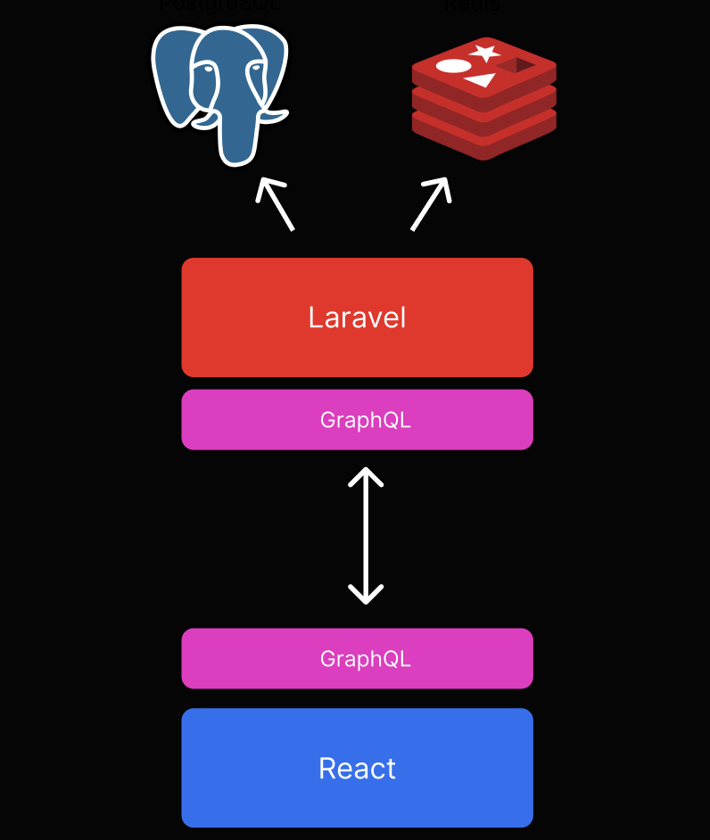

# JAS Annotatie Tool
Dit project is gemaakt in opdracht van de Hogeschool van Amsterdam. Het project is gemaakt door een groep van zes studenten van de opleiding Software Engineering.

Developers:
- Mo Kadib Alban
- Mika Rövenkamp
- Roy Wiersma
- Stefan de Haan
- Tracy Owusu
- Alexander Vreeswijk

## Introductie

Deze krachtige tool is ontwikkeld om juristen in staat te stellen wetten op een gestructureerde en overzichtelijke manier te annoteren. Of je nu een jurist, wetenschapper of beleidsmaker bent, deze applicatie biedt een intuïtieve omgeving om diepgaande analyses te maken, begrippen te verhelderen en de evolutie van wetten in de tijd te volgen.

### Belangrijkste Kenmerken:

#### Annotatiefunctionaliteit
Voeg begrippen toe aan wetten en voorzie ze van een begrip, een commentaar en een definitie. Breng verhelderende opmerkingen aan bij specifieke woorden, waardoor een dieper begrip ontstaat. Maak complexe juridische taal toegankelijker door begrippen te definiëren en context toe te voegen.

#### Relatieschema
Stel eenvoudig relaties in tussen verschillende begrippen om de onderlinge verbondenheid te visualiseren. Creëer een helder beeld van de samenhang tussen verschillende juridische concepten en bepalingen.

#### Versiebeheer
Bewaar gemaakte annotaties veilig door regelmatig op te slaan. Navigeer eenvoudig door verschillende versies van wetten en bekijk de historische ontwikkeling.

## Technische informatie
Deze applicatie bestaat uit een front- en backend applicatie. De frontend is geschreven in React en de backend is geschreven in PHP met een Laravel framework. De backend is volledig containerized met Docker, de frontend is niet containerized.

### GraphQL
Het fundament van deze applicatie is GraphQL. GraphQL is een querytaal voor API's en een runtime voor het uitvoeren van queries met behulp van een type systeem dat door de gebruiker wordt gedefinieerd. GraphQL is gereleased is 2021 en dient als een alternatief voor REST. Het helpt bij het versnellen van web requests, door alleen de benodigde data op te halen. Dit zorgt voor minder endpoints, een snellere applicatie en een betere gebruikerservaring. Ook zorgt GraphQL voor een betere documentatie van de API, omdat deze documentatie automatisch gegenereerd wordt en gelezen kan worden door de frontend. Met deze documentatie kan de frontend automatisch de benodigde types genereren, zodat de frontend altijd up-to-date is met de backend. Hieronder is een weergave van de architectuur te zien.
[](../../static/img/jas-architecture.png "GraphQL")

### Datamodel
Het datamodel is zo abstract mogelijk gehouden. Dit betekent dat het technisch mogelijk is om begrippen in de toekomst toe te voegen of verwijderen, zonder dat de code ergens stuk loopt. Ook is het mogelijk om zelf relatie schemas te creeëren met de begrippen die op dat moment actief zijn. Oude schemas blijven bewaard en zijn nog steeds van toepassing op wetten die in het verleden zijn geannoteerd. Het nieuwe schema wordt alleen op nieuwe wetten toegepast. Hieronder is een weergave van het datamodel te zien.
[](../../static/img/jas-ERD.png "Datamodel")


### Backend

De backend bestaat uit containers. De containers zijn te vinden in de `docker-compose.yml` file. De containers zijn als volgt:
- `nginx`: Nginx webserver (1.18)
- `api`: Laravel applicatie
- `db`: PostgreSQL database (15.1-alpine)
- `redis`: Redis database (7.0.8)

De laravel applicatie dient puur als API en heeft zelf geen views. De views worden gegenereerd door de frontend applicatie. De API is te benaderen op `localhost:8000/graphql`.

#### Installatie
Om verder te werken aan het project moet de applicatie worden opgezet. De eerste stap is om de `.env.example` te kopiëren en deze `.env` noemen. Vervolgens kan het volgende commando uitgevoerd worden:
```
make setup
```

Dit commando zet de containers op en installeert de benodigde dependencies. Vervolgens voert het commando de database migraties uit en seed de database met test data. De applicatie is nu opgestart en klaar voor gebruik.

#### Development
Er zijn ook aan aantal handige commando's om de ontwikkeling te versnellen. Deze commando's zijn te vinden in de `Makefile`. De belangrijkste commando's zijn:
- `make setup`: Zet de applicatie op
- `make up`: Start de applicatie
- `make down`: Stop de applicatie
- `make db-fresh`: Maakt de database leeg en seed de test data opnieuw
- `make test`: Voert alle tests uit
- `make ide-helper-lighthouse`: Compileert het GraphQL schema voor de frontend (moet uitgevoerd worden na elke wijziging aan `*.graphql` bestanden)

### Frontend
De frontend is geschreven in React en is niet containerized, dus moet dan ook lokaal opgezet worden. De frontend is te benaderen op `localhost:3000`.

#### Installatie
Om de frontend op te zetten moet eerst NPM geïnstalleerd worden. Vervolgens kan het volgende commando uitgevoerd worden:
```
npm install
```
Dit installeert alle benodigde dependencies. Vervolgens moeten alle GraphQL types worden gelezen uit de backend en gecompileerd worden naar TypeScript types. Dit kan gedaan worden met het volgende commando:
```
npm run gql:codegen
```
Als dit is gebeurd is de applicatie op te starten met:
```
npm run start
```

#### Development
Wanneer de backend een wijziging heeft in het GrahpQL schema en de `make ide-helper-lighthouse` commando is uitgevoerd, moet de frontend opnieuw gecompileerd worden. Daarvoor moet dan opnieuw  het `npm run gql:codegen` uitegevoerd worden.