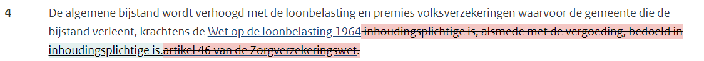

# Inleiding

Een goede vertaling van wetgeving naar de uitvoeringspraktijk vraagt om een aanpak waarbij alle stappen voor het interpreteren, preciseren en nader invullen van wetgeving expliciet en op een gestructureerde manier worden vastgelegd. Dat zorgt ervoor dat de keuzes die worden gemaakt bij het vertalen van wetgeving naar uitvoering helder zijn en dat besluiten die op grond van die keuzes worden gemaakt, uit te leggen en te verantwoorden zijn.

Voor de ondersteuning van de methode om tot deze vertaling van wetgeving te komen ontbreekt goede, open source tooling. Een eerste vingeroefening daarmee is inmiddels achter de rug. Resultaat is beschikbaar op de [lab pagina](https://regels.overheid.nl/lab#wetsanalyse) alhier.

Met deze ervaring achter de rug is besloten om échte user stories te laten maken die de functionele behoefte formuleren van ondersteunende software voor analyse/annotatie van wetgeving.

:::info

Deze user stories zijn opgesteld door [Mariette Lokin](mailto:mariette@hooghiemstra-en-partners.nl) en [Ivar Timmer](mailto:i.timmer@hva.nl).

- [ ] nog niet gerealiseerd en beschikbaar gesteld in release
- [X] gerealiseerd en in een release opgenomen

:::

## User stories

- [ ] **ANOT01** Als jurist/regelanalist wil ik alle typen regelingen (wet, amvb, ministeriële regeling, beleidsregels) kunnen uploaden uit wetten.nl.
---
- [ ] **ANOT02** Als jurist/regelanalist wil ik afzonderlijke tekstelementen in de regelgeving op woordniveau<mark>[**1**]</mark> óf onderdeelniveau<mark>[**2**]</mark> óf lidniveau<mark>[**3**]</mark> óf zinsniveau<mark>[**4**]</mark> óf artikelniveau (elke combinatie van woorden of getallen, derhalve, ook verspreid over verschillende plaatsen in de tekst) kunnen markeren (ook wel: annoteren) aan de hand van een juridisch classificatiemodel.

### voorbeeld

**Artikel 19, eerste lid, Participatiewet**
1. <mark>De alleenstaande [1]</mark> of het gezin heeft recht op algemene bijstand indien: 
 
a. <mark>het in aanmerking te nemen inkomen lager is dan de bijstandsnorm; en [2]</mark> 
 
b. er geen in aanmerking te nemen vermogen is. 
 
<mark>2. De hoogte van de algemene bijstand is het verschil tussen het inkomen en de bijstandsnorm. [3]</mark>

**Artikel 18b, vierde lid, Participatiewet**

4. <mark>Belanghebbende wordt na de uitkomst van de toets, bedoeld in het tweede lid, waaruit blijkt dat hij niet of niet in voldoende mate de vaardigheden in de Nederlandse taal beheerst, binnen een door het college te bepalen termijn die ten hoogste acht weken bedraagt, door het college schriftelijk in kennis gesteld van het redelijk vermoeden, bedoeld in het eerste lid. [4]</mark> De verlaging van de bijstand vindt plaats vanaf het moment dat die schriftelijke kennisgeving plaatsvindt.
---
- [ ] **ANOT03** Als jurist/regelanalist wil ik meer dan één classificatie aan een tekstelement kunnen toekennen.

### voorbeeld

**Artikel 19, tweede lid, Participatiewet**  
2. De hoogte van de algemene bijstand is het verschil tussen het inkomen en de bijstandsnorm.

De hele zin wil ik classificeren als *afleidingsregel*, daarbinnen wil ik de woorden ‘het verschil tussen’ classificeren als *operator*, en ‘de bijstandsnorm’ als *variabele*.

---
- [ ] **ANOT04** Als jurist/regelanalist wil ik voorgeprogrammeerde classificatiemodellen aangeboden krijgen (bijvoorbeeld het juridisch referentieschema van Wetsanalyse en de classificatie van Norm engineering (Calculemus-Flint)), maar ook de typen classificaties zelf kunnen bepalen of aanpassen.

Zie https://regels.overheid.nl/methoden voor de modellen van Wetsanalyse en Calculemus-Flint.

---
- [ ] **ANOT05** Als jurist/regelanalist wil ik aan tekstelementen die ik heb geclassificeerd, zelf te formuleren begrippen kunnen verbinden. Begrippen wil ik voorzien van een (doorzoekbare) omschrijving en eventueel een bronvermelding (Juriconnect).

### voorbeeld
**Artikel 19, eerste lid, Participatiewet**

| tekstelement | klasse | begrip | omschrijving |
| - | - | - | - |
| Heeft recht op algemene bijstand | Rechtsbetrekking | Recht op algemene bijstand | Het recht op bijstand ter voorziening in de algemeen noodzakelijke kosten van het bestaan |
| Algemene bijstand | Rechtsobject | Algemene bijstand | Bijstand ter voorziening in de algemeen noodzakelijke kosten van het bestaan ([artikel 5, onderdeel b, Participatiewet](jci1.3:c:BWBR0015703&hoofdstuk=1&paragraaf=1.1&artikel=5&z=2024-01-01&g=2024-01-01)) <mark>omschrijving met Juriconnect bronvermelding</mark>|

 **NB**  
 De link verwijst naar heel artikel 5 Participatiewet, Juriconnect/wetten.nl heeft nog geen mogelijkheid om te deeplinken naar delen van artikelen.

---
- [ ] **ANOT06** Als jurist/regelanalist wil ik mijn classificaties en begrippen op latere momenten kunnen wijzigen, waarna het systeem aangeeft welke conflicten hierdoor ontstaan en moeten worden opgelost.
---
- [ ] **ANOT07** Als jurist/regelanalist wil ik dat ik nieuwe versies van dezelfde regeling kan uploaden en dat het systeem aangeeft welke conflicten hierdoor ontstaan met betrekking tot bestaande classificaties (en dus moeten worden opgelost).
---
- [ ] **ANOT08** Als jurist/regelanalist wil ik annotaties in verschillende geclassificeerde versies van hetzelfde artikel naast elkaar kunnen bewaren en raadplegen. 

### voorbeeld
Ideaal is een ‘versies vergelijken’ optie zoals in wetten.nl (zie hieronder). Alternatief zou een ‘kloon’ van wetten.nl zijn die ergens afgeschermd staat maar wel steeds ‘bij’ is (zoals bedacht is voor [PUC](https://puc.overheid.nl/)).

**Artikel 19, vierde lid, Participatiewet**

---
- [ ] **ANOT09** Als jurist/regelanalist wil ik dat ik via de geclassificeerde tekstelementen naar de verbonden begrippen kan navigeren en omgekeerd, waarbij ik bij voorkeur in hetzelfde scherm blijf.
---
- [ ] **ANOT10** Als jurist/regelanalist wil ik met de begrippen [declaratieve regels](https://nl.wikipedia.org/wiki/Declaratieve_taal) kunnen opstellen (dan… als…).

### voorbeeld
Ik wil de begrippen kunnen ‘slepen’ naar de regels. Ik wil hierbij altijd heen en weer kunnen navigeren tussen begrippen, omschrijving, classificaties en onderliggende wetteksten.

Voorbeeld declaratieve regel op basis van **Artikel 19, eerste lid, Participatiewet**

Een <u>alleenstaande</u> heeft <u>recht op algemene bijstand</u> indien hij voldoet aan <u>alle</u> volgende voorwaarden:
- zijn <u>bijstandsinkomen</u> <mark>is kleiner dan</mark> zijn <u>bijstandsnorm</u>
- zijn <u>bijstandsvermogen</u> <mark>is gelijk aan</mark> <u>nul</u>

---
- [ ] **ANOT11** Als jurist/regelanalist wil ik dat aan de regels formele vereisten qua opbouw/ structuur kunnen worden gesteld (vaste patronen, bouwblokjes), zodat afgedwongen kan worden dat ze aan vereisten van geformaliseerde natuurlijke talen - zoals RuleSpeak, RegelSpraak, DMN of andere varianten - voldoen.  

Ik wil de declaratieve regels ook kunnen visualiseren als beslisboom

---