# Gebruikers documentatie

In dit document krijgt u een rondleiding door de web-app `Legal Annotation Tool`. 

Allereerst beginnen we op de `home` pagina. Deze pagina bevat een overzicht van alle geüploade xml documenten. Zoals u kunt zien is er momenteel nog niet veel zichtbaar, dit komt omdat wij nog geen documenten hebben geüpload. Dit zal zo meteen in stap 2 gedaan worden. Voor dat we naar stap twee gaan breng ik eerst de aandacht naar de tekst `0/40 XML's beschikbaar`. Hier kunt u straks gaan zien hoe veel xml's er geüpload zijn naar het systeem. Aan dit totaal zit ook een limiet. Dit limiet kan aangepast worden in de database, voor meer informatie verwijs ik u naar de technische documentatie.

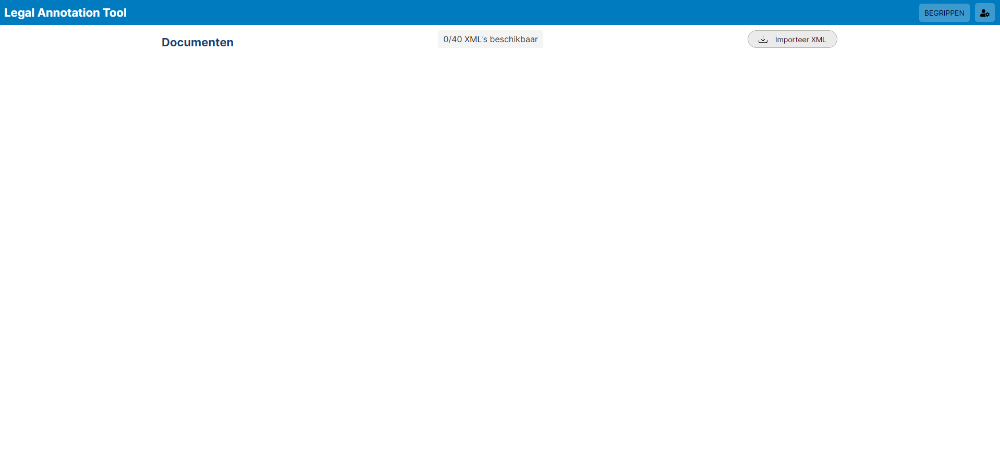

Door te klikken op `Importeer XML` krijgt u het onderstaande Modal te zien. Hier heeft u de mogelijkheid om een XML te uploaden. 

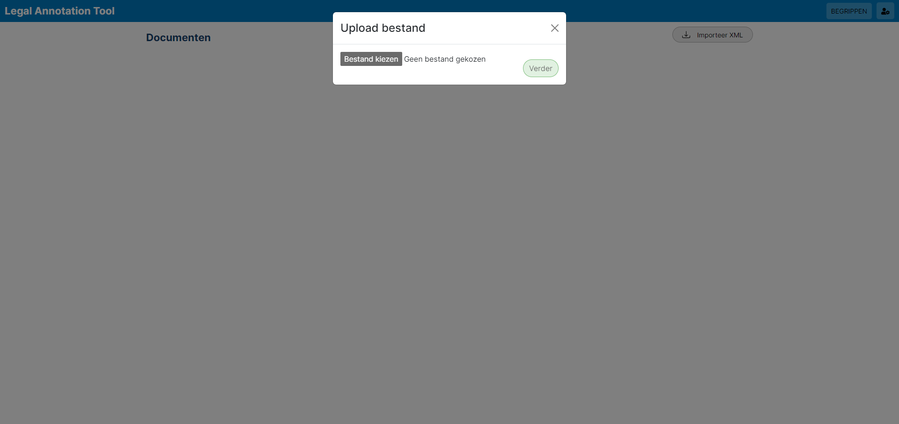

Na een document te hebben geüpload wordt de `verder` knop actief en wordt u naar de volgende stap geleid.

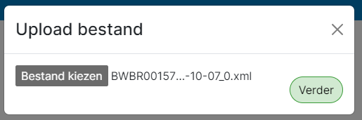

Na het uploaden van een document krijgt u de mogelijkheid om de artikelen die beschikbaar zijn in de XML zichtbaar of onzichtbaar te maken. U kunt er voor kiezen om een specifieke selectie te maken of om alle artikelen te selecteren, klik hier voor op `Selecteer alles`.

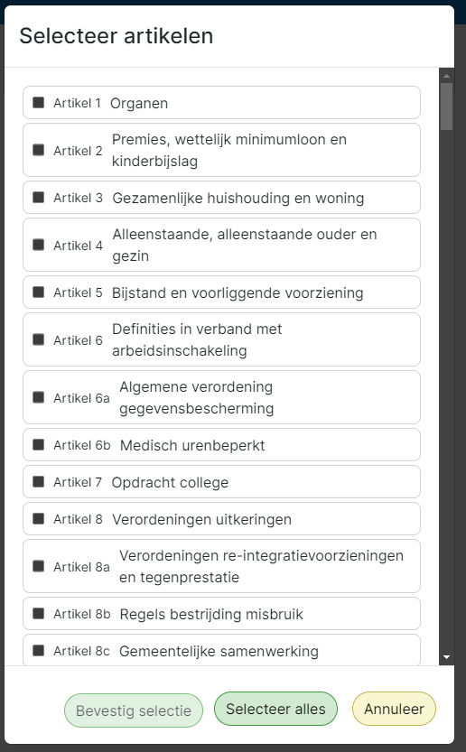

Wanneer u er voor kiest om alleen een selectie van artikelen zichtbaar te hebben, kunt u klikken op de artikelen die u zichtbaar wilt houden. Alle niet geselecteerde artikelen zullen niet getoond worden op verdere pagina's. Na het maken van uw selectie komt de knop `Bevestig selectie` beschikbaar. Door op deze knop te klikken wordt de selectie afgerond en het document toegevoegd aan het systeem.

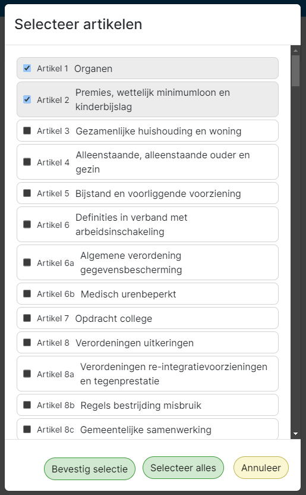

Zoals u hier onder kunt zien is de xml succesvol toegevoegd. Zoals u ook kunt zien is het niet nodig om handmatig de naam van de wet in te vullen, deze hebben wij uit de XML kunnen halen en tonen wij deze als document naam. Zoals u ook kunt zien heeft u nu de mogelijkheid om het project te openen of te verwijderen. Om een project te kunnen verwijderen zijn echter bepaalde rechten nodig. Meer informatie hier over vindt u in de volgende stap.

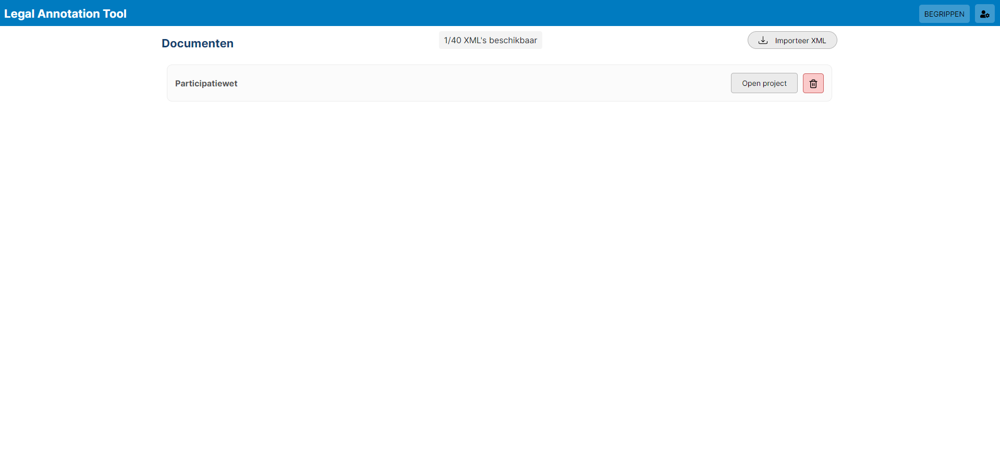

Op de homepagina ziet u rechts bovenin een gebruikers knopje. Wanneer hier op geklikt wordt krijgt u onderstaande modal zichtbaar. Hier in kunt u kiezen welke gebruiker u wilt zijn. De reden waarom dit systeem op deze manier is toegepast wordt verder uitgelegd in de technische documentatie. 

Zoals u kunt zien is er momenteel maar één gebruiker beschikbaar met de rol `Admin`. Om een nieuwe gebruiker te maken klikt u op `maak nieuwe gebruiker`.

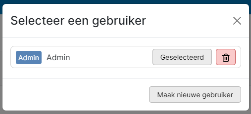

In het scherm hier onder krijgt u de mogelijkheid om een nieuwe gebruiker toe te voegen. U mag zelf een naam aan deze gebruiker geven en een rol selecteren. Om de gebruiker op te slaan klikt u op `opslaan`.

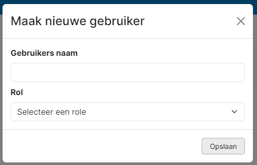

Wanneer de gebruiker is opgeslagen klikt u op `selecteer`. U ziet dan meteen dat de tekst van de knop veranderd naar `geselecteerd`. Ook zult u op de achtergrond zien dat de `verwijder` knop van een xml document niet meer beschikbaar is.

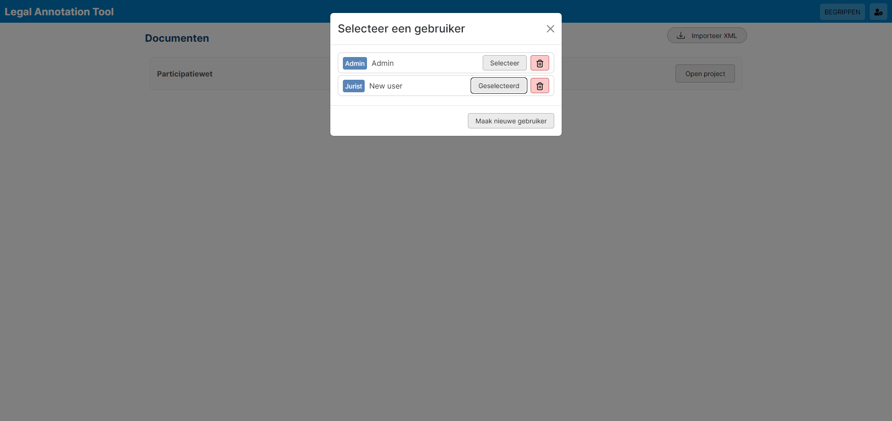

Als u op het home scherm op `open project` klikt wordt u naar het annotatie scherm gebracht. Dit is het scherm waar de wetteksten en gemaakte annotaties getoond worden. 

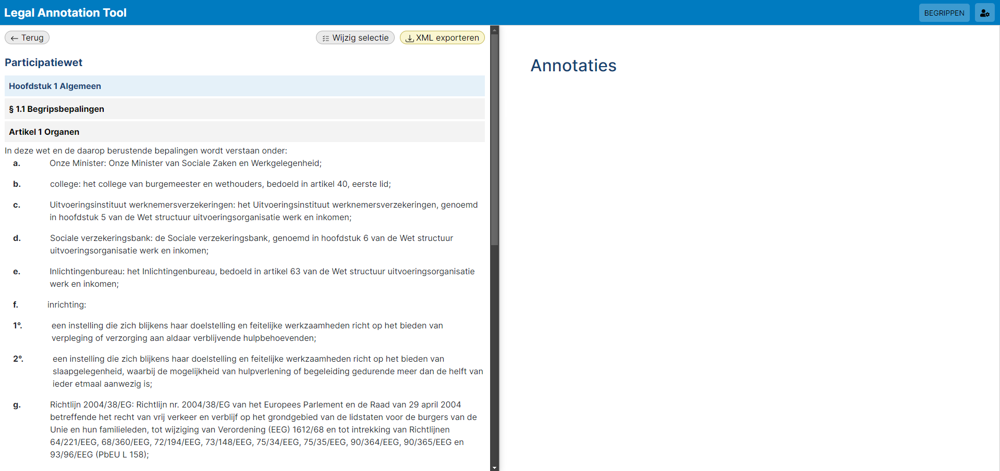

Zodra u een tekst selecteert zult u zien dat de tekst aan de linkerkant een achtergrond kleur krijgt. Tegelijkertijd wordt de rechterkant van het scherm voorzien van een annotatie aanmaak scherm. Hier kunt u nogmaals zien welke tekst u geselecteerd heeft en betekenis geven aan dit specifieke woord. 

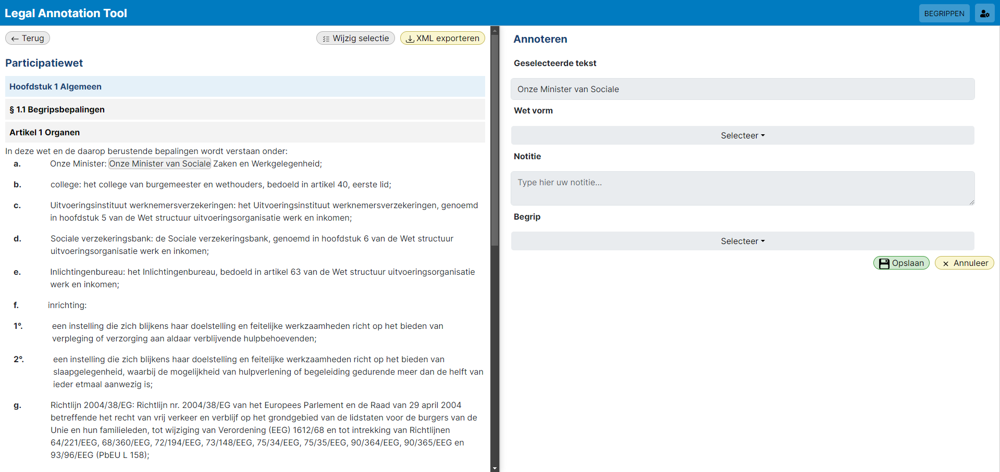

Als eerste moet een `Wet vorm` geselecteerd worden. Wanneer er gedrukt wordt op `selecteer` krijgt u de mogelijke opties te zien.

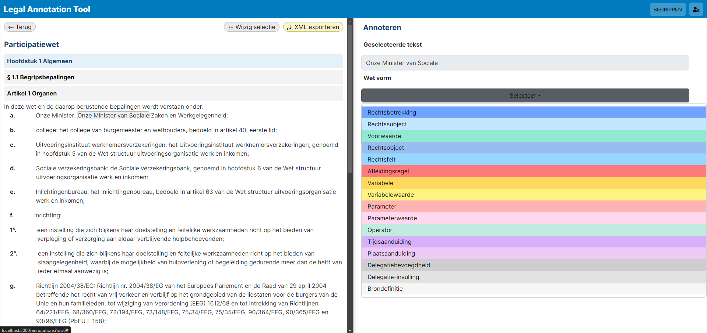

Daarnaast heeft u de mogelijkheid om een optionele notitie toe te voegen en een begrip. Het begrip kan gebruikt worden om betekenis te geven aan een woord. Begrippen wordt los van een annotatie opgeslagen. Dit houdt in dat een specifiek begrip bij meerdere annotaties gebruikt kan worden. Wanneer u in het linker scherm een woord selecteert waar al eerder een begrip aan is gegeven zult u ook de suggestie krijgen om die opnieuw te gebruiken.

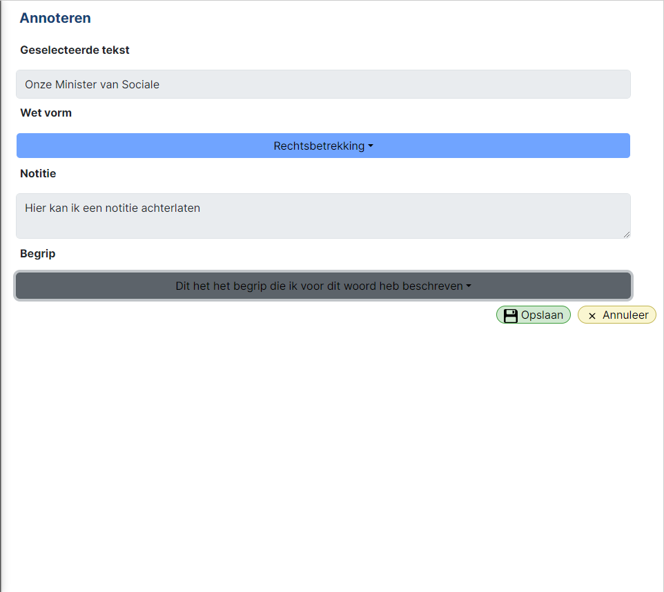

Na dat u deze velden hebt ingevuld kunt u klikken op `Opslaan`. Wanneer u dit doet, wordt de annotatie opgeslagen en krijgt het geselecteerde woord aan de linkerkant een gerelateerde achtergrond kleur. Bepaalde wet vormen hebben relaties. Deze relaties worden zichtbaar zodra er voor de eerste keer op opslaan geklikt wordt. Bepaalde van deze relaties kunnen verplicht zijn. Hier is in het overzicht ook onderscheid tussen gemaakt. 

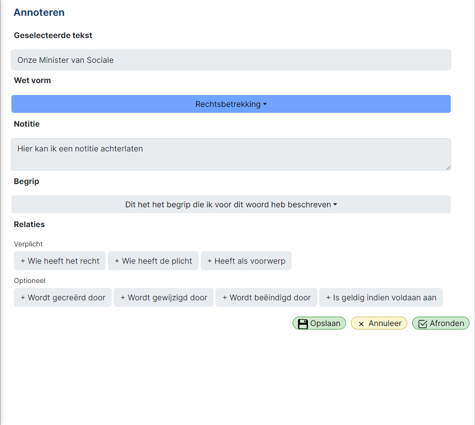

Wanneer u klikt op één van deze relaties krijgt u daar onder opnieuw de mogelijkheid om in het linker scherm een tekst te selecteren.

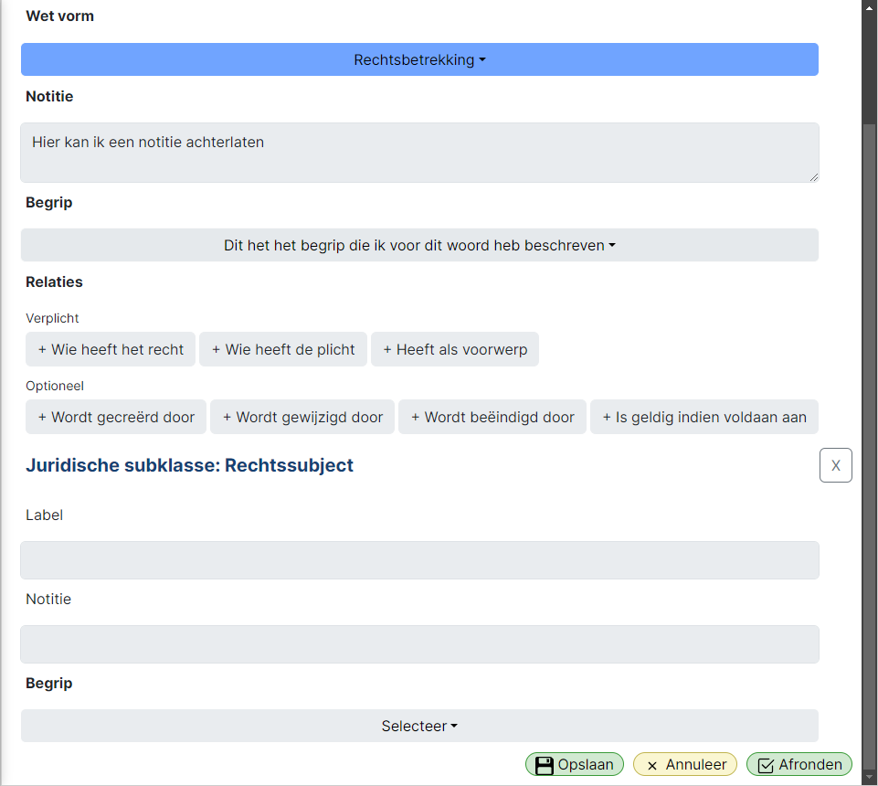

Wanneer u deze tekst heeft geselecteerd wordt deze zichtbaar in het `Label` veld. Ook hier kunt u nu een optionele notitie en begrip toevoegen. Als u dit heeft gedaan kunt u opnieuw op opslaan klikken en ziet u dat ook deze annotatie in het linker scherm kleur krijgt. 

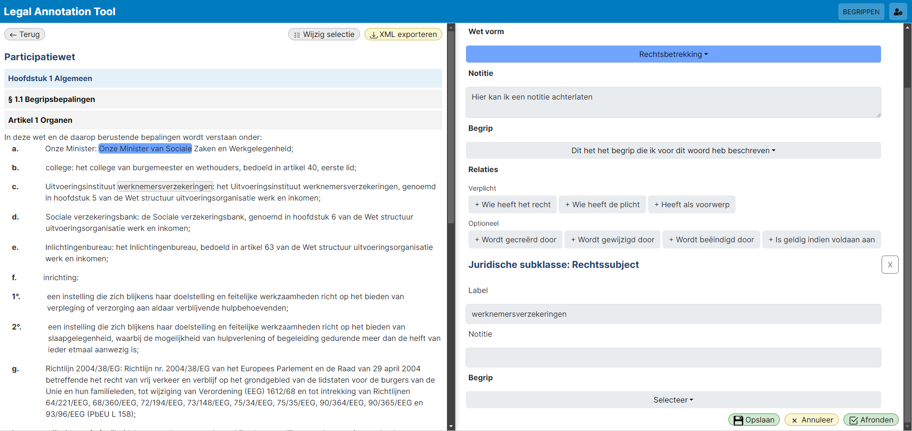

Ook ziet u dat de relatie groen gekleurd wordt om aan te tonen dat de relatie voldaan is.

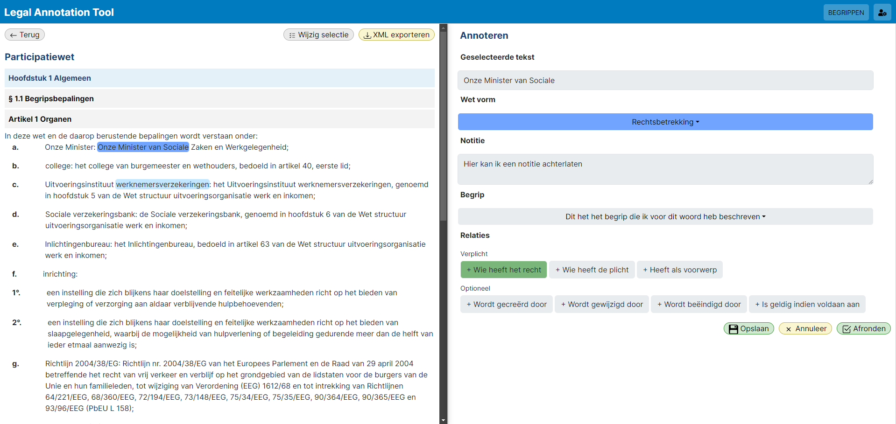

Als u volledig tevreden bent met uw annotatie kunt u klikken op `Afronden`. Hier mee sluit u het rechter scherm en komt u terug bij het overzicht scherm. Hier ziet u nu op het rechter scherm de twee wet vormen die tijdens het annoteren toegevoegd zijn. 

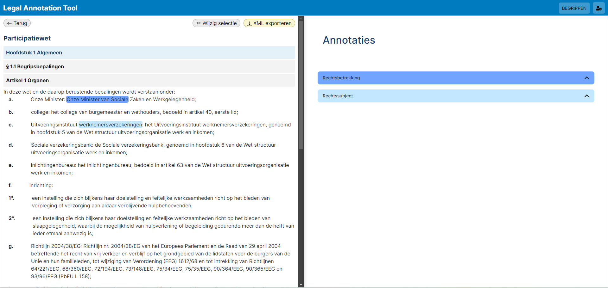

Door te klikken op de balken kunt u de annotaties zien die hier bij horen. Ook ziet u dat bij de annotatie onder `Rechtssubject` dat deze onderdeel is van de annotatie onder `Rechtsbetrekking`. Op deze manier kunt u de relaties tussen annotaties achterhalen.

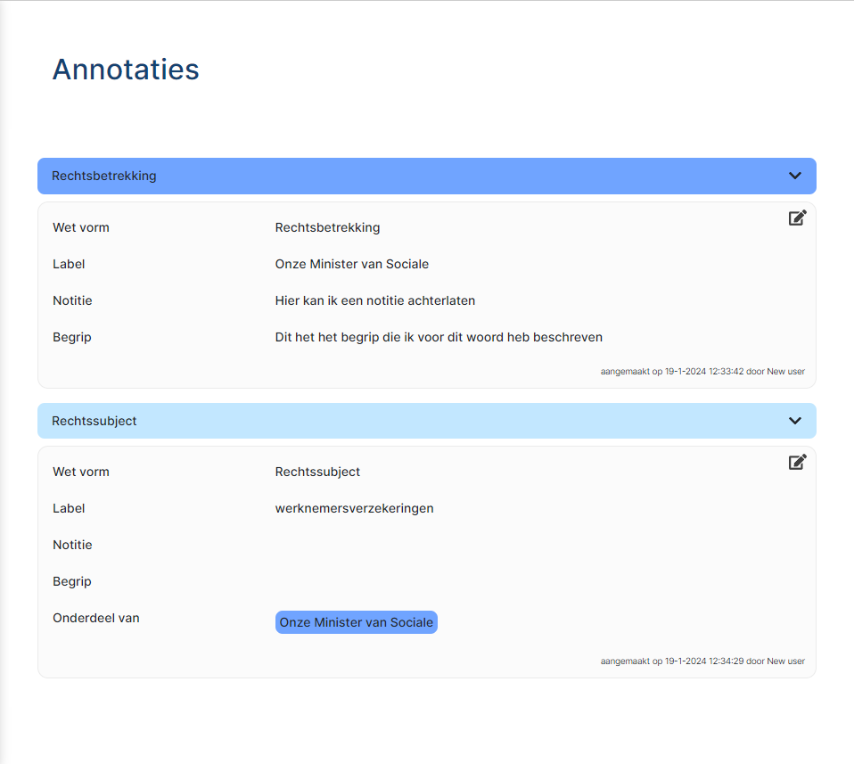

Bij elke annotatie ziet u rechts bovenin een klein pennetje staan. Als u hier op klikt, kunt u de annotatie aanpassen. U kunt er ook voor kiezen om de annotatie te verwijderen.

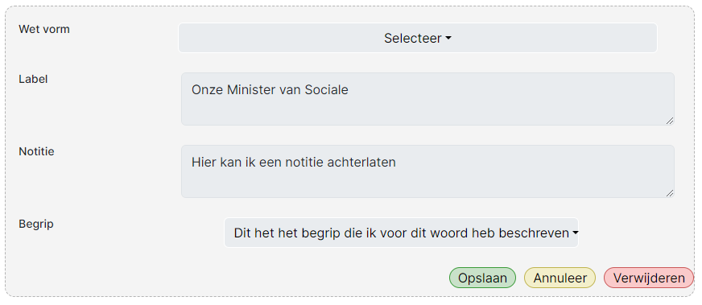

Het linker kant van het scherm ziet u ook enkele knoppen: `Terug`, `Wijzig selectie`, en `XML exporteren`.
De `Terug` knop brengt u terug naar de homepagina. De `wijzig selectie` knop geeft u de mogelijkheid om de selectie van zichtbare artikelen aan te passen. En de `XML exporteren` knop geeft u de optie om de xml, inclusief annotaties, te exporteren. Deze geëxporteerde annotatie kunt u opnieuw importeren op het home scherm.

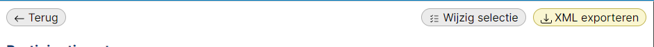

Op elk scherm ziet u rechts boven in naast de gebruikers knop ook de knop `Begrippen`. Als u hier op klikt komt u op een overzichtpagina met alle gemaakte begrippen.

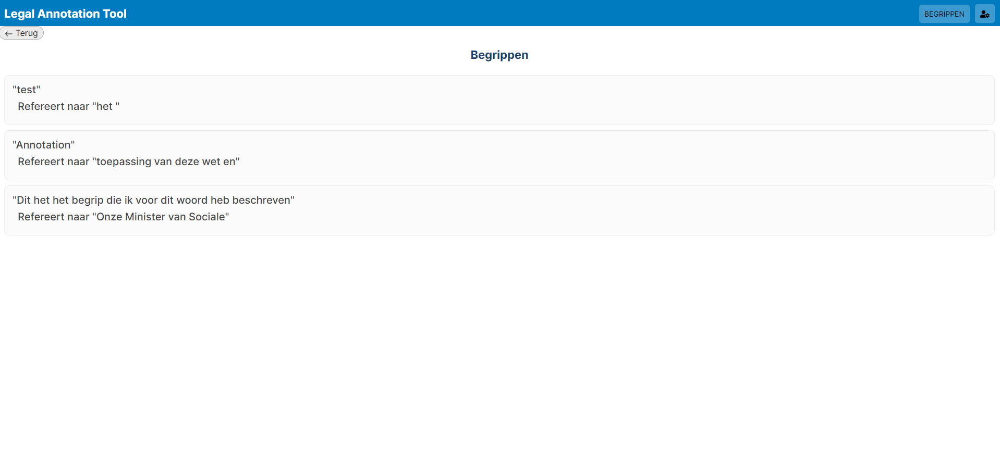