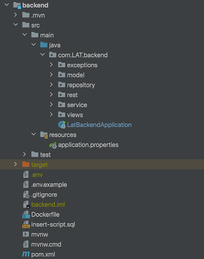

# Ontwikkelaars Documentatie
## 1. Architectuur
Dit hoofdstuk biedt een blik op de bouw en structuur van de legal annotation tool webapplicatie, waarbij gebruik wordt gemaakt van het Next.js-framework voor de frontend en het Spring Boot-framework met Java voor de backend. 
### 1.1 Frontend
Het fundament van een Next.js-applicatie zijn de pagina's. In plaats van een traditionele React-applicatie met een enkelvoudige App-component, maakt Next.js gebruik van het concept van pagina's. Elke folder wordt een route in de applicatie. Naast pagina's kun je gedeelde componenten creëren en organiseren in de components-map. Deze componenten worden hergebruikt over verschillende pagina's heen.

#### 1.1.2 NextJS (React & Typescript)
Code die vaak terug is te zien is “useEffect” en “useState”; dit zijn React-hooks. useEffect wordt gebruikt voor het verwerken van "side effects" in functionele componenten, zoals het ophalen van gegevens van een API. useState wordt gebruikt om de lokale state in functionele componenten te beheren. Het geeft een array terug met twee elementen: de huidige waarde van de state en een functie waarmee je de waarde kunt bijwerken. Wanneer je een React-hook, zoals useState of useEffect, gebruikt in een functionele component, dan zal een wijziging in de waarde die door de hook wordt beheerd, leiden tot een re-rendering van het component. Dit is een van de kernprincipes van React: het reageren op veranderingen in de state en het dynamisch bijwerken van de gebruikersinterface.
Gegevens kunnen van een ouder naar een kind component worden doorgegeven via props. In het ouder component, binnen de JSX-code, geef je het kind component op en voeg je een attribuut toe. Tijdens de re-rendering van het ouder component wordt het kind component opnieuw geëvalueerd. Op dat moment wordt de waarde van de oudere data doorgegeven als prop naar het kind component. In het kindcomponent kun je de ontvangen props gebruiken door ze als argumenten te gebruiken in de functionele component.
Het is belangrijk om te weten dat props unidirectioneel zijn, wat betekent dat de dataflow van ouder naar kind gaat. Als het kind iets moet doorgeven aan de ouder, kan dit worden bereikt door middel van callback-functies die als props aan het kind worden doorgegeven.
Communicatie tussen frontend en backend gaat via API-endpoints. De frontend maakt een HTTP-verzoek naar het juiste API-endpoint, ontvangt de gegevens als reactie en verwerkt deze vervolgens in de gebruikersinterface.

##### 1.1.2.1 Commando’s
`npm run dev`: Dit commando wordt meestal gebruikt tijdens de ontwikkeling. Het start een lokale ontwikkelings server, waardoor je de front end-applicatie lokaal kunt testen en wijzigingen live kunt zien terwijl je codeert. Node.js wordt gebruikt om deze server uit te voeren en te beheren.

`npm run build`: Dit commando wordt gebruikt om een productieversie van de frontend-app te bouwen. Het genereert geoptimaliseerde code die klaar is voor implementatie in een live-omgeving.

#### 1.2.1 Environment variables
In de frontend hebben we ook een .env bestand gegenereerd om bijvoorbeeld delen van een API endpoint te definiëren. We doen dit onder andere door dubbele code te voorkomen en het beter beheerbaar te maken, doordat er maar vanuit een plek een aanpassing moet worden gemaakt. 

### 1.2 Backend (Spring Boot, Java)

#### 1.2.1 Spring Boot onderdelen
Repository, Controller, Model, Exceptions: Dit zijn veelvoorkomende onderdelen van het Spring Boot-framework.
Repository: Hiermee kun je gegevens opslaan en ophalen vanuit een database. Het maakt gebruik van het Data Access Object (DAO) patroon.
Controller: Hier worden de API-eindpunten gedefinieerd. Het ontvangt HTTP-verzoeken, verwerkt deze en geeft een HTTP-response terug.
Model: Dit representeert de gegevensstructuur van je applicatie, vergelijkbaar met entiteiten in een database.
Exceptions: Het afhandelen van fouten en uitzonderingen in je applicatie.
De repositories, entity-klassen, service-klassen en controller-klassen werken samen om gegevens te verwerken en te presenteren via de REST API. Het application.properties-bestand bevat configuratie-informatie voor de databaseconnectie. 

#### 1.2.2 Spring JPA
De applicatie wordt gestart met de main-methode van de @SpringBootApplication-klasse. In Spring Boot, als je gebruikmaakt van JPA (Java Persistence API) met Hibernate als de JPA-implementatie, is er een handige functie genaamd "Hibernate DDL auto". Deze functie stelt Spring Boot in staat om automatisch de database schema's te genereren of bij te werken op basis van de JPA-entity klassen.

#### 1.2.3 Maven
Verder gebruiken we Maven als bouwhulpmiddel (build tool). De combinatie van Maven en Spring Boot vereenvoudigt de configuratie en het bouwproces aanzienlijk. Maven beheert de projectafhankelijkheden, voert bouwprocessen uit en maakt het eenvoudig om de applicatie te pakken en uit te voeren.

##### 1.2.3.1 Commando’s
build: `mvn clean install`

run: `mvn spring-boot:run`

#### 1.2.4 Environment variables
In de environment file in de backend kan database informatie voor de connectie tussen backend en de database worden gedefinieerd. De LatBackendApplication.java gaat namelijk op zoek naar de environment variabelen om de connectie tussen backend en database te kunnen leggen. 

### 1.3 Database
We maken gebruik van een SQL database. In dit project hebben we ervoor gekozen om de structuur zo op te zetten dat de relatie tussen juridische klassen dynamisch kan worden gemaakt. Zo blijft de databasestructuur overzichtelijk en kunnen er indien nodig makkelijk aanpassingen worden gedaan. 
Daarnaast liggen de annotaties en termen los van elkaar. Hierdoor blijven voorgaande begrippen behouden, zelfs wanneer een annotatie wordt verwijderd.

Een ander onderdeel van dit systeem is de toepassing van een aparte tabel voor applicatie-eigenschappen. Deze tabel stelt ons in staat om specifieke staten te definiëren die relevant zijn voor de applicatie.
Bovendien hebben we het project bewust losgekoppeld van de rest van de tabellen. Deze architectuurkeuze biedt de mogelijkheid om een XML-bestand met annotatie-tags opnieuw te importeren en weer op te halen in de webapplicatie. Door deze losse koppeling kunnen we annotaties toevoegen en toch de bestaande gegevens behouden.

## 2. Project
Het ‘’project’’ wordt gezien als een XML(een wet). Het was belangrijk om een project te kunnen importeren en tijdens het importeren is het mogelijk om meerdere onderdelen van een wet te selecteren. Eerst wordt er natuurlijk een artikel sectie geopend dat gebeurd in de app\page.tsx bij setOnArticlesShow. Daarna is het mogelijk om handleXMLUpload uit te voeren ook in app\page.tsx, de functie werkt voor het upload van het project.

Het is ook belangrijk om het project weer te kunnen exporteren er is een export-xml-button component die ervoor zorgt dat de xml ge-export wordt, waardoor iemand het weer later kan oppakken. Zelfs als je een annotatie aanmaakt worden de tags in de xml weergeven, dus de annotaties komen mee, ook al importeer je het geëxporteerde bestand. Bij de app\page.tsx wordt ook een startUpload opgeroepen die checked of het uploaden is gelukt. Indien het gelukt is wordt er fetchProjects opgeroepen om alle projecten te laten zien in de frontend en het aantal projecten. Indien het fout gaat is er een else statement die aangeeft dat er iets fout is gegaan bij het uploaden en er is validatie als er geen ‘’citeertitel’’ bevat.

## 3. Term
### 3.1 Tabel en begrippenlijst
Een ‘“term” staat voor “begrip” in het Engels. Een begrip is een woord dat aangemaakt kan worden tijdens het annoteren, maar dit is optioneel. Het doel van een begrip is om een referentie te geven aan een woord dat geannoteerd is in de xml, samen met de omschrijving (notitie) van het geselecteerde woord. Dit heet de definitie. De term heeft 2 kolommen in de Term tabel: “definition” en “reference”. Deze tabel is in de backend gekoppeld met een “foreign key” in de Annotatie tabel als “term_id”. We hebben de term in een aparte tabel gehouden zodat er een relatie gemaakt kan worden met de annotatie, maar ook omdat dit handiger is voor het ophalen van alle begrippen. Deze begrippen kunnen na het aanmaken teruggevonden worden in het menu als een lijst. 

### 3.2 Frontend en backend
Bij de dropdown menu in create-annotation.tsx “file” is er een functie gemaakt dat heet handleTerm. Bij het aanmaken van een term moet er eerst via de dropdown een term worden aangemaakt via de “modal”. Hiermee kan er een term worden aangemaakt. In het bestand annotated-row.tsx (frontend) bevindt zich de fetchTerms functie. Hier wordt een endpoint gebruikt in de `TermController` (backend). Deze controller staat in `backend/src/main/java/com/LAT/backend/rest/TermController.java`.

## 4. Annotation
### 4.1 Tabel 
Een "annotation" staat voor “annotatie” in het Engels. Een annotatie bevat het volgende: een wet vorm (ook wel “law class”/klasse genoemd), label, notitie en begrip. In de database is er een tabel genaamd “Annotation” met 10 kolommen: "created_at", "selected_word", "text", "updated_at", "user_id", "law_class_id", "parent_annotation_id", "relation_id", "term_id", "user_updated_by". De "created_at", "updated_at", "user_id” en "user_updated_by" fungeren voor wanneer een gebruiker een annotatie aanmaakt en updatet. Deze gebruiker is op de homepagina al vastgesteld via het menu in de rechterbovenhoek. De “selected_word” is het label, dus het woord dat selecteert wordt in de wet aan de linkerkant van het scherm. De kolom “text” is voor de notitie. "parent_annotation_id" en "relation_id" hebben te maken met het aanmaken van een sub annotatie. Een klasse kan namelijk een relatie hebben met een andere klasse. Deze relatie is vastgelegd door het juridische klassenschema en hebben wij geïmplementeerd in de database. Na het aanmaken van een annotatie voor beide klassen, is er een hoofd -en sub-annotatie gecreëerd. 

### 4.2 Het annoteren
Het annoteren wordt voornamelijk gedaan aan de rechterkant van het scherm, na het uploaden en openen van een xml op de homepagina. Na het openen van de xml, zijn er twee helften op het scherm. De linkerkant is de xml dat geüpload is en aan de rechterkant verschijnt een scherm waar geannoteerd kan worden zodra er een woord geselecteerd is. Wanneer er iets geannoteerd is, wordt de kleur van de klasse toegepast bij het woord. De annotatie pagina bestaat uit 3 componenten die verder worden toegelicht bij 4.3. Het annoteren bestaat uit de volgende stappen: het selecteren van een woord bij de xml in het linkerscherm > de rechterkant van het scherm wordt opgevuld met een nieuw component > er kan een klasse worden geselecteerd > er is een mogelijkheid om een notitie bij toe te voegen (optioneel) > notitie toevoegen (optioneel) > begrip aanmaken/toevoegen (optioneel). 

### 4.3 Frontend
In de frontend zijn deze “files” te vinden in de mappen: `frontend/src/app/annotation-view` en `frontend/src/app/annotations`. Het aanmaken van de annotatie gebeurt vooral in de create-annotation “file”. En waar de “dropdowns” komen te staan na het annoteren gebeurt in de annotation-view en annotated-row. Deze worden geladen als component. De AnnotatedRow component wordt aangeroepen in de annotation-view. En deze AnnotationView component wordt aangeroepen in een `page.tsx`, deze bevindt zich in de `frontend/src/app/annotations/page.tsx`. Dit is de annoteer pagina die te zien is op de frontend. Ook de CreateAnnotation component wordt hierin aangeroepen. Door middel van componenten wordt het makkelijker om functionaliteiten uit elkaar te halen. Het model staat in de map `frontend/src/app/models`. 

### 4.4 Backend
In de backend bevindt het model zich in `backend/src/main/java/com/LAT/backend/model` map, dit is `Annotation.java`. Deze “models” dienen als een tabel in de database, deze worden automatisch aangemaakt bij het runnen van de applicatie bij de LatBackendApplication in `backend/src/main/java/com/LAT/backend/LatBackendApplication.java`. De controller van het annoteren heet de AnnotationController, deze “file” bevindt zich in de map backend/src/main/java/com/LAT/backend/rest. Hier is een endpoint gemaakt die wordt aangeroepen in de frontend en hier bevinden zich de vele crud operaties. Daarnaast is er ook een AnnotationRepository die in de map `backend/src/main/java/com/LAT/backend/repository` zit. 

## 5. User
Voor diverse aspecten van de web-app zijn gebruikersgegevens zoals rol en/of naam nodig. Omdat dit project tijdgebonden was, is ervoor gekozen om geen volledig login systeem te ontwikkelen. Er is gekozen om de basisfunctionaliteiten van een gebruikers systeem (inclusief rollen) te implementeren zodat later uitwerking van een login systeem eenvoudiger is. 

Om het gebruikerssysteem eenvoudig te houden wordt er momenteel in de database een gebruikersnaam en rol. In de app heeft de gebruiker de mogelijkheid om via een modal een gebruiker te selecteren. Standaard wordt er altijd een gebruiker gemaakt met de naam: admin en de rol: admin. De rollen waar de gebruiker uit kan kiezen zijn: Admin, Jurist, User en zijn via de backend als enum gedefinieerd. 
Deze rollen worden in de web-app gebruikt om bepaalde functionaliteiten te activeren of te deactiveren. Een voorbeeld hiervan is het verwijderen van XML-documenten. Dit is alleen toegestaan voor een Admin. Verder is ervoor gekozen om het volledige user object in localstorage op te slaan. Dit zorgt voor eenvoudige toegang tot de gebruikersgegevens. Om ervoor te zorgen dat bij het wijzigen van de geactiveerde gebruiker de rechten van bepaalde functionaliteiten direct gewijzigd worden, is er een observer pattern toegepast in de user service. 

## 6. Application Properties
In de back-end bestaat er een tabel genaamd application_properties daarin staan er een aantal velden vermeld: ‘’property_value’’, ‘’id’’ en property_name. Dit is gedaan om een wasstraatlijst bij te houden van het aantal XML’s die geïmporteerd worden. De property_value geeft aan hoeveel XML’s er mogen geupload worden, indien je die overschrijdt krijg je een melding dat het aantal maximale xmls zijn bereikt en dat het handig is om een xml(wet) te verwijderen. In de backend van de applicatie is er een in de projectcontroller file een maxxmlcount functie aangemaakt die de maximale aantal XML’s oppakt, indien deze niet gevonden wordt geeft hij een standaardwaarde van 40  XML’s. In de frontend project.tsx wordt er een async functie gemaakt die de xmls oppakt. In de app/page.tsx wordt er een state aangemaakt genaamd maxXMLCount en een currentXMLCount. In de useEffect wordt daarna de fetchmaxcmlcount opgeroepen om de aantal  XML’s op te pakken in de frontend. Daarna wordt er nog een useEffect gemaakt met een if statement om te checken of de huidige aantal  XML’s gelijk is aan de max  XML’s indien ze gelijk zijn komt er er een warning dat je op het limiet bent en anders krijg je geen warning met setShowMaxXMLwwarning die een boolean is want je moet kunnen aangeven of het actief is of niet. Daarnaast heb ik natuurlijk een projectCount aangemaakt die de current projects oppakt dus niet het maximale aantal maar het aantal geïmporteerde XML’s in de frontend staat het ook in app\page en in de backend in de projectController bij /projectCounts.

## 7. Law Class
Law class, ook wel juridische klasse in het nederlands, is een belangrijk deel van het project. In de database is er een law_class tabel met 2 kolommen, namelijk “color” en “name”. De color kolom bevat een hexadecimale kleurcode die gebruikt wordt om de geannoteerde teksten die bij deze juridische klasse horen te highlighten. De name kolom bevat de naam van de juridische klasse. 

In de front-end wordt de Law class met name toegepast in het create-annotation component. Bij het aanmaken van een annotatie kan de Law class geselecteerd worden aan de hand van een dropdown. In het create-annotation component worden alle juridische klassen uit de database opgehaald en worden deze opgeslagen in de state.

Zodra een Law class aan een annotatie is gekoppeld komt er in de annotatietabel een foreign key te staan die verwijst naar de geselecteerde Law class. De Law class die aan een annotatie is gekoppeld kan aangepast worden. Deze aanpassing wordt afgehandeld door de handleEdit functie in het annotation-view component. Hier zit echter nog wel een bug in die ervoor zorgt dat de onderlinge relaties van de geselecteerde annotatie verbroken worden bij het updaten van de Law class.

## 8. Relation
In de “relation” tabel in de database staan alle onderlinge relaties tussen de verschillende juridische klassen opgeslagen. Deze tabel bevat verschillende kolommen. Ten eerste zijn er de “main_law_class_id” en de “sub_law_class_id”. De “main_law_class_id” verwijst naar de parent (hoofdklasse) binnen een relatie en de “sub_law_class_id” naar de child (subklasse). Vervolgens is er een “description” kolom waar een omschrijving kan worden gegeven over de betekenis van de onderlinge relatie. Tot slot is er een“cardinality” kolom. Deze kolom geeft aan of een relatie verplicht is en hoe vaak deze relatie gelegd mag/moet worden. Dit gebeurd aan de hand van de volgende enums:
- "V_1": Verplicht en moet 1 keer gelegd worden.
- NV_0_1_N”: Niet verplicht, mag 0, 1 of meerdere keren gelegd worden.
- "V_1_N": Verplicht, moet 1 of meerdere keren gelegd worden.
- "NV_0_1": Niet verplicht, mag 0 of 1 keer gelegd worden.

### 8.1 Voorbeeld
Een rechtsbetrekking (law class id 1) heeft een relatie met rechtssubject (law class id 2). Zodra er een annotatie wordt gemaakt met de klasse rechtsbetrekking, moet het mogelijk zijn om er één rechtssubject aan te koppelen. Dit rechtssubject heeft als omschrijving “Wie heeft het recht”. De relatie is verplicht en hij moet 1 keer voorkomen. Dit komt dan zo in de database te staan:

Zodra er een annotatie wordt aangemaakt wordt er gekeken wat de juridische klasse is van de gemaakte annotatie. Dan wordt er gekeken in de relatie tabel of die klasse voor komt als hoofdklasse. Als dit het geval is wordt er gekeken om welke subklasse het gaat en wat de omschrijving en kardinaliteit zijn. Deze informatie wordt vervolgens weergeven in het annotatie scherm waar deze relatie vervolgens aangemaakt kan worden. Dit proces vindt plaats in de “fetchExistingChildren” functie in het “createAnnotation” component.

## 9. Docker
Voor eenvoudige integratie is ervoor gekozen om de applicatie deployable te maken via Docker. Om ervoor te zorgen dat niet alleen de front- en backend via de Docker container gehost worden, is er ook voor gekozen om een database via docker aan te kunnen zetten. Deze drie aspecten worden via het docker-compose document aangestuurd. De frontend draait op poort 3000, de backend op poort 8000 en de database op 3306. 
Om de Docker omgeving aan te kunnen zetten moeten de volgende terminal commands uitgevoerd worden vanuit de root van het project:

`docker compose build`
`docker compose up`

### 9.1 Verplichte data
Wanneer het project voor het eerst is opgestart, staan de relaties en juridische klassen nog niet in de database. We hebben een sql bestand genaamd `insert-script.sql` toegevoegd die gebruikt kan worden om de juiste tabellen te vullen met deze data. Om deze data in de database te krijgen kan een tool als MySQL Workbench gebruikt worden om het script uit te voeren.

## 10. Toekomstige ontwikkelingen
### 10.1 Oplossen annotatie bug
Binnen de huidige versie van het project is het dus mogelijk om een stuk tekst te selecteren en dit te annoteren. Echter zijn we tegen een uitdaging aangelopen: het is momenteel niet mogelijk om langere stukken tekst, zoals volledige alinea’s, te selecteren en te annoteren. Dit probleem komt voor zodra er een stuk tekst is geselecteerd dat zich uitstrekt over meerdere (geneste) XML elementen. Gezien de complexiteit van de XML structuur die gebruikt wordt, is de kans dus groot dat dit voorkomt bij het selecteren van een langer stuk tekst.

Ondanks meerdere pogingen is het ons niet gelukt om dit probleem op te lossen. Wel weten we nu hoe de oplossing er uit moet komen te zien om het wel te laten werken. Er zou een functie moeten komen die zodra er een selectie wordt gemaakt controleert of de selectie zich uitstrekt over meerdere XML elementen. Als dit het geval is, zouden binnen deze XML elementen afzonderlijke `<annotation>` tags geplaatst moeten worden die allemaal hetzelfde id bevatten. Hierdoor zal de geselecteerde tekst volledig herkend worden voor deze annotatie, zal de geselecteerde tekst volledig gehighlight worden en blijft de styling en de structuur van het XML document intact.

### 10.2 Exporteren van begrippen 
Voor de toekomstige implementatie zou het vanuit de opdrachtgever fijn zijn als er een functie wordt gemaakt waarbij de begrippen die gemaakt zijn bij het annoteren, om deze te kunnen exporteren. Dit kan bijvoorbeeld in een XML file. Een voorbeeld hiervan is wat er nu mogelijk is bij het exporteren van de XML bij het annoteren: er is een knop bij de annotatie pagina waarmee de gemaakte annotaties geëxporteerd kunnen worden. Vervolgens wordt er een XML file gedownload en bevat dit de gemaakte annotaties. Vervolgens is er een knop op de hoofdpagina waarbij het mogelijk is om de XML’s te importeren en in te laden. Dit geldt dus ook voor de geëxporteerde XML. Na het inladen en openen van de geëxporteerde XML, is het mogelijk om weer de eerder gemaakte annotaties in te zien. Vergelijkbaars moet er dus nog komen voor de begrippen in de applicatie. Nu staan deze in een lijst in het menu genaamd “begrippen” en is dat niet mogelijk. 

### 10.3 Handmatig invoeren van een label bij een sub annotatie
Bij het aanmaken van een sub annotatie moet er momenteel een tekst worden geselecteerd die als label dient voor die sub annotatie. Echter is de wens om een mogelijkheid toe te voegen waarbij een label niet afkomstig is uit de wettekst, maar dat dit label handmatig wordt ingevoerd. Het moet dus mogelijk zijn om bij een sub annotatie te kiezen uit het handmatig invoeren van een label of om een stuk tekst uit de wettekst te selecteren.

### 10.4 Concept van Versiebeheer voor Annotaties

Het concept van versiebeheer voor annotaties is gericht op het bieden van een gedetailleerd overzicht van de wijzigingsgeschiedenis van elke annotatie. Het stelt gebruikers in staat om na te gaan wie wat heeft veranderd aan een annotatie, met informatie over de auteur van de wijziging, de aard van de wijziging en het tijdstip waarop deze plaatsvond. Dit concept is cruciaal voor projecten waar transparantie, nauwkeurigheid en traceerbaarheid van wijzigingen van groot belang zijn.

#### Huidige Status van Implementatie
Op dit moment is er nog geen implementatie van dit versiebeheersysteem voor annotaties. Het is echter een gewenste functionaliteit die in toekomstige updates kan worden overwogen. Voor de implementatie zou het volgende benaderd kunnen worden:

Databaseschema: Een schema dat elke versie van een annotatie als een aparte entiteit opslaat, met referenties naar de originele annotatie.

Gebruikersidentificatie: Integratie van een systeem dat de identiteit van de gebruiker die de wijziging aanbrengt, vastlegt.

Tijdstempels: Het gebruik van tijdstempels (updated_at) om de volgorde van wijzigingen vast te leggen.

Gebruikersinterface: Een interface die een duidelijk overzicht geeft van de historie van wijzigingen per annotatie.

API-uitbreidingen: Aanpassingen aan de bestaande API om de ophaal- en weergavefunctionaliteiten voor de geschiedenis van annotaties te ondersteunen.

Dit zou geïmplementeerd kunnen worden met een combinatie van geavanceerde databasebeheertechnieken, server-side logica voor het bijhouden van wijzigingen, en client-side interfaces voor het weergeven van deze informatie. Het is belangrijk om te begrijpen dat deze functionaliteit zorgvuldige planning en ontwikkeling vereist om de integriteit en prestaties van het systeem te waarborgen.

