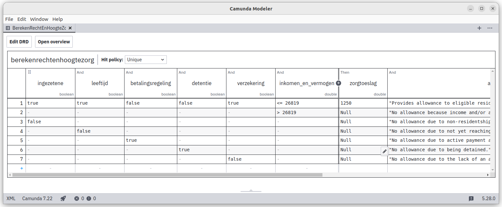
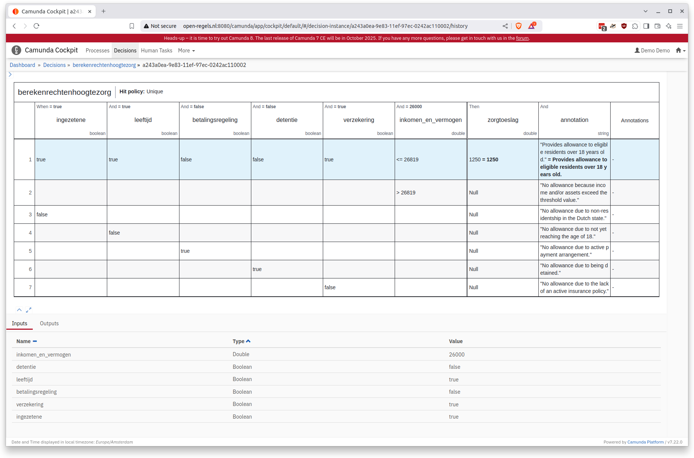

# Field Lab FDS - zorgtoeslag

Voor Field Lab FDS is een zorgtoeslag service beschikbaar gemaakt. Hier vind je een korte uitleg van wat er gemaakt is.

## CPSV-AP-RONL
Op basis van de ALEF rapportage van Dienst Toeslagen én de beschikbare gegevens van het [Besluit Zorgtoeslag](https://gegevensbijbesluiten.overheid.nl/besluit/61720422) is een [CPSV-AP-RONL metadata beschrijving](https://github.com/MinBZK/regels.overheid.nl/blob/main/apps/register/CPSV-AP-RONL/Zorgtoeslag/zorgtoeslag-CPSV-AP-RONL.ttl) gemaakt.

## DMN
Aan de hand van de metadata beschrijving is een eenvoudige [DMN](https://github.com/MinBZK/regels.overheid.nl/blob/main/apps/register/CPSV-AP-RONL/Zorgtoeslag/BerekenRechtEnHoogteZorg.dmn) tabel gemaakt en deployed in Camunda 7.22.



## Evaluate
De deployed DMN kan worden geëvalueerd met onderstaand POST  request (voorbeeld):
:::info
De service (non-SSL):  
http://open-regels.nl:8080/engine-rest/decision-definition/key/berekenrechtenhoogtezorg/evaluate  

De autorisatieheader vereist het Basic Auth Type met Username: demo en Password: demo
:::


```
{
    "variables": {
        "ingezetene_requirement": {
            "value": true,
            "type": "Boolean"
        },
        "leeftijd_requirement": {
            "value": true,
            "type": "Boolean"
        },
        "betalingsregeling_requirement": {
            "value": false,
            "type": "Boolean"
        },
        "detentie_requirement": {
            "value": false,
            "type": "Boolean"
        },
        "verzekering_requirement": {
            "value": true,
            "type": "Boolean"
        },
        "inkomen_en_vermogen_requirement": {
            "value": 26000,
            "type": "Double"
        }
    }
}
```
Voornoemde voorbeeld geeft deze respons:

```
[
    {
        "annotation": {
            "type": "String",
            "value": "Provides allowance to eligible residents over 18 years old.",
            "valueInfo": {}
        },
        "zorgtoeslag": {
            "type": "Double",
            "value": 1250.0,
            "valueInfo": {}
        }
    }
]
```

Een check in de Camunda Cockpit toont tenslotte de succesvolle hit.


