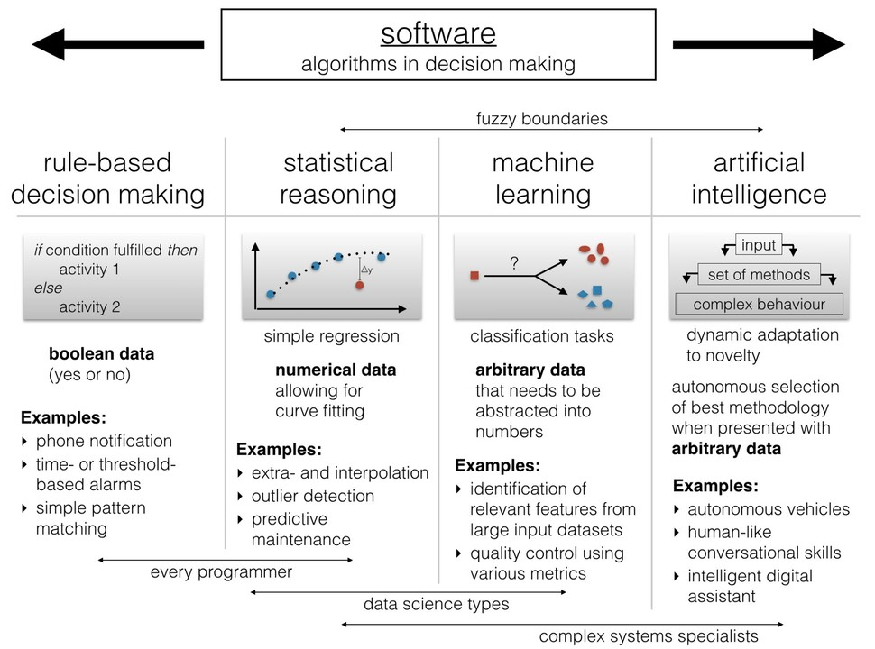

In deze stap worden de gegevens van de aanleverende partijen geanalyseerd, gestructureerd, aangevuld en/of gecorrigeerd waar nodig én gedocumenteerd.

## Organisatie

Van organisaties kennen we het [Register van Overheidsorganisaties](https://organisaties.overheid.nl/) en de [Centrale OIN Raadpleegvoorziening](https://portaal.digikoppeling.nl/registers/) van alle uitgegeven openbare Organisatie Identificatienummers (OIN). Organisaties die met of binnen de overheid digitaal informatie willen uitwisselen op basis van de Digikoppeling Standaard kunnen een OIN krijgen. Dit is een uniek identificerend nummer dat gebruikt wordt in de digitale communicatie en onder meer wordt opgenomen in PKIO-certificaten.

### OWMS

De [Overheid.nl Web Metadata Standaard (OWMS)](https://standaarden.overheid.nl/owms/terms) is de metadatastandaard voor informatie van de Nederlandse overheid op internet. OWMS bestaat uit afspraken over semantiek en syntax van:

- eigenschappen die overheidsinformatie beschrijven
- lijsten van waarden die deze eigenschappen kunnen hebben
- syntax van waarden die deze eigenschappen kunnen hebben

De status van de OWMS-standaard is: uitontwikkeld en zal geen nieuwe versie krijgen na 4.0. De OWMS-waardelijsten blijven nog geruime tijd ondersteund, dus gebruikers van OWMS 4.0 kunnen OWMS voorlopig blijven gebruiken. KOOP adviseert partijen die een nieuwe toepassing gaan realiseren of een bestaande toepassing gaan aanpassen om gebruik te maken van het kennismodel van TOOI.

### Thesaurus en Ontologie Overheidsinformatie (TOOI)

Status: TOOI is een standaard in ontwikkeling. De [documentatie van TOOI](https://tardis.overheid.nl/manual/Documentatie_TOOI.html) is beschikbaar ter inzage. Deze eerste versie van het model wordt momenteel binnen KOOP geïmplementeerd. Er wordt voorzien dat er komend jaar uitbreidingen zullen komen, zodat externe partijen TOOI ook kunnen gaan toepassen. De exacte versionering van TOOI en zijn onderdelen wordt op een later moment beschreven (Documentatieversie: 1.0.2, gepubliceerd op 16-mrt-2022).

De ervaringen en inzichten die zijn opgedaan met OWMS en de nieuwe ontwikkelingen in het linked datalandschap hebben geresulteerd in een nieuw model en een nieuwe URI-strategie. Daarom is gekozen voor een nieuwe naam, "TOOI", in plaats van een nieuwe versie van OWMS.

Het doel — een betere informatiehuishouding voor overheidsinformatie — wordt beter bereikt naarmate TOOI intensiever gebruikt wordt bij de vormgeving van overheidsinformatie. De basisregel daarbij is: gebruik waar mogelijk taalelementen van TOOI. Het een stap vooruit als in de metadata van het algoritmeregister TOOI-URIs worden gebruik om veldnamen en veldwaarden te benoemen. Het toepassen van TOOI is een specifiek geval van het toepassen van de algemene [FAIR-principes](https://www.go-fair.org/fair-principles/). Dat betekent dat ook het gebruik van andere kennismodellen in combinatie met TOOI de informatiehuishouding verder verbetert.

### Overheidsorganisaties en hun properties

De klasse `tooiont:Overheidsorganisatie` is gedefinieerd als een subklasse van `prov:Entity` en van `org:FormalOrganisation`. ORG is een ontologie voor het modelleren van organisaties en is een W3C-recommendation.

| Klasse | Subklasse van | Definitie | Toelichting |
| :----- | :------------ | :-------- | :---------- |
| `tooiont:Overheidsorganisatie` | `prov:Entity, org:FormalOrganisation` | Een organisatie die namens de overheid taken uitvoert en onder het gezag en toezicht van de overheid valt | Welke organisaties dat zijn hangt af van wetgeving en verandert daarom met de tijd.

### Toepassen

Voor het veld **Organisatie** hanteren we de OWMS-URIs. Die we (later?) vervangen door TOOI-URIs.

| Organisatie | Label | URI |
| :---------- | :---- | :-- | 
| UWV | Uitvoeringsinstituut Werknemersverzekeringen | [https://standaarden.overheid.nl/owms/terms/Uitvoeringsinstituut_Werknemersverzekeringen](http://standaarden.overheid.nl/owms/terms/Uitvoeringsinstituut_Werknemersverzekeringen) |
| Ministerie van Financiën | Ministerie van Financiën | [https://standaarden.overheid.nl/owms/terms/Ministerie_van_Financien](http://standaarden.overheid.nl/owms/terms/Ministerie_van_Financien) | MINFIN |
| Provincie Zuid-Holland | Zuid-Holland | [http://standaarden.overheid.nl/owms/terms/Zuid-Holland](http://standaarden.overheid.nl/owms/terms/Zuid-Holland) |
| Kadaster | Dienst voor het kadaster en de openbare registers | [https://standaarden.overheid.nl/owms/terms/Dienst_voor_het_kadaster_en_de_openbare_registers](https://standaarden.overheid.nl/owms/terms/Dienst_voor_het_kadaster_en_de_openbare_registers) |

## Naam

De **Naam** is een vrij veld van het type String dat uniciteit afdwingt op de gegevens die zijn ingevoerd. Het mag letters, cijfers, speciale symbolen, zoals % en #, en elk ander afdrukbaar teken bevatten. Maximale lengte: 80 tekens.

## Grondslag

Voor de **Grondslag** herleiden we de herkomst(en) uit één of meerdere van de volgende OWMS contenmodellen:
- [Basis Wetten Bestand](https://standaarden.overheid.nl/bwb)
- [Decentrale Regelgeving](https://standaarden.overheid.nl/cvdr)
- [Officiële publicaties](https://standaarden.overheid.nl/op)

### Basiswettenbestand (BWB)

Meer informatie over en documentatie van het BWB is [hier](https://www.overheid.nl/help/wet-en-regelgeving) te vinden.

In het onderdeel Wet- en regelgeving vindt u de verdragen, wetten, ministeriële regelingen, algemene maatregelen van bestuur en andere koninklijke besluiten, regelgeving van zelfstandige bestuursorganen (ZBO's) en de publiekrechtelijke bedrijfsorganisatie (PBO) en de wetten en regels die per 10-10-2010 van kracht zijn geworden voor de BES-eilanden (Bonaire, Sint Eustatius en Saba). Opgenomen zijn de geconsolideerde teksten zoals die op een zeker moment luiden; dat wil zeggen dat alle wijzigingen in de teksten zijn verwerkt. Daarbij wordt informatie geboden over wijzigingshistorie en publicatiebronnen.

BWB volgt voor identificatie van (onderdelen van) wet- en regelgeving de standaard [Juriconnect](https://standaarden.overheid.nl/juriconnect). Het BWB gebruikt Juriconnect versie 1.3.1.

### Centrale Voorziening Decentrale Regelgeving (CVDR)

Decentrale overheden zijn verplicht geconsolideerde teksten van hun algemeen verbindende voorschriften op het internet beschikbaar te stellen. Een geconsolideerde tekst is de tekst van de oorspronkelijke regeling waarin later vastgestelde wijzigingen zijn verwerkt.

Voor het beschikbaar stellen van die teksten is het gebruik van de Centrale Voorziening Decentrale Regelgeving (CVDR) voorgeschreven. Met die applicatie worden regelingen gepubliceerd op een speciale [lokale regelgeving website](https://lokaleregelgeving.overheid.nl/zoeken).

### Officiële publicaties (OP)

OP ("Officiële publicaties") is de XML-standaard om officiële publicaties rechtsgeldig op het internet te plaatsen. Deze XML-standaard wordt gebruikt voor het coderen van de bronbestanden van alle documenten op [officielebekendmakingen.nl](https://www.officielebekendmakingen.nl/). Ook [DROP](https://www.koopoverheid.nl/voor-overheden/gemeenten-provincies-en-waterschappen/drop) gebruikt OP.

:::info

Officiële publicaties is nog niet beschouwd op relevantie hieromtrent.

:::

### Toepassen

Voor de **Grondslag** hanteren we de link(s) mét citeertitel van het Basis Wetten Bestand en/of de directe link(s) van Decentrale Regelgeving.

| Organisatie | Naam | Grondslag |
| :---------- | :--- | :-------- |
| UWV | Klantapplicatie WW | [Hoofdstuk II Werkloosheidswet](https://wetten.overheid.nl/jci1.3:c:BWBR0004045&hoofdstuk=II&z=2022-08-02&g=2022-08-02) |
| Ministerie van Financiën | Berekenen huurtoeslag | [Wet op de huurtoeslag](https://wetten.overheid.nl/jci1.3:c:BWBR0008659&z=2023-01-01&g=2023-01-01) |
| Zuid-Holland | Webapplicatie Impactmonitor Brugopening | https://lokaleregelgeving.overheid.nl/CVDR431299 |
| Dienst voor het kadaster en de openbare registers | Akte AI | [artikel 3, eerste lid, van de Kadasterwet](http://wetten.overheid.nl/jci1.3:c:BWBR0004541&hoofdstuk=1&artikel=3&lid=1) |

## Type

Het veld **Type** mag niet leeg zijn en we hanteren de volgende waardenlijst:

- regelgebaseerd
- statistische redenering
- machine learning
- kunstmatige intelligentie

Bron: [Intelligent Things >> It's all about machine learning](https://www.linkedin.com/pulse/intelligent-things-its-all-machine-learning-roger-attick)

*Image Credit: Dr. Boris Adryan*

### Toepassen

| Naam | Type |
| :--- | :--- |
| Klantapplicatie WW | regelgebaseerd |
| Berekenen huurtoeslag | regelgebaseerd |
| Webapplicatie Impactmonitor Brugopening | statistische redenering |
| Akte AI | machine learning |

## Status

Het veld **Status** mag niet leeg zijn en we hanteren de volgende waardenlijst:

- in gebruik
- gestopt
- archief
- in ontwikkeling
- pilot

| Naam | Status |
| :--- | :--- |
| Klantapplicatie WW | in gebruik |
| Berekenen huurtoeslag | in gebruik |
| Webapplicatie Impactmonitor Brugopening | pilot |
| Akte AI | in gebruik |
