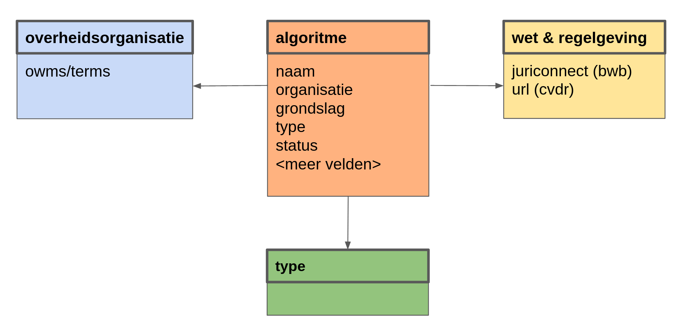

In deze stap maken we een vocabulaire dat de dataset beschrijft.

Het uitgangspunt voor deze stap is de documentatie van de database. Een deel van de documentatie wordt weergegeven in de onderstaande tabel. Dit geeft inzicht in de betekenis van de data en is uitgangspunt voor een conceptueel model van de data.

| Variabele/veld | Mogelijke waarden | Toelichting |
| :------------- | :---------------- | :---------- |
| **Organisatie** | [owms:Overheidsorganisatie](https://standaarden.overheid.nl/owms/terms/Overheidsorganisatie.html) | De volledige naam van de organisatie verantwoordelijk voor de inzet van het algoritme. |
| **Naam** | Vrij (met afgedwongen uniciteit) | De naam die gebruikt wordt om het algoritme aan te duiden. |
| **Grondslag** | Citeertitel o.b.v. [Juriconnect](https://standaarden.overheid.nl/juriconnect) en/of directe link naar https://lokaleregelgeving.overheid.nl/ | Een omschrijving van de wettelijke grondslag voor de inzet van het algoritme, of URL van het formele besluit. |
| **Type** | waardenlijst | Typering van het algoritme o.b.v. een wetenschappelijk onderbouwde onderverdeling. Bij twijfel geeft peer review de doorslag. |
| **Status** | waardenlijst | De status van het algoritme. Bijv. In ontwikkeling, in gebruik óf gestopt. |

Onderstaande figuur laat zien hoe dit gemodelleerd zou kunnen worden als een ontologie.

