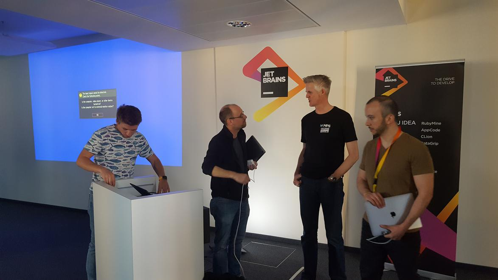

# Agile Law Execution Factory 

Agile Law Execution Factory (Alef): een fabriek waarmee software geautomatiseerd wordt gemaakt uit specificaties in RegelSpraak. Alef is gebaseerd op MPS van het Tsjechische bedrijf JetBrains, dat een heel scala aan innovatieve tools maakt, waaronder de zeer bekende Java-ontwikkelomgeving IntelliJ. 

## Features ALEF

### Modelleren
- Objectmodel met Objecttypen, feittypen, attributen en ‘kenmerken’
- Meervoudige instanties bij objecttypen
- Dimensies, domeinen en eenheden

### Specificeren
- Regels en Beslistabellen
- Parametersets
- ‘Flow’ (container voor declaratieve regelgroepen)
- Niet-declaratieve flow

### Errorchecking

### Testen op verschillende niveaus:
- Individuele regels
- Individuele regelgroepen
- Alle regels die attribuut X bepalen
- Alle regels in regelgroep A die attribuut X bepalen
- Flows
- Service

### Configureren
- Mappings
- In- en uitvoerberichten
- SOAP-service
  - met wsdl + xsd OF
  - met wsdl + name-value pairs
- Transparantie service 

### Bouwen, testen en deployen projecten via pipeline (Jenkins, Jmeter)

### Beheerfunctionaliteit
- Git(hub) integratie e.a.
- Full text search
- Hiërarchische structuur
- Tags voor labelen specificaties

### Rapportagemogelijkheden
- Excel
- HTML
- Testdekkingsrapportage

### Hergebruik modellen en specificaties middels plugins

##MDSE

In het competence centre model driven software engineering (MDSE) van de Belastingdienst komt alle technische kennis samen die nodig is om op basis van Jetbrains Meta Programming Systems (MPS) te bouwen aan ALEF. Kijk ook op <a href="https://werken.belastingdienst.nl" target="_blank">werken.belastingdienst.nl</a>

