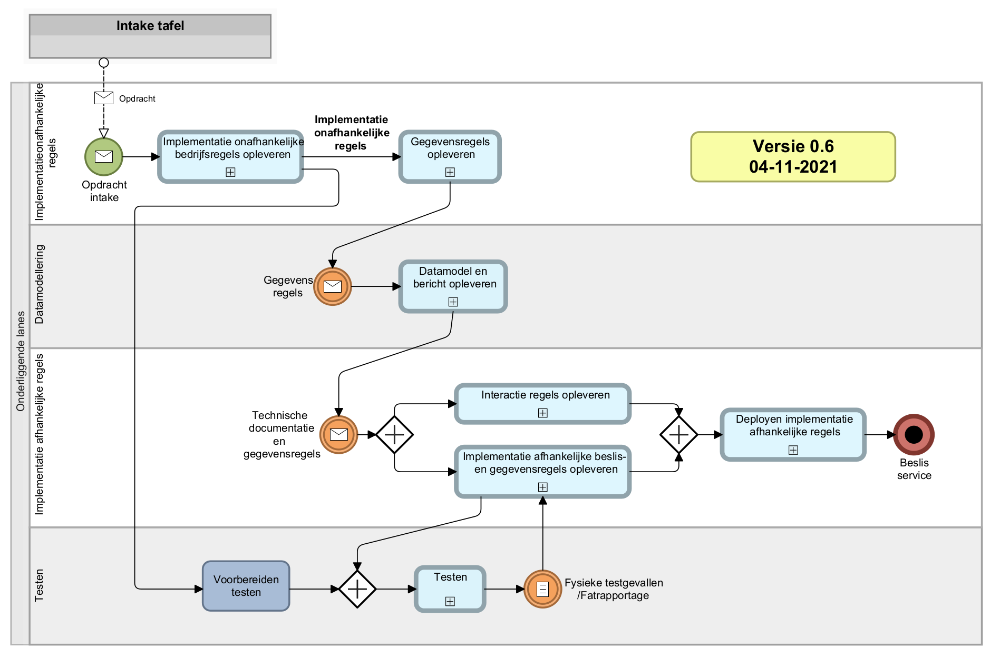
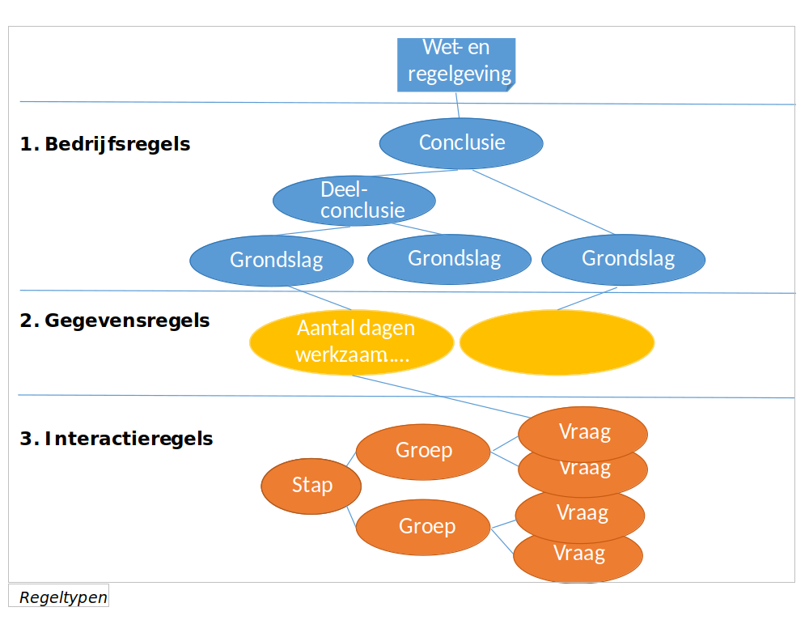

RuleSpeak® is een verzameling richtlijnen voor het formuleren van bedrijfsregels op een bedrijfsvriendelijke en precieze manier. Het is geen taal of syntax maar eerder een verzameling voorschriften voor Nederlandstalige formulering van bedrijfsregels gebaseerd op ervaringen in de praktijk.

Bedoeling:
- Het vergroten van de helderheid en consistentie in het communiceren van regels tussen mensen uit de bedrijfspraktijk of als eisen (requirements) voor de ontwikkeling van IT systemen.
- Het effectief verkrijgen, verwoorden en behouden van bedrijfskennis en criteria om beslissingen te nemen.

## UWV

Binnen het Uitvoeringsinstituut Werknemersverzekeringen (UWV) gebruikt men het onderstaande hoofdproces.

## Regels
We hebben het tot nu toe over bedrijfsregels, maar er spelen ook andere typen regels een rol in het BRM-voortbrengingsproces. Basis voor verdere implementatie is een gevalideerde set implementatie-onafhankelijke bedrijfsregels die zijn opgesteld volgens de UWV conventies, die zijn gebaseerd op RuleSpeak©.
De bedrijfsregels zijn gebaseerd op enerzijds de wet- en regelgeving en ‘officieel’ (gepubliceerd) beleid en anderzijds op ‘intern’ UWV-uitvoeringsbeleid. De bedrijfsregels geven aan hoe UWV deze wet- en regelgeving en beleid gaat uitvoeren. Bijvoorbeeld hoe de hoogte van een uitkering berekend moet worden voor een klant.

### Bedrijfsregels
De bedrijfsregellaag bevat de regels die worden gemaakt op basis van de juridische bronnen zoals wet- en regelgeving en (intern) beleid. De bedrijfsregels bevatten regels die leiden tot de conclusies. Deze conclusies kunnen bijvoorbeeld bij een aanvraag voor een uitkering de volgende zijn: recht, duur en hoogte. De conclusies kennen een decompositie van deelconclusie (bijvoorbeeld “is de klant uitgesloten voor recht”) tot aan het kleinste element, de grondslag (bijvoorbeeld “SV loon”).
In veel aanvragen worden gegevens gevraagd die nodig zijn voor de afhandeling van de aanvraag maar niet voor het bepalen van recht, duur of hoogte van de uitkering. Bijvoorbeeld contactgegevens van de klant, om brieven te kunnen versturen. We willen dit soort gegevens alleen uitvragen bij een aanvraag. Een recht/hoogte/duur-bepaling willen we ook kunnen hergebruiken in andere situaties, bijvoorbeeld als een medewerker wat moet narekenen. Daarom is er voor gekozen om procesgegevens als aparte regelset/conclusie te beheren. Deze regelset zul je dus ook vaak tegenkomen, we spreken dan van RDHP (Recht, Duur, Hoogte & Procesgegevens).
 
### Gegevensregels  
In de gegevensregels worden de grondslagen gekoppeld aan de attributen in de systemen van UWV op basis van het canonieke gegevens model van UWV (CGM). Dit wordt bewust in aparte regels gedaan. Op deze manier kan in de bedrijfsregels de juridische taal zo dicht mogelijk gevolgd worden, om het schrijven en valideren van de regels zo goed mogelijk te kunnen doen. De grondslagen uit deze regels, bv het “SV loon” moeten echten natuurlijk wel ergens vandaan komen. Bijvoorbeeld aan een klant uitgevraagd worden, of bij een bronsysteem worden opgehaald. Voor al deze gegevens is binnen het CGM vastgelegd hoe we deze moeten noemen, zodat alle systemen binnen UWV dezelfde gegevenstaal spreken. In de gegevensregel gaan we dus van de juridische term (die vaak anders is per regeling), naar de generiek gemaakte CGM-term. 

### Interactieregels
Als er in de gegevens dingen tussen zitten die bij de klant moeten worden uitgevraagd, of brongegevens die door de klant moeten worden gecontroleerd, schrijven we hierover interactieregels. De interactieregels bevatten alle regels om een dynamisch dialoog te realiseren met de klant, waarin alle benodigde gegevens worden uitgevraagd. Om de klant voor zijn beleving een logische set met vragen aan te bieden is sturing nodig op bijvoorbeeld de volgorde en groepering van de vragen. Ook zorgt de dynamische dialoog ervoor dat er geen overbodige vragen worden gesteld. Daarnaast bevatten de interactieregels logische en semantische validatie.

### Andere type regels
Bovengenoemde regeltypen worden onderscheiden in het BRM-proces ‘van wet naar loket’ en het ontwikkelen van een dynamische dialoog. Het zijn niet de enige type regels die we onderkennen. Zo kennen we bijvoorbeeld ook procesregels: regels die voor iedere casus bepalen welke activiteiten in een proces uitgevoerd moeten worden en die zo de processtroom bepalen per individuele instantie van een proces. Procesapplicaties worden ontwikkeld op basis van BAW (Business Automation Workflow), het BPMS van IBM. De simpele redenering: procesregels in BAW, beslisregels in ODM gaat niet op. BAW biedt beperkte functionaliteit voor regels/beslissingen. De richtlijn wanneer een beslissing met BAW functionaliteit opgelost kan worden en wanneer daarvoor ODM ingezet zou moeten worden is als een beslisboom geformuleerd in het document ‘Regels in BAW of ODM’ (Welk type regels worden geïmplementeerd met ODM en welke met BAW). Deze richtlijn is het kader van de proeftuin BAW opgesteld en wordt beheerd door de Expertgroep BRM.

