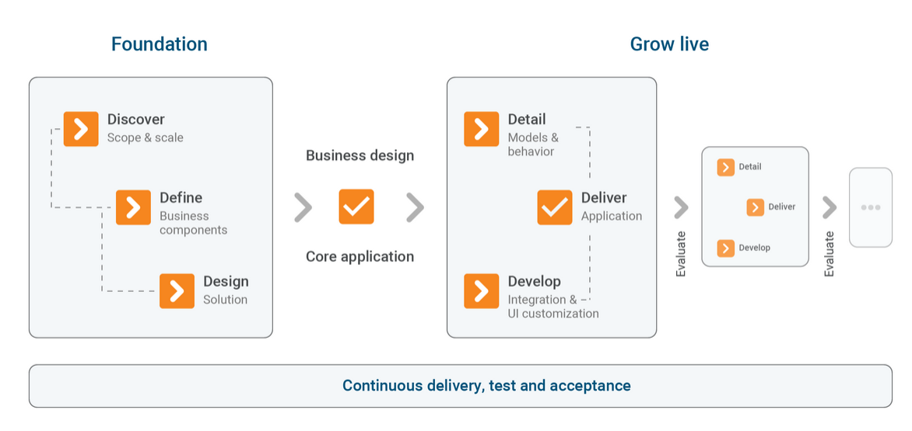

## Modelgebaseerd intelligent automatiseringsplatform

Be Informed is in 2006 opgericht om tegemoet te komen aan de toenemende behoefte van organisaties om complex, kennisintensief werk te automatiseren. Het resultaat is ons modelgebaseerde intelligente automatiseringsplatform. Modellen stellen mensen in staat zich te concentreren op het vastleggen van de bedrijfsregels vanuit relevante gezichtspunten, zijn begrijpelijk, verklaarbaar en gemakkelijk te ontwerpen.

Wij geloven dat intelligente automatisering u in staat stelt nieuwe waarde te creëren met behulp van bestaande middelen.

## Hoe doen we dat?

De uitdaging bij het automatiseren van kenniswerk is dat de kennis vaak wordt verzameld in de hoofden van mensen, en niet in hun systemen. Om complexe kennisautomatisering te ondersteunen en mogelijk te maken, heeft het platform de volgende kenmerken:

## Contextgedreven en doelgerichte besluitvorming

Het Be Informed-platform maakt gebruik van declaratieve modellen en geavanceerde doelgerichte, achterwaarts gekoppelde gevolgtrekkingen om beslissingen te automatiseren, besluitvormers te ondersteunen en contextuele processen te genereren volgens de regels die specifiek zijn voor de situatie. Door de regels en beperkingen van het proces te beschrijven, en niet het proces zelf, maken we het mogelijk duizenden regels op te nemen, terwijl het toch begrijpelijk en gemakkelijk aanpasbaar blijft.

De manier waarop ons platform functioneert, is vergelijkbaar met een satellietnavigatiesysteem. Op basis van een vooraf gedefinieerde bestemming wordt de optimale route voortdurend herberekend op basis van het concept van backward chaining.

**Het resultaat:** onze software biedt een realtime, contextbewust procesafhandelingsplatform met een gepersonaliseerde, klantgerichte gebruikerservaring.

## Directe modelgedreven ontwikkeling

Het Be Informed-platform is een direct modelgestuurd automatiseringsplatform. Onze modellen (en de processen die ze vertegenwoordigen) zijn direct bruikbaar, zonder extra programmering of conversie naar code. Bedrijfsregels worden semantisch vastgelegd en gemodelleerd en kunnen op elk moment worden getest en aangepast.

**Het resultaat:** het is onafhankelijk bewezen dat onze ontwikkeling drie tot tien keer sneller en minder arbeidsintensief is dan traditionele benaderingen. Door gebruik te maken van de directe modelgestuurde methodologie produceert u applicaties die sneller, modulair en met minder technische schulden zijn. Het is eigenlijk net zo simpel als dat. Bij de vertaling gaat niets verloren. U heeft de controle over de modellen die u maakt en implementeert.

## Eén bedrijfstaal

De bestaande bedrijfstaal van een klant wordt gebruikt bij het beschrijven en modelleren van de producten, diensten, processen en beleid van het kennisproces dat u wilt automatiseren.

**Het resultaat:** De kennis van experts wordt actief betrokken en toch herkenbaar, waardoor duidelijkheid, compliant handelen en het vergroten van eigenaarschap ontstaat.

## Eén open platform

Vanwege bestaande systemen en IT-landschappen is integratie van cruciaal belang. Daarom gebruiken we een solide open integratieplatform om ervoor te zorgen dat alle relevante of gewenste (externe) relaties, afhankelijkheden en resultaten binnen onze modellen worden vastgelegd. Het platform verbindt, omhult en orkestreert zo het volledige end-to-end bedrijfsproces, waarbij rekening wordt gehouden met elke stap, rol en systeem.

**Het resultaat:** een platform met een hoge schaalbaarheid dat in staat is om alle niveaus van complexiteit aan te kunnen, terwijl het gebruik maakt van de bestaande IT-infrastructuur en toekomstige innovaties verwelkomt.

## Contact
Voor meer informatie over de regelservices van Blueriq op regels.overheid.nl, neem contact op met: g.rensen@beinformed.com of +31 (0)6 52343919
