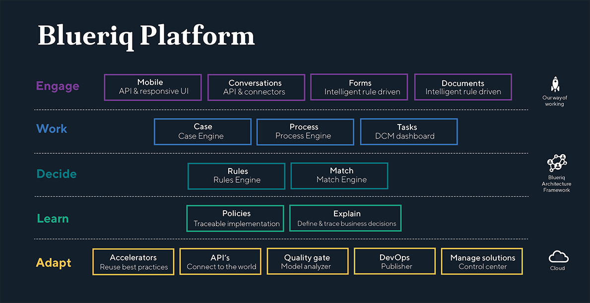

In een wereld waar klantervaringen centraal staan en wet- en regelgeving dagelijks kunnen veranderen, worden organisaties dagelijks geconfronteerd met technologische uitdagingen. Het Blueriq Platform stelt organisaties in staat hun processen hierbij te laten aansluiten en zet deze uitdagingen om in een kracht. Het Blueriq platform is een regelgedreven software platform ontworpen voor dynamische, zakelijke oplossingen voor organisaties met kennisintensieve processen. Het stelt jou en je organisatie in staat snel en kosteneffectief te reageren op veranderende omstandigheden en regelgevingen zodat je een persoonlijke en efficiënte dienstverlening kunt bieden aan iedere klant.

## Van model naar applicatie
Het Blueriq Platform stelt gebruikers in staat oplossingen te modelleren. Hiermee zet de gebruiker (Business Engineer) de taal van de business om in modellen. In het model zit alle proces en beleidskennis, betekenis en logica. Alle lagen van het Blueriq Platform maken gebruiken van dezelfde modellen. Zo werkt een organisatie die Blueriq gebruikt altijd vanuit één waarheid. De kracht van modelleren ligt in het beheersbaar maken van complexiteit door data, beleid, wetten en regels op leesbare wijze te vertalen naar een oplossing en de mogelijkheid om het model te executeren als applicatie.

## Alle lagen van het platform
Het Blueriq Platform is opgebouwd uit 5 verschillende bouwblokken, waarmee organisaties hun digitale kracht verder kunnen versterken: Engage, Work, Decide, Learn en Adapt. Ieder bouwblok heeft unieke eigenschappen om het verschil te maken, maar de combinatie van verschillende lagen geeft organisaties de kracht hun processen anders vorm te geven.

### Engage
Engage geeft organisaties de kracht om de interactie met klanten, burgers, partners en medewerkers op een slimme manier vorm te geven. Het Blueriq Platform helpt hierbij door alle gangbare interactie mogelijk te maken. Onafhankelijk van de vorm van interactie die is gekozen door de klant of medewerker, geeft Blueriq altijd een eenduidig gepersonaliseerd antwoord op basis van de bekende gegevens. Wij noemen dit werken vanuit één waarheid waarbij er rekening gehouden wordt met (wettelijke) kaders. Deze vorm van intelligente interactie zet klanten, burgers en medewerkers in hun kracht door alleen maar te tonen of te vragen wat relevant is.

#### Forms
Met Blueriq Forms creëer je intelligente formulieren. Vergeet formulieren met honderd vragen die niet relevant zijn. Alleen wat nodig en relevant is op dit moment in het proces is zichtbaar voor de gebruiker. Dit doet het Blueriq Platform door gebruik te maken van de informatie die al bekend is van de gebruiker en zijn vraag. Deze formulieren werken niet alleen prettiger voor de gebruiker, maar ook voor de medewerker. Er vindt een snelle validatie plaats en het is snel duidelijk wat de volgende stap is voor de klant.

### Work
Work zorgt voor de uitvoering van het proces in dienst van de medewerker of klant. Alleen de activiteiten die nodig zijn worden uitgevoerd en er zijn geen overbodige handelingen nodig door de slimme samenwerking tussen geautomatiseerde kennistaken en taken voor medewerkers of klanten. De vraag van de klant staat centraal in een zaak. Deze zaak geeft een relevante compositie van alle beschikbare gegevens binnen de organisatie en stelt een dashboard beschikbaar voor alle betrokkenen. Iedere betrokkene ziet hier alleen de informatie die voor hem relevant is op dat moment. De medewerker kan vanuit het dashboard taken starten en gemakkelijk het verloop van de zaak volgen. Zo werkt iedereen vanuit één centrale waarheid.

#### Process Engine
De Proces Engine is de motor van alle Blueriq processen. Deze engine wordt gevoed door regels en acties, en executeert op basis hiervan taken. Wanneer de situatie complex is en taak orchestratie belangrijk is, komt de Proces Engine het best tot zijn recht.

#### Case Engine
In tegenstelling tot de Proces Engine, executeert de Case Engine acties op basis van de op dat moment aanwezige informatie in de case. Door het toepassen van de regels wordt bepaald welke handelingen op elk moment door het systeem of door de gebruikers kunnen of moeten worden uitgevoerd. Dit maakt de Case Engine perfect voor ieder zaaksysteem.
        ◦ 
### Decide
Decide is de plek waar geautomatiseerde beslissingen worden genomen of beslis ondersteunende informatie wordt teruggegeven aan medewerker. Bedrijfskennis en –regels bevinden zich vaak op papier of in de hoofden van kenniswerkers. De Decide laag van het Blueriq Platform maakt het mogelijk deze kennis leesbaar en onderhoudbaar vast te leggen als basis voor de verdere automatisering van bijvoorbeeld een proces. Naarmate de (wettelijke) veranderlijkheid en/of complexiteit van deze bedrijfskennis toeneemt, komt de waarde van kennis gemodelleerd in Blueriq meer tot zijn recht. Om de geautomatiseerde beslissingen in het landschap beschikbaar te stellen, kunnen deze ontsloten worden via een API.

#### Transparantie
Het vastleggen van kennis in leesbare modellen maakt het proces en de besluiten die hierin worden genomen transparanter en inzichtelijker.

#### Vertrouwen in beslissingen
Door het transparante proces en besluitvorming, is het vertrouwen in geautomatiseerde processen groter.

#### Ondersteuning van de medewerker
Blueriq matcht de beschikbare informatie met mogelijke oplossingen, om zo de medewerker te ondersteunen met het maken van de juiste beslissing.

### Learn
De Learn laag maakt het mogelijk te leren van geautomatiseerde regels door deze te traceren en om te zetten naar kansen en punten van verbetering. Veel regels komen voort uit wetgeving of productbeleid. Door expliciet aan te geven wat de bron is van deze geautomatiseerde regels, is traceerbaar hoe de doorvertaling van beleid naar implementatie is gemaakt. Deze basis kan gebruikt worden om te leren waar de inconsistenties en kansen zitten om vervolgens effectiever wijzigingen op door te kunnen voeren in de oplossing.
Het zichtbaar maken van het gebruik van beleidsregels, maakt duidelijk welke regels er zijn, hoe ze gebruikt worden en of het goed is dat ze worden aangeroepen. Explain maakt dit mogelijk. Met Policies (zie afbeelding) kan ook de bron van de regels of het beleid worden vastgelegd, voor het traceerbaar maken van de doorvertaling van regels naar implementatie. Door de combinatie van deze factoren heeft iedere organisatie de juiste handvatten om hun eigen processen te verbeteren ten behoeve van de dienstverlening.

### Adapt
De Adapt laag van het Blueriq platform geeft organisaties de mogelijkheid om wendbaar te zijn. Met Blueriq kunnen organisaties snel reageren wanneer daarom gevraagd wordt, op basis van kwalitatief krachtige versnellers. De manier waarop Blueriq neergezet wordt, maakt het ook mogelijk een heldere scheiding te maken in verantwoordelijkheden. Hiermee kan er voor ieder component een eigen levenscyclus gemaakt worden. Ook zorgt Adapt voor de koppeling met andere systemen en de overdracht van gegevens.
De volgende componenten zijn onderdeel van Adapt:

#### Blueriq Publisher
Blueriq Publisher helpt om op de distributie van applicaties in omgevingen te vereenvoudigen.

#### Blueriq Model Analyzer
Blueriq Model Analyzer zorgt voor een objectieve beoordeling van de kwaliteit van Blueriq modellen. Modellen kunnen worden geanalyseerd en gecontroleerd op fouten die zorgen voor slecht onderhoudbare en gevoelige modellen.

#### Blueriq Control Center
Organisaties die Blueriq gebruiken voor grotere of meerdere applicaties hebben vaak slecht zicht op het gebruik van herbruikbare componenten. Het Blueriq Control Center helpt je hierbij en lokaliseert o.a. hergebruikte elementen en importeert meerdere libraries in verschillende projecten in een actie.

## Dynamic Case Management 
Om een ideale klantreis te bieden, gebruikt Blueriq Dynamic Case Management (DCM) en staat een zaak centraal. Waar gebruikersinteractie bepaalt wat er binnen een taak van zo’n klantreis gebeurt bepaalt DCM wie als volgende aanzet is of zijn en hoe de klantreis verder afgehandeld kan warden. Kenmerkend aan DCM is dat het verloop, in tegenstelling tot Business Process Management (BPM), **geheel regelgedreven** is. Alleen stappen die 
in het specifieke geval van de klant relevant zijn, worden op het juiste moment verplicht óf optioneel uitvoerbaar voor de kenniswerker of de klant. Zo worden processen, autorisaties en tijdslijnen streng bewaakt maar wordt tegelijk ook maximale flexibiliteit geboden. Alle procesvarianten passen binnen een model, van volledig automatische processen (STP Straight Through Processing) tot meer handmatige afhandeling wanneer het verloop onvoorspelbaar is. Of wanneer de situatie zodanig complex is dat deze door een expert beoordeeld moet worden. 

## Decision Management 
In ieder proces worden **talloze beslissingen** genomen. Dit kunnen formele beslissingen zijn, zoals de vraag of een bepaalde subsidie verstrekt mag worden. Maar ook alle eenvoudige vragen die nodig zijn om de zaak af te handelen; Hoe wordt de aanvraagdatum bepaald, welke termijn is van toepassing etc. Deze beslissingen kennen vaak een relatie met wet- en regelgeving, beleidsdocumenten of ontwerpbeslissingen. Doordat beslsissingen in Blueriq als business rules gemodelleerd worden, bijvoorbeeld in overzichtelijke beslistabellen, wordt dit expliciet gemaakt. 
Afhankelijkheden tussen regels en gegevens kunnen makkelijk in kaart gebracht worden met een **Decision Requirement Graph (DRG)**. Zo’n DRG toont de regels en gegevens die gebruikt worden om een afgeleid gegeven (c.q. een beslissing) te bepalen. Deze DRG kent Blueriq voor zowel het model van alle mogelijke paden naar een beslissing als in de oplossing voor een individueel genomen besluit.

## Drie keer Blueriq 
Met Blueriq bedoelen we niet aIleen ons bedrijf en het platform, maar ook de expertise van gecertificeerde specialisten die werken volgens een bepaalde aanpak.

Het platform Blueriq is erop gericht om onnodige vertaalslagen en overdrachtsmomenten te elimineren, zodat de specialist die de oplossing realiseert ook echt inhoudelijk betrokken is bij de klant en het gewenste bedrijfsproces. Het specialisme om met Blueriq te modelleren en te werken volgens die succesvolle aanpak is bij de Blueriq Academy te leren in specifieke opleidingen. De drie-eenheid aanpak, specialisten en ons unieke platform maakt onze dienstverlening compleet.

## Beheerbaar Blueriq
Blueriq biedt uitgebreide functionaliteit om oplossingen te beheren. Dit begint met het integrale versiebeheer, dat modelleurs in staat stelt om te werken met een eigen kopie van een bepaalde versie van een oplossing. Dit maakt het mogelijk om teams zelfstandig en onafhankelijk van elkaar te laten werken aan verschillende releases of features. Met de publisher kan een model 'doorgezet' worden van een Ontwikkelomgeving naar een Test-, Acceptatie- en Productieomgeving of andere aanvullende omgevingen. Zo is altijd helder welke modellen op welke omgeving aanwezig zijn. De Blueriq Runtime is ook in staat om meerdere versies van een oplossing gelijktijdig te draaien, of op een ontwikkelomgeving wijzigingen direct live te zien. Het bewaken van de kwaliteit van modellen wordt in Blueriq mogelijk gemaakt door model unit tests en de Blueriq Model Analyzer.

## Contact
Voor meer informatie over de regelservices van Blueriq op regels.overheid.nl, neem contact op met: r.frankena@blueriq.com of +31 (0)6 26358741