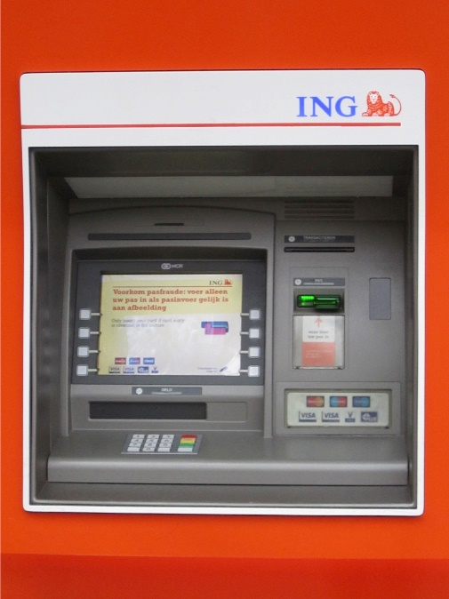
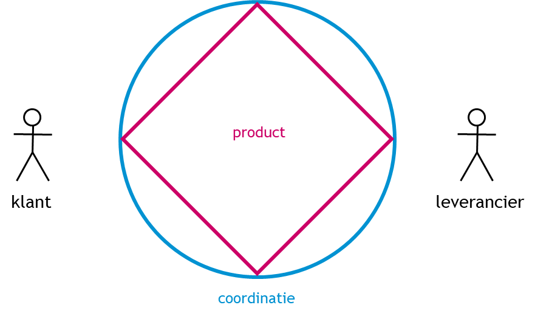
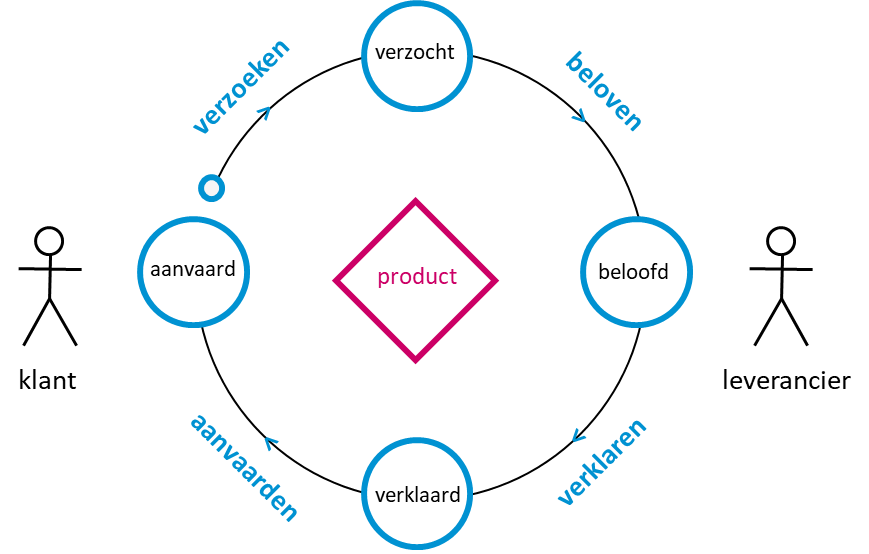
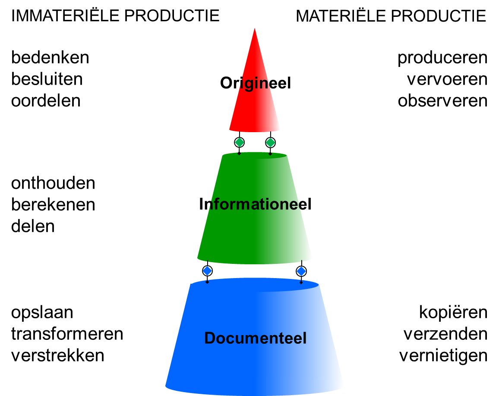
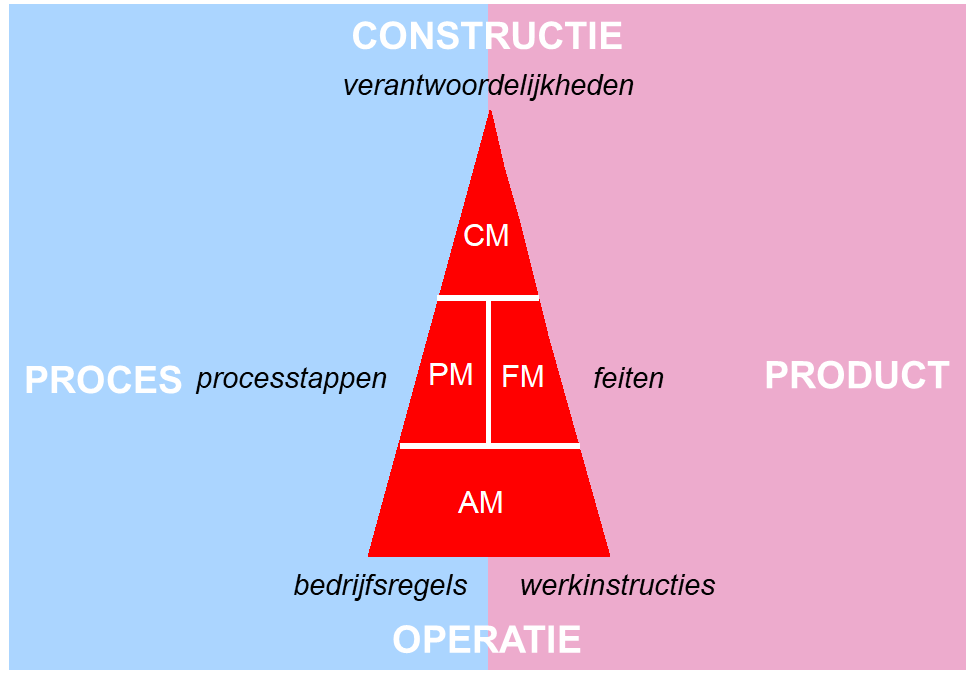

# Inleiding
DEMO (Design and Engineering Methodology for Organizations) is een methode voor het analyseren en (her)ontwerpen van organisaties, waarbij het menselijk handelen centraal staat. DEMO focust zich op de essentie van een organisatie – WAT de organisatie doet – en abstraheert van implementatie – HOE een organisatie dat doet. Een DEMO model beschrijft een samenwerkingsverband binnen een organisatie of over organisaties heen. Een DEMO model vormt een consistent geheel van producten, verantwoordelijkheden, processen, informatie en bedrijfsregels.

# Achtergrond
DEMO is ontstaan vanuit de wetenschap (Universiteit van Maastricht, TU Delft) en bouwt voort op diverse theorieën waaronder systeemtheorie (Simon, 1962), taalfilosofie (Austin, 1962 en Searle, 1968), communicatieve actie (Habermas, 1986), gegevensmodelleren (Nijsen en Halpin, 1989) en ontologieën (Guizzardi, 2005). In samenwerking met universiteiten in o.a. Antwerpen (België), Duisburg (Duitsland), Bolzano (Italië), Luxemburg, Wenen (Oostenrijk), Lissabon en Madeira (Portugal), Praag (Tsjechië), St. Gallen (Zwitserland), San Jose (USA) en Tokyo (Japan), is in 2020 DEMO-4 uitgebracht. DEMO is onder beheer van het [Enterprise Engineering Institute](https://ee-institute.org/).

# Belangrijkste concepten
DEMO beschrijft de constructie van een organisatie, geabstraheerd van de implementatie. Het model is dus onafhankelijk van hoe iets gebeurt en beschrijft slechts wat er gebeurt of moet gebeuren. Het kernconcept in de constructie van een organisatie is de transactie, die een vast patroon volgt. 

## Abstractie van implementatie
Balie | Geldautomaat 
:-------------------------:|:-------------------------:
 | 

Links en rechts zie je twee implementatie van de transactie ‘opnemen van (cash) geld’. Je kan hiervoor een medewerker spreken, of je kan dit via een automaat doen. Wat de twee implementatie gemeen hebben – de essentie – is dat er een vorm van autorisatie bij komt kijken, er gecontroleerd moet worden of het geld wel beschikbaar is, en, uiteindelijk, dat het saldo op de betreffende bankrekening wordt bijgewerkt.
Door te abstraheren van implementatie, wordt het mogelijk na te denken over significant andere implementaties, in plaats van dat de huidige implementatie verder wordt geoptimaliseerd. Bovendien is de achterliggende essentie relatief stabiel – een bank blijft een bank – en biedt daarmee een goed startpunt voor het ontwerpen van ondersteunende ICT-systemen.

## Transactie
In een organisatie vinden twee soorten activiteiten plaats. Allereerst produceren mensen dingen. Daarvoor of daaromheen is communicatie, of coordinatie, nodig. Coordinatie en productie gaan dus hand-in-hand. Gezamenlijk heet dat een transactie. Bij een transactie zijn altijd twee personen betrokken: de klant, of initiator, en de leverancier, of uitvoerder.

Transacties kunnen worden geplaatst in een boomstructuur, die gezamenlijk een bedrijfsproces vormen.

## Transactiepatroon
Een transactie doorloopt een standaardpatroon dat uit 3 fasen bestaat:

1. In de bestelfase bespreken de klant en leverancier het product dat geleverd moet worden (door de leverancier). Details die besproken kunnen worden zijn fysieke eigenschappen (hoe groot, hoe veel, …) maar ook de levertijd, betalingsvoorwaarden, etc. Het ‘proces’ start met een klant die een verzoek doet, en eindigt met een leverancier die een belofte doet.
2. In de productiefase creëert de leverancier het product.
3. In de resultaatfase verklaart de leverancier dat hij zijn werk gedaan heeft. Dit is nodig omdat niet altijd zichtbaar is voor de klant dat de leverancier zijn werk heeft gedaan. Indien het geleverde product afwijkt van het product zoals bepaald in de bestelfase, kan een nadere conversatie nodig zijn over of het product opnieuw moet worden gemaakt, of dat de klant korting krijgt, of… Deze fase eindigt met een aanvaarding van het product door de klant.

## Focus op originele transacties
DEMO onderkent 3 soorten transacties: originele (rood), informationele (groen) en documentele (groen). Informationele en documentele transacties zijn typisch ondersteunend aan originele transacties. Door de focus te leggen op originele transacties, wordt een verdere vereenvoudiging bereikt.

## Modellen
Een DEMO model wordt uitgedrukt in een samenhangend geheel van transactiesoorten (product + verantwoordelijke rol), processtappen, informatie (feiten) en bedrijfsregels. Het bevat meerdere diagrammen en tabellen om inzichten te verschaffen vanuit verschillende perspectieven, gebaseerd op een achterliggend model. Een overzicht van tools om DEMO modellen mee te maken is te vinden op https://ee-institute.org/tooling/.

## Toepassingen
DEMO is o.a. toegepast bij KLM/Air France Cargo, de Nationale Politie, Rijkswaterstaat, ING, en in de bouwsector ([VISI-standaard](https://www.forumstandaardisatie.nl/open-standaarden/visi)); Enerzijds als gemeenschappelijk kader voor het (her)ontwerp, splitsen en samenvoegen van organisaties en verantwoordelijkheden, anderzijds als instrument voor het rationaliseren of ontwerpen van applicatielandschappen en zelfs voor het volledig genereren van software.

## Meer informatie
Het boek ‘[Begrijpen en Maken van Essentiele Modellen](https://ee-institute.org/demo/werken-met-demo/)’ biedt een Nederlandse en praktische introductie in DEMO (tevens beschikbaar in het Engelse). [Marien Krouwel](https://www.linkedin.com/in/marienkrouwel/recent-activity/articles/) publiceert regelmatig blogs en (wetenschappelijke) artikelen over of gerelateerd aan DEMO.