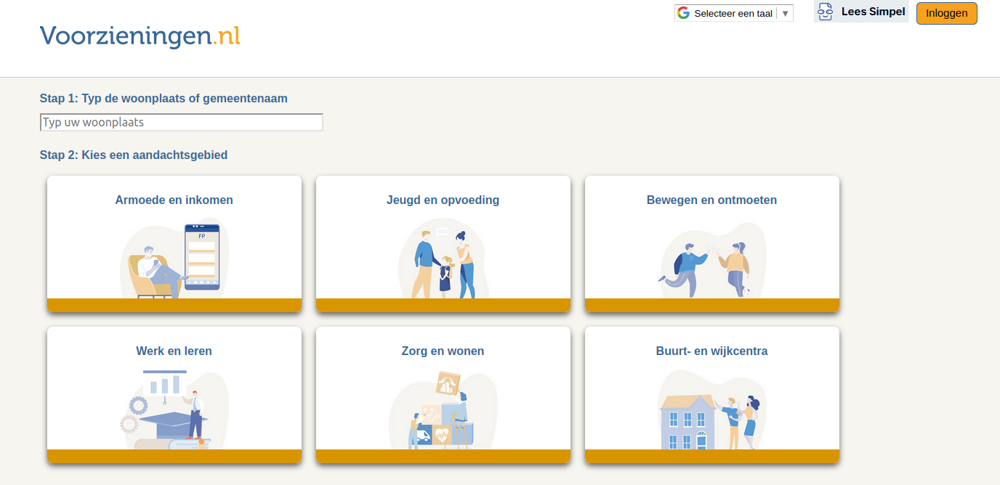

# Wat is het
[Voorzieningen.nl](https://voorzieningen.nl/) is brede sociale kaart waarin informatie staat van organisaties die zich richten op hulp en advies voor mensen met armoede en eenzaamheid. Voorzieningen.nl heeft tot doel die informatie snel en makkelijk toegankelijk de maken voor hulpverleners en hun cliënten. Voorzieningen zijn ook zorg, leren, trainen, werk en gezondheid.
Voor iedere gemeente in Nederland is een passende sociale kaart.
In een overzichtelijk menu kan gezocht worden naar best passende voorzieningen, per onderwerp, gemeente, doelgroep of leeftijdscategorie.

# Voor wie is het
Voorzieningen.nl zal vooral gebruikt worden door hulpverleners of verwijzers. 
Iedereen die informatie zoekt via internet of de App FP kan er gebruik van maken. 
Iedere organisatie is vrij om op de eigen website een link aan te brengen naar Voorzieningen.nl of Voorzieningen.nl/[Gemeentenaam]. 

# Wie beheert het
Voorzieningen.nl  wordt beheerd door vrijwilligers van de stichting Financieel Paspoort, of door medewerkers van de organisaties.
De informatie in Voorzieningen.nl is in de meeste gevallen overgenomen vanaf de websites van de betreffende organisatie, of van andere openbare bronnen. 
Organisaties ontvangen twee keer per jaar een mail met het verzoek om de gegevens te controleren en aan te passen, of wijzigingen door te geven.
Iedere organisatie kan een inlogaccount krijgen om de eigen gegevens aan te passen en aan te vullen. 

# Wat kost het
Alle informatie in Voorzieningen.nl is door iedereen vrij en kosteloos te gebruiken.
Vrijwilligersorganisaties die passen in de doelstelling worden kosteloos opgenomen.
Voor het invoeren en beheren van gegevens van professionele hulp- of zorgorganisaties wordt een kleine vergoeding in rekening gebracht.
Informatie uit Voorzieningen.nl wordt nooit (tegen betaling) op een andere manier verstrekt aan andere organisaties of partijen.

# Waar is de informatie te van Voorzieningen.nl vinden
In eerste instantie op de website Voorzieningen.nl .
In de App Financieel Paspoort is Voorzieningen.nl  ook opgenomen om mensen snel te helpen naar de best passende voorziening.
Van oorsprong is Voorzieningen.nl de [Digitale-Sociale-Kaart.nl](https://www.digitale-sociale-kaart.nl/).
Voor specifieke doelgroepen is en worden ook specifieke sociale kaarten ingericht.