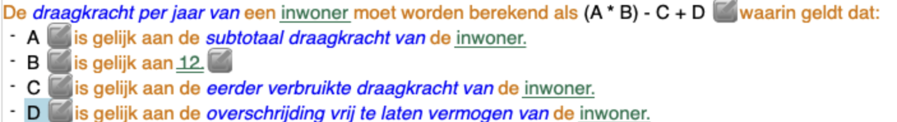

## Gedachtegoed en ontstaan
IAM4 en zusterbedrijf RuleManagement Group zijn opgericht naar aanleiding van een groot reserch programma van de Belastingdienst: POWER. POWER was het Programma Ondersteuning Wet- en Regelgeving, waarin het idee van een gestructureerde vertaling van wet- en regelgeving naar uitvoering werd onderzocht. Het gedachtengoed van dit programma vormen nog steeds de basis van waaruit IAM4 en RuleManagement Group opereren; de toegepaste technieken en tooling zijn inmiddels wel sterk verbeterd.

## De methode
IAM4 beschikt over een methode, de RuleManagment Methode (RMM) waarmee wet- en regelgeving op een gestructureerde wijze worden doorvertaald naar bedrijfsregels. Deze bedrijfsregels representeren een eenduidige vastlegging van de logica van de wet- en regelgeving. Dit vergt Interpretatie, Analyse en Modellering voor, hetgeen met IAM4 wordt aangeduid. De bedrijfsregels worden opgebouwd vanuit een feittypemodel volgens vaste regelpatronen, welke gebaseerd zijn op RuleSpeak en SBVR. Onze regelpatronen in natuurlijke taal dekken inmiddels het overgrote deel aan mogelijke constructies die nodig zijn om alle in wet- en regelgeving voorkomende logica vast te leggen. Daarnaast zijn onze regelpatronen in combinatie met ons feittypemodel formeel logisch correct, ze zijn eenduidig en automatisch vertaalbaar naar andere logische talen zoals programmeertalen. De methode wordt ondersteund door een software tool, de IAM4 RMSuite.

## Bedrijfsregel
Een regel in gestructureerde natuurlijke taal, waarvan de logica precies één betekenis heeft. De regel is daarmee menselijk leesbaar en door computers uit te voeren.

Voorbeeld van een regel met een berekening:

## Bedrijfsregels in de keten
De methode omvat niet alleen het opstellen van bedrijfsregels, maar richt zich juist ook op de aansluiting van deze bedrijfsregels op de gehele keten van 'wet tot loket', en het beheer van de bedrijfsregels. Daarvoor gebruikt de methode een samenhangende set modellen en informatie -elementen, waarin verschillende soorten informatie  worden vastgelegd, die allemaal aan elkaar gelinkt  worden voor optimale beheersbaarheid.
- Teksten: voor importeren en/of opstellen van regelgeving,
- Feittypen: voor de vastlegging van de juridische 'gegevens' (een vorm van object modellering), waarover in de regelgeving gesproken wordt,
- Bedrijfsregels: voor het opstellen van formeel logische vertalingen van wet- en regelgeving, waarbij de feittypen de bouwblokken vormen waarmee de patronen gevuld worden; de bedrijfsregels vormen gezamenlijk een beslissing c.q. berekening, die in de wet- en regelgeving beschreven staat,
- UML: voor het vastleggen van gegevensmodellen, welke al dan niet via een transformatie te koppelen zijn aan overeenkomstige feittypen,
- BPMN: voor de vastlegging van processen, waarbij gekoppeld kan worden naar de te nemen juridische beslissingen, zoals vastgelegd met de bedrijfsregels,
- Opmerkingen en vragen: overal in de IAM4 RMSuite kunnen bij elementen opmerkingen gemaakt worden en expert-vragen gesteld worden; hiermee is het gehele 'vertaal'-proces te documenteren.

## IAM4 RMSuite
Belangrijk kenmerk is dat in de IAM4 RMSuite 'alles-aan-alles' gekoppeld kan worden, waarmee het gehele vertaalproces gedocumenteerd wordt en alles traceerbaar is naar de bron: de wet- en regelgeving. Hiermee is de impact van wijzigingen in de wet- en regelgeving eenvoudig vast te stellen.
Naast de bovengenoemde modellen, informatie-elementen en koppelmogelijkheden tussen elementen in en tussen modellen bevat de IAM4 RMSuite de volgende functionaliteiten:
- Deployment Center: om de opgestelde bedrijfsregelmodellen 'met-een-druk-op-de-knop' om te zetten naar code (momenteel Java, C#, DMN en Blueriq),
- Testmodule: voor het testen van een bedrijfsregelmodel,
- Rapporten: naast standaard rapportages kunnen ook maatwerk rapportages worden opgesteld,
- Portal: een in HTML-vorm geëxporteerde set bedrijfsregels met feittypen en eventueel links naar bontekstentekst.
