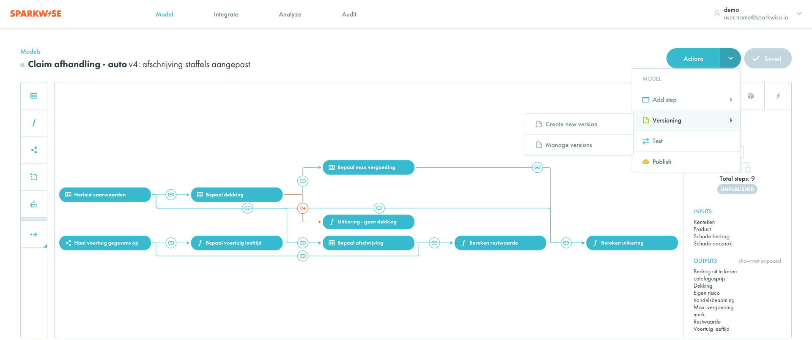
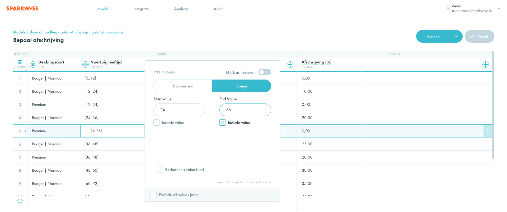
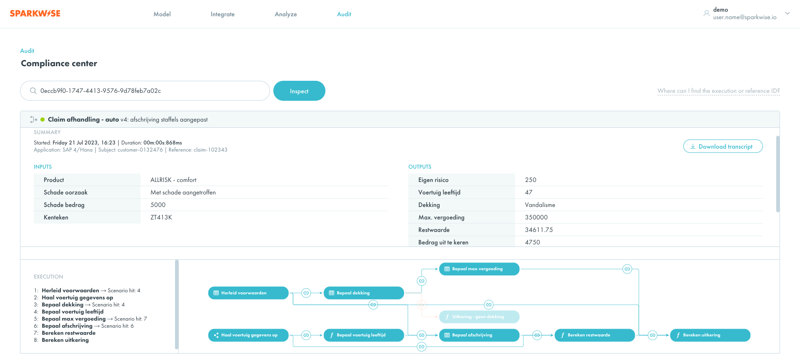

[Sparkwise](https://www.sparkwise.io/) is een platform waarmee beleidregels en bedrijfslogica kan worden gemodelleerd en, met 1 druk op de knop, geautomatiseerd omgezet worden naar toepasbare regels, door middel van uitvoerbare beslisservices (APIs). Deze beslisservices zijn eenvoudig op te nemen in de bekende low-code platformen, systemen en (maatwerk) applicaties, doordat er model-specifieke openAPI specificaties worden gegenereerd. 

## Waarom Sparkwise?
Met Sparkwise is het mogelijk om regels en logica aan te passen aan de steeds veranderde omstandigheden door een slimme combinatie van beheer, automatisering en vastlegging. Het ondersteunt de LegOps-aanpak, een aanpak waarin Legislation & Operations samen in teams optrekken volgens agile principes. De leesbare manier van modelleren zorgt voor een eenduidige manier van delen en communiceren binnen de teams van juristen, beleidsmakers en ICT-deskundigen. De geautomatiseerde omzetting en publicatie naar beslisservices stelt teams in staat om kort-cyclisch aanpassingen te doen waarmee het doorlooptijden verkort terwijl IT-architectuur principes blijven geborgd. Doordat alle invoer en uitvoer worden vastgelegd, is transparantie in handelen en besluiten van de organisatie automatisch geborgd.

Voordelen zijn:
    • Meer grip op wijzigingen
    • Kortere doorlooptijden bij aanpassingen
    • Maximale leesbaarheid van toegepaste regels/logica
    • Handelen en besluiten is volledig transparant en uitlegbaar
    • Verantwoorde en controleerbare manier van AI/ML toepassen

## Hoe werkt het?
De logica wordt gemodelleerd door middel van een of meer beleid- en beslis stappen (sub-beslissingen). Hierdoor ontstaat een keten (boomstructuur) van opvolgende stappen die uiteindelijke leiden tot een uitkomst van de beslissing of berekening. 

Doordat er ook proces uitzonderingen kunnen worden gemodelleerd kan deze boomstructuur ook vertakkingen hebben om in een specifiek scenario benodigde informatie ad-hoc en real-time op te halen vanuit een externe applicatie of database. Zo ontstaat er een samenspel tussen de benodigde informatie, de toegepaste logica én uitkomsten. Met als resultaat: een menselijk leesbare, aanpasbare, testbare, uitvoerbare en controleerbare digitale blauwdruk van de werkelijkheid.

## Toepassen door publicatie
Met een druk op de knop wordt het regel/logica model vertaald naar toepasbare regels. Hiervan wordt zelfstandig opererende softwarecomponent gemaakt, die - volledig geautomatiseerd – in een (cloud) locatie naar keuze wordt gepubliceerd en voorzien van afgeleide technische documentatie. 
Klaar om te worden opgenomen in applicaties en verzoeken af te handelen. En klaar voor de toekomst, om snel wijzingen te kunnen doorvoeren.

## Voor medewerkers, geen technische code!
Bij Sparkwise geloven we dat toepasbare bedrijfsregels en -logica moeten worden beheerd door mensen die deze inhoudelijk snappen en overzien, zonder dat zij daarvoor technische IT-kennis nodig hebben. Daarom hebben we ons toegelegd dat het modelleren niet alleen op een gebruiksvriendelijke manier gebeurt maar juist ook een behulpzame, door gebruikers maximaal te ondersteunen in hun taak. 

Als gebruiker word je daarom voortdurende geholpen om je regel/logica uit te drukken. Zo ontstaat er niet alleen grip op wijzigingen maar worden ook kosten verlaagd.

Om de kwaliteit van de toepasbare regels en logica te borgen kan Sparkwise de ingevoerde regels en logica ook geautomatiseerd controleren. Door fouten en onvolkomenheden vroeg in het proces te ontdekken en te corrigeren, wordt de doorlooptijd van idee naar operatie aanzienlijk verkort. Met behulp van de test functie, kunnen er ook verschillende test-cases worden uitgevoerd en getoetst op gewenste uitkomsten.

## Maximale transparantie in besluiten en handelen
Voor elk afgehandeld verzoek is vastgelegd hoe de besluitvorming tot stand gekomen is en kan deze visueel in detail worden geïnspecteerd. Hierbij is de exacte logica, zoals toen actief en gebruikt was, altijd inzichtelijk en beschikbaar om te simuleren.

Vastlegging gebeurt volledig automatisch - ook na het aanbrengen nieuwe/gewijzigde regels waarbij gevoelige informatie kan worden pseudonimiseerd. Daarnaast kunnen bedrijfsinzichten worden verkregen door het analyseren van resultaat grafieken en statistieken.

## Toepassing AI/ML in de bedrijfsvoering
Sparkwise ondersteunt verder kunstmatige intelligentie (AI) in de vorm van Machine Learned modellen. Deze kunnen eenvoudig worden geoperationaliseerd met als doel deze op een verantwoorde manier toe te passen in de bedrijfsvoering. 

Want, een computer geeft altijd een antwoord. Essentieel in dit geval is: wat doen we ermee, waarom en wanneer gebruiken we het niet?

## Meer informatie?
Neem vrijblijvend contact op via hello@sparkwise.io of +31 (0)85 047 9637.