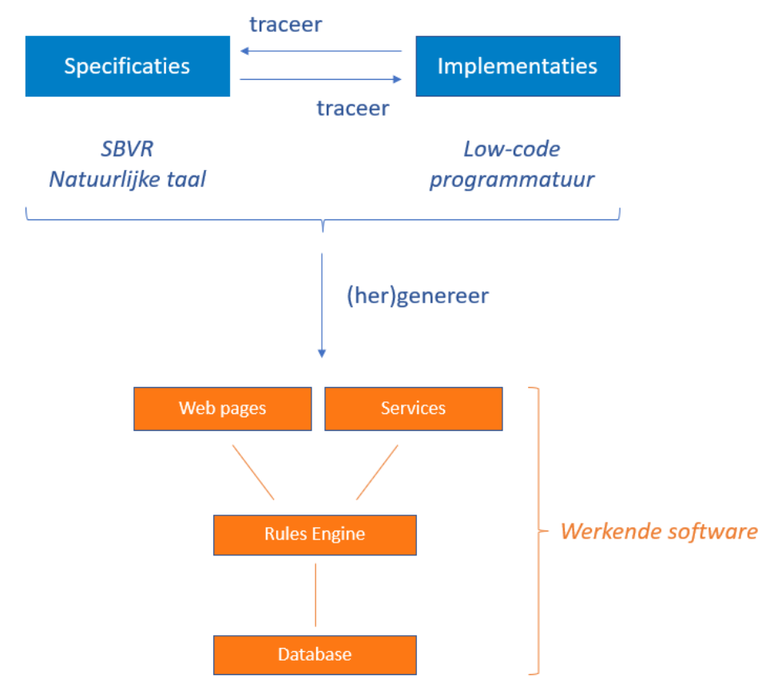
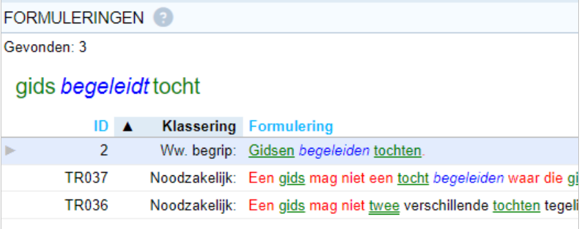
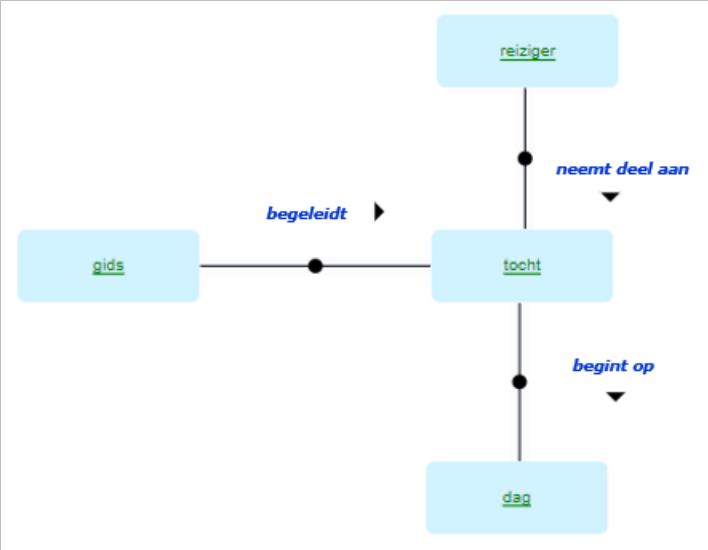
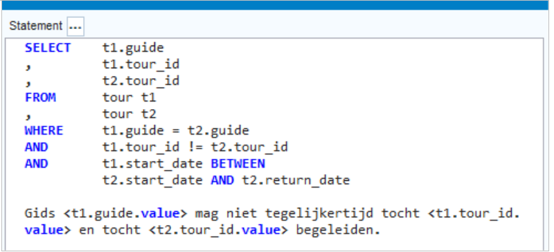

# USoft
[USoft](https://www.usoft.com/) biedt als softwareleverancier een low-code platform voor regelgestuurde software. Middels een standaard methodiek wordt vanuit bedrijfsregels software gegenereerd. Deze methodiek maakt gebruikt van [SBVR](https://www.omg.org/spec/SBVR/) (Semantics of Business Vocabulary and Business Rules Specification), een standaard van de Object Management Group. SBVR maakt het mogelijk in natuurlijke taal bedrijfsregels en begrippen te definiëren, alsook hun onderlinge relaties.

## Specificeren in USoft Studio
USoft Studio maakt het mogelijk regels, definities en begrippen te specificeren in natuurlijke taal. De tool herkent, categoriseert en codeert begrippen die gebruikt worden in regels en definities en maakt het mogelijk hier doorheen te navigeren. Dit werkt voor zowel Engels als Nederlands. Ook kunnen diagrammen worden gemaakt om de relaties op een andere manier inzichtelijk te maken.

## Implementeren in het USoft platform
In het USoft platform kun je low-code programmeren tegen de (SBVR) specificaties uit Studio. Kennis van SQL is daarbij vereist. Het platform bundelt stukken low-code in één of meerdere Rules Engines. De software bewaakt te allen tijde dat alle data in de software aan de regels blijft voldoen, of gáát voldoen. Een Rules Engine is in staat om zelf te bepalen hoe regels elkaar beïnvloeden, ook bij een netwerk van honderden regels en duizenden database records.

# Traceren van bedrijfsregel tot implementatie
De low-code implementaties lijken op de bedrijfsregels in natuurlijke taal. Implementaties en bedrijfsregels die bij elkaar horen worden stuk voor stuk gekoppeld. Hierdoor is traceerbaar welke programmatuur welke regels implementeert, en andersom.

# Genereren van een werkende applicatie
Low-code betekent dat je relatief weinig hoeft te programmeren om een volledig werkende applicatie te krijgen. USoft genereert uit de SBVR specificaties een gelaagde applicatie. Op het laagste niveau wordt een database ingericht voor gebruikersdata. Op het middelste niveau wordt een Rules Engine geplaatst. Deze zorgt ervoor dat alleen data in de database terecht komt die voldoet aan alle (verplichte) regels. Op het hoogste niveau worden webpagina’s, services en andere interfaces gegenereerd waardoor mensen en machines van de Rules Engine gebruik kunnen maken. De opstelling als geheel biedt een uniek hoge en traceerbare datakwaliteit.

# Van wetgeving naar agile software met USoft
Omdat USoft specificeren in natuurlijke taal ondersteunt, kan eenvoudig wetgeving worden ingelezen. Deze voldoet vaak niet aan de standaard van SBVR, maar is vaak wel vrij eenvoudig om te zetten naar een bedrijfsregel die wel voldoet aan die standaard. Met USoft kunnen eenvoudig kruisverwijzingen worden aangebracht tussen de daadwerkelijke wettekst en de geformaliseerde bedrijfsregels. Omdat in feite één groot woordenboek wordt opgebouwd, kan voor nieuwe wet- en regelgeving worden doorgebouwd op de al gedefinieerde termen en begrippen. Zo wordt het omzetten van wetteksten naar gestructureerde bedrijfsregels steeds eenvoudiger.

Op deze manier is altijd traceerbaar hoe een artikel uit de wet is omgezet naar een bedrijfsregel en hoe deze is geïmplementeerd in werkende software. Zo is ook eenvoudig de impact van een wijziging (in wetgeving) in te schatten. Omdat iedere regel afzonderlijk is geïmplementeerd, is de impact klein en is een wijziging snel door te voeren. Zo ontstaat software die eenvoudig en snel meebeweegt met wijzigende wet- en regelgeving.