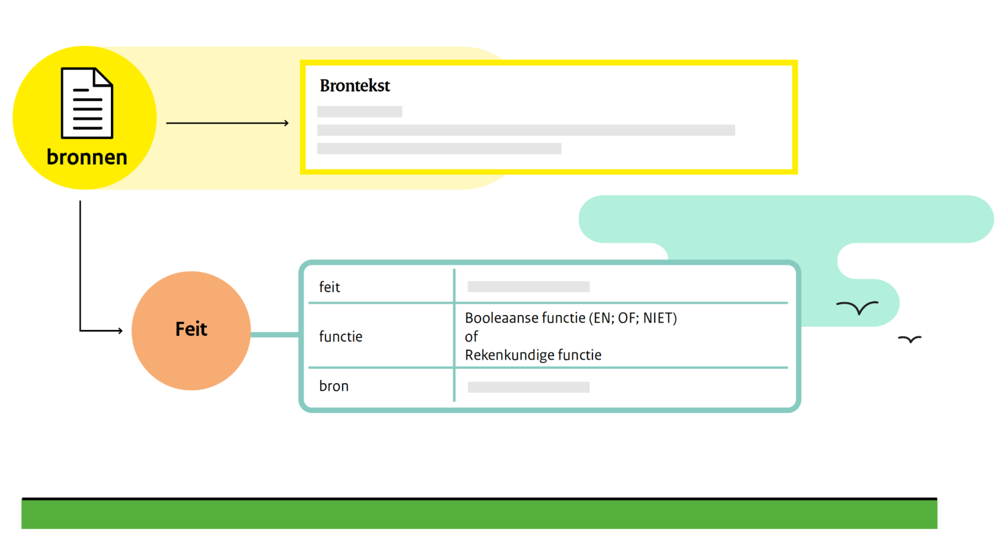
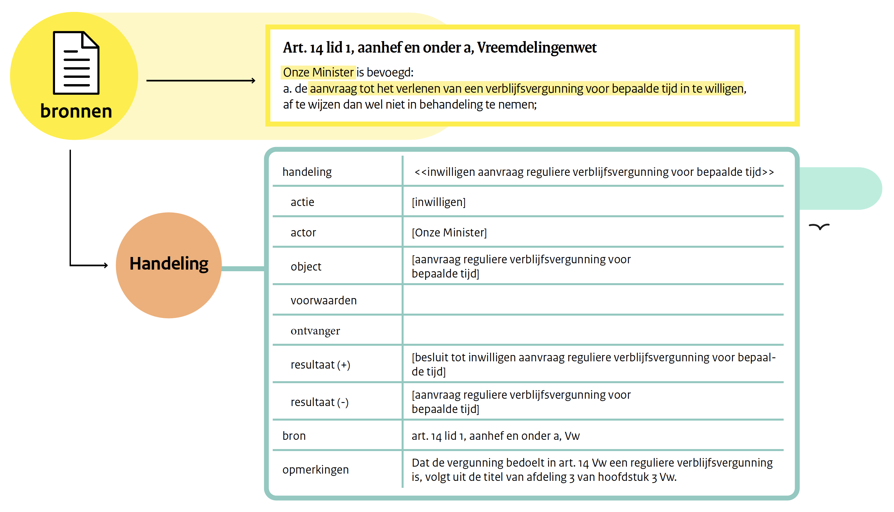

Flint is een actie-gerichte interpretatiemethode waarin normen worden uitgedrukt als _handelingen (acts)_, _feiten (facts)_ of _plichten (duties)_. 

Flint is ontwikkeld om alle toestanden en toestandsovergangen waarin normen een rol spelen expliciet te kunnen beschrijven met een referentie naar gebruikte bronnen.

# Wat zijn normen?

*Definitie norm*
Een norm is:

1. sociaal gedrag dat in een groep wordt geaccepteerd of verwacht, of
2. een waarde gebruikt als een ijkpunt voor vergelijkingen: een regel, criterium, graadmeter, maatstaf of standaard.

*Soorten normen*

- Sociale normen gaan over gedrag dat in een groep wordt verwacht of geaccepteerd
- Ethische normen gaan over gedrag dat als 'goed' of 'fout' kan worden gekwalificeerd
- Juridische normen gaan over gedrag dat door de staat kunnen worden afgedwongen

# De bouwstenen van Flint

- [Handelingen](#handelingen)
- [Feiten](#feiten)
- [Plichten](#plichten)
- [Een voorbeeld](#een-voorbeeld)

## Handelingen

Een handeling is een _actie_, uitgevoerd door een _actor_, die betrekking heeft op een _object_. 

Als bij het uitvoeren van de actie aan de _voorwaarden_ wordt voldaan, dan is de actie geldig en heeft deze een _resultaat_. Het resultaat (_feiten_ of _plichten_ die worden gecreëerd of die verdwijnen) zijn bestemd voor een _ontvanger_. 

Een _handeling_ zonder _actie_, _actor_ of _resultaat_ kan niet bestaan, maar een _handeling_ zonder _object_ (vb. een ambtshalve besluit) of zonder _voorwaarden_ is mogelijk

Een handeling kan worden beschreven in een zogenoemd frame, zie onderstaande figuur:

## Feiten

Een _feit_ is iets dat onder voorwaarden _waar_ is. Dat wil zeggen:

1. iets is waar omdat de functie waarmee dat feit kan worden afgeleid waar is (e.g. X is waar als A en B waar zijn, of als B waar is en C is niet waar),
2. X is waar omdat X het resultaat is van een geldige actie.

Een ‘feit’ kan worden beschreven in een frame, zie onderstaande figuur:

Omdat ieder feit een afleidingsfunctie kan bevatten, kan ieder feit tot in het oneindige in meer detail worden beschreven. Op het moment dat de actor en ontvanger die bij een handeling betrokken zijn, tot overeenstemming zijn gekomen, verdwijnt de behoefte aan verdere detaillering. Als er een meningsverschil ontstaat tussen beiden, kan dat worden opgelost:

1. door het toevoegen van nieuwe bronnen;
2. door het aanpassen van een interpretatie;
3. door het oplossen van een meningsverschil over het bewijsmateriaal in de zaak;
4. door een arbiter.

## Plichten

Een _plicht_ wordt in Flint uitgedrukt als een combinatie van handelingen en feiten:

- een plicht is de relatie tussen een plichthouder en de houder van een aanspraak;
- een plicht is het resultaat van een handeling (iets kopen resulteert in een betalingsplicht);
- aan een plicht kan worden voldaan door handeling (door te betalen verdwijnt de betalingsplicht);
- een plicht kan (meestal) worden afgedwongen met een handeling die de plichthouder aanzet tot het vervullen van zijn plicht.

Een plicht is een feit (de plicht bestaat omdat hij het gevolg is van een handeling). Voor het frame van een plicht, zie hieronder:

## Een voorbeeld

Artikel 14, eerste lid aanhef en onder a, Vreemdelingenwet (de brontekst) bevat drie handelingen: het inwilligen, het afwijzen en het niet in behandeling nemen van een aanvraag tot het verlenen van een verblijfsvergunning. Hieronder is het frame van de handeling _inwilligen aanvraag reguliere verblijfsvergunning voor bepaalde tijd_ uitgewerkt.

De actie, de actor en het object van de handeling kunnen worden gevuld. De voorwaarden en de ontvanger ontbreken in deze zin. Om deze elementen van de handeling te kunnen vullen, moet een bron worden gevonden. In dit geval zijn dat respectievelijk [artikel 26, eerste lid](https://wetten.overheid.nl/BWBR0011823/2022-10-01/0#Hoofdstuk3_Afdeling3_Paragraaf5_Artikel26) en [artikel 8 aanhef en onder a](https://wetten.overheid.nl/BWBR0011823/2022-10-01/0#Hoofdstuk3_Afdeling1_Artikel8), Vreemdelingenwet.

Opmerkelijke aspecten bij deze interpretatie zijn:

- Artikel 14 heeft alleen betrekking op aanvragen voor reguliere verblijfsvergunningen. Dit volgt uit het opschrift van de afdeling waar artikel 14 toe behoord.
- Dat het resultaat van het inwilligen is dat er een ‘besluit tot inwilligen van een aanvraag tot het verlenen van een reguliere verblijfsvergunning voor bepaalde tijd’ wordt gecreëerd, volgt uit artikel 1:3 eerste t/m derde lid Algemene wet bestuursrecht.
- Dat de ‘aanvraag tot het verlenen van een reguliere verblijfsvergunning voor bepaalde tijd’ verdwijnt door het inwilligen van de aanvraag volgt uit artikel 1:3 derde lid Algemene wet bestuursrecht: er is voldaan aan het verzoek een besluit te nemen.

## Meer informatie

Voor meer informatie over Flint, zie [Methode beschrijving](./methodebeschrijving/01-INLEIDING.md)

