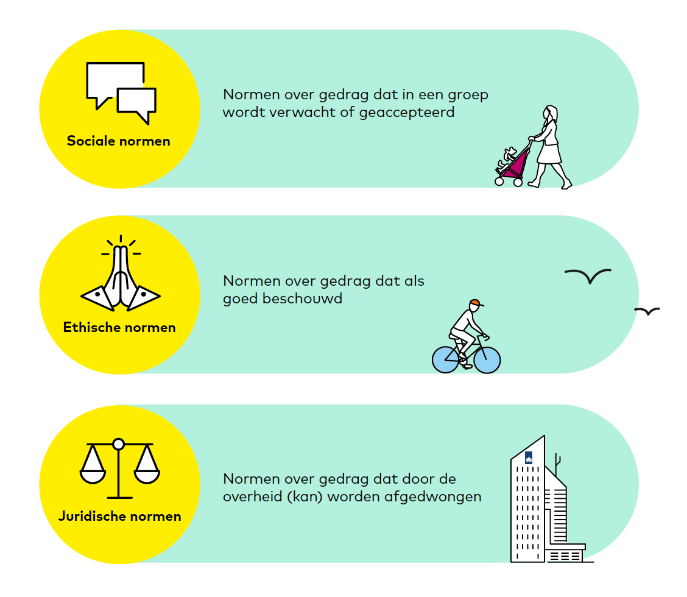

# Afspraken tussen mensen

Stel je voor: er zijn mensen. En die mensen weten wat ze willen, ze hebben een doel. Ze maken een plan om dat doel te bereiken. Ze komen erachter dat ze elkaar soms in de weg zitten. De sterkste krijgt zijn zin.

Dan leren ze dat ze samen sterker zijn dan gevaarlijke dieren, en (daarvoor, of vlak daarna?) ook dat ze samen sterker zijn dan de sterkste individuele mens.

Ze maken afspraken met elkaar. De samenleving wordt groter en er worden steeds meer afspraken gemaakt. Afspraken in kleine groepen, en in grote gezelschappen van mensen die elkaar niet kennen.

Er ontstaan steden, het wordt drukker. Er zijn verkeersregels nodig. Wie van rechts komt voorrang heeft. Er ontstaan organisaties, waar mensen rollen krijgen. Deze mensen zijn niet langer alleen zichzelf. De rollen die ze hebben hebben een betekenis die los staat van hun persoon. Ze zijn koper of verkoper, bestuurder van een vervoersmiddel, of vertegenwoordiger van een groep. Ze leren hun kinderen hoe ze zich behoren te gedragen, waarom dat goed is, en welke voordelen dat heeft.

En dan wil iemand weten hoe het nu eigenlijk precies zit met die afspraken. Welke zijn er, wat betekenen ze en hoe kun je ze zo precies mogelijk beschrijven. Hoe kun je ze het best uitleggen aan anderen? Als we het eens zijn over de bronnen waarin ze zijn opgeschreven, zijn we het dan ook eens over hun betekenis? Ook als we die afspraken toepassen op concrete zaken van waar onze belangen soms botsen?

Lukt het om met mensen met verschillende achtergronden, en verschillende belangen een gedeeld beeld hebben van de normen die ons gedrag richting geven, en de betekenis van die normen in specifieke zaken? Hoe kunnen we gemeenschappelijke opvattingen en meningsverschillen over ons gedrag in zijn algemeenheid en ons gedrag in specifieke zaken zo vastleggen dat we er een volgende keer gebruik van kunnen maken: wanneer we in een groep gedragsregels willen afspreken, wanneer we interactie hebben met anderen: om samen te werken, om een transactie tot stand te brengen, om onze belangen te verdedigen of om machines en computersystemen te ontwerpen die interacties tussen mensen ondersteunen.

Dat is het terrein van de normen en de normatieve systemen. Op deze plek beschrijven we wat normen zijn en hoe we ze gebruiken. Welke methoden mensen hebben om normen vast te leggen. Wat het verschil is tussen normen en waarden en regels, van rechten en plichten, van bevoegdheden en van alle andere termen en concepten die een rol spelen bij het reguleren van gedrag.

Dat doen we op verschillende manieren:

- door beknopte, eenvoudige beschrijvingen te geven van de methoden waar we mee werken en de begrippen die we gebruiken (zoals de definitie van het begrip 'norm' hieronder),
- door methoden en begrippen verder uit te werken, voor degenen die daar behoefte aan hebben of die zelf een bijdrage willen leveren,
- door instrumenten te ontwikkelen die helpen bij het maken en gebruiken van normatieve systemen (en mensen uit te nodigen daar aan mee te doen),
- door uit te leggen hoe je die instrumenten kunt gebruiken, en waarvoor,
- door voorbeelden te geven en zaken uit te werken.

Waar we korte, eenvoudige beschrijvingen geven, gebruiken we geen voetnoten en referenties. Op de plekken waar we methoden en concepten in detail uitwerken, doen we dat wel.

# Wat zijn normen?

*Definitie norm*

1. sociaal gedrag dat in een groep wordt geaccepteerd of verwacht, of
2. een waarde gebruikt als een ijkpunt voor vergelijkingen: een regel, criterium, graadmeter, maatstaf of standaard.

*Soorten normen*

- Sociale normen gaan over gedrag dat in een groep wordt verwacht of geaccepteerd
- Ethische normen gaan over gedrag dat als 'goed' kan worden gekwalificeerd
- Juridische normen gaan over gedrag dat door de staat kan worden afgedwongen

# Wat zijn normatieve systemen?

