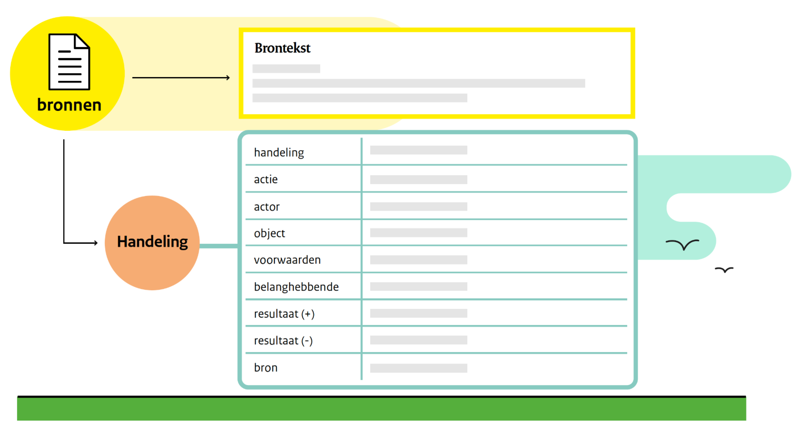
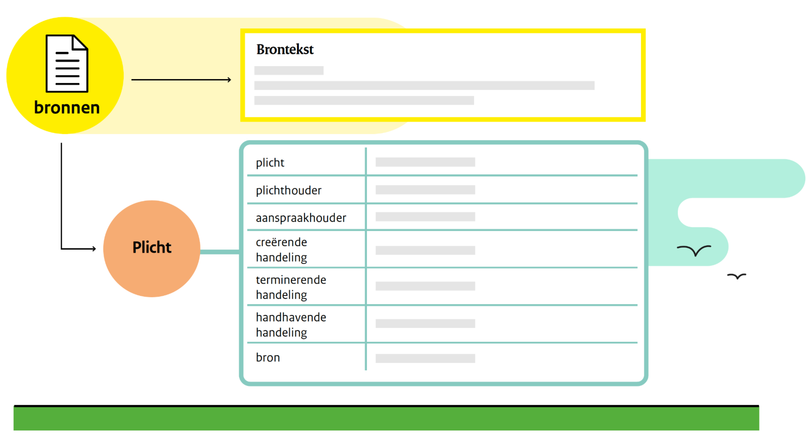
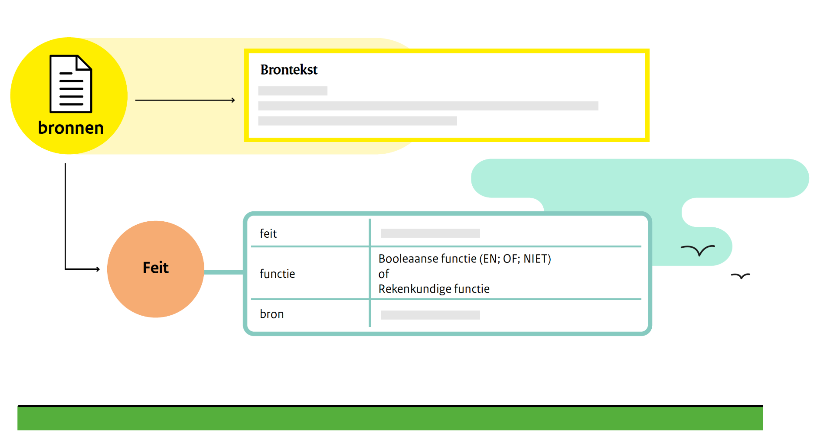

# Het Calculemus protocol voor normatieve systemen

Het Calculemus protocol is een stappenplan dat gereguleerde taken opdeelt in stappen.

Dat heeft drie doelen:

1. de stappen zo eenvoudig te maken dat ze herkenbaar zijn voor anderen, ook als die een andere werkmethode gebruiken;
2. de stappen zo eenvoudig te maken dat die afzonderlijke stappen makkelijker kunnen worden ondersteund met instrumenten;
3. de stappen zo eenvoudig te maken dat de uitkomst van de (meeste) afzonderlijke stappen automatisch kan worden afgeleid (berekend).

Het Calculemus protocol heeft vijf stappen die iteratief doorlopen kunnen worden.
Dat betekent dat je van iedere stap weer terug kunt naar de vorige stap, of de stap daarvoor.
Iedere stap kan aanleiding geven tot aanpassingen in eerdere stappen.
Het protocol is geschikt voor het gebruik in groepen en voor het ondersteunen van interactie tussen groepen.

De vijf stappen van het Calculemus protocol zijn:

1. Het definiëren van een taak
2. Het verzamelen van bronnen
3. Het interpreteren van bronnen
4. Het uitvoeren van de taak
5. Het vergelijken van resultaten

De interpretatiestap is de kern van de methode.
Daar wordt vastgelegd aan welke normen men zich moet houden.
Deze stap is de schakel tussen de algemene normen in een bepaald domein, en de betekenis van die normen in een specifieke zaak.

Wanneer mensen of groepen tot verschillende uitkomsten komen, kan dat vier oorzaken hebben:

1. er is een meningsverschil over de taak,
2. er is een meningsverschil over de relevante bronnen,
3. er is een meningsverschil over de interpretatie van de bronnen,
4. er is een meningsverschil over het bewijsmiddelen (waarmee wordt aangetoond dat de taak op de juiste wijze is uitgevoerd).

De ervaring is dat het Calculemus protocol een goede basis is voor het inzichtelijk maken en oplossen van meningsverschillen over gereguleerde taken tussen mensen, en voor het specificeren van automatiseerbare onderdelen van een taak.

Het Calculemus protocol is niet klaar. Het is een stappenplan dat werkt in de huidige praktijk. Mogelijk is er in de toekomst behoefte is aan veranderingen. Misschien zijn er nieuwe stappen nodig. Of er is behoefte aan meer gedetailleerde van stappen, bijvoorbeeld om de automatische ondersteuning van onderdelen van het normatief systeem te ondersteunen.

- [instrumenten](../methodebeschrijving/07-INSTRUMENTEN.md)

# Flint als taal voor het beschrijven van normen

Het interpreteren van teksten is de kern van het maken van normen en regels.
Het zoeken van fundamentele concepten voor het beschrijven van normen is bedoeld om:

- het interpreteren van normen zo helder mogelijk te beschrijven,
- het automatisch ondersteunen van interpretatiewerkzaamheden mogelijk te maken,
- verschillende interpretatiemethoden te kunnen vergelijken (want als een andere methode niet is om te zetten in fundamentele normatieve concepten, dan voldoen deze concepten dus (nog) niet en is aanpassing van de taal nodig).

## Wat is interpreteren?

De algemene betekenis van interpreteren is: verklaren of uitleggen.
Het interpreteren van een norm is het expliciet beschrijven welk gedrag vanuit sociaal, ethisch of juridisch perspectief gewenst is.

Door interpretatie worden normen uit een bron gehaald (geëxtraheerd).

## Interpreteren met Flint

Het interpreteren van bronnen begint met het zoeken naar acties, actors, objecten en ontvangers.

We zijn niet op zoek naar alle acties, maar naar normatieve acties; acties die sociaal, ethisch, of juridisch gewenst zijn.
We zijn op zoek naar acties die een resultaat hebben.
De actie is gewenst omdat hij een gevolg heeft.
Een actie zonder gevolg is geen normatieve actie omdat hij niets verandert in de wereld.

Dit is een soort zinsontleden.
In een zin in de bedrijvende vorm is de actie het gezegde, de actor het onderwerp, het object het lijdend voorwerp (direct object) en de ontvanger het ontvangend voorwerp (indirect object).

Flint staat voor de 'Formal language for the interpretation of sources of norms'.
De taal streeft ernaar elementaire deeltjes van normatieve kennis te gebruiken om kennis over normen vast te leggen en te gebruiken in normatieve systemen.

Er zijn meerdere redenen voor de zoektocht naar de kleinste bouwstenen van normatieve kennis.
Een verzameling van de kleinste bouwstenen van normatieve kennis:

- is een duidelijke en betwistbare theoretische basis voor het vastleggen normatieve kennis (het maakt voor iedereen duidelijk wat er wordt bedoeld met normen en wat je er mee kunt doen);
- zou een goede basis moeten zijn voor het interpreteren van normatieve teksten;
- zou omgezet moeten kunnen worden in iedere andere manier om normen uit te drukken (zodat gebruikers van verschillende normatieve methoden makkelijker kunnen samenwerken);
- zorgt ervoor dat direct duidelijk is dat de taal (nog) niet voldoet als er voorbeelden zijn van normatieve kennis die niet kan worden vastgelegd.

Als blijkt dat er normatieve kennis die niet in de Flinttaal kan worden uitgedrukt, of als blijkt dat het nuttig is om de concepten waar Flint op te splitsen in nog kleinere concepten, zoals dat met de elementaire deeltjes in de natuurkunde in de afgelopen 120 jaar meerdere keren is gebeurd, zal de taal worden aangepast of uitgebreid.

## Frames voor het maken van Flint interpretaties

Flint interpretaties maak je door fragmenten van bronteksten te classificeren als een categorie in een Flint frame.
Er zijn drie soorten Flint frames:

- handelingsframes,
- plicht frames, en 
- feit frames.

**Handelingsframes**

**Plicht frames**

Een plicht is iets wat iemand (een plichthouder) hoort te doen.
Een plicht kan alleen bestaan als hij is gemaakt (door het verrichten van een handeling), als hij weer kan verdwijnen als er aan is voldaan (door een andere handeling) en als er iemand is (de aanspraakhouder) die er aanspraak op maakt dat de plichthouder zich aan zijn plicht houdt.

Vaak is het zo dat er de mogelijkheid is om iets te doen wanneer een plichthouder zijn plicht verzaakt: een handhavende handeling.
Maar dit is niet noodzakelijk.

Een voorbeeld voor het interpreteren van plichten en de relaties met handelingen wordt hier later toegevoegd.

**Feit frames**

### Wat is een feit?

Een feit is de beschrijving van iets dat waar is.
Dingen die je ziet in de wereld, zijn waar als je ze ziet (observeert).
Voor normen en andere institutionele feiten geldt dat ze waar zijn omdat een groep mensen van mening is dat het zo is.

Een briefje van vijf Euro is een papier met gekleurde inkt erop.
Dat is een observatie.
Maar die vijf Euro is geld, en heeft waarde omdat er in de wereld een grote groep mensen het eens is dat er geld bestaat en dat de Euro geld is met een waarde.
De wetten en de instituties waarmee we de Euro ondersteunen die opvatting.

De algemene functie om dingen een functie te geven los van hun fysieke betekenis noemen we een status functie en dit is hem:

X telt als Y in Context C

Dus het feit Y is waar als X bestaat in de Context C.

- voorbeelden (pm)
- voorbeelden (pm)
- [theorie](../methodebeschrijving/09-NORMATIEVE-CONCEPTEN.md)

# Het uitwerken van een gereguleerde taak met Calculemus-Flint

1. Het definiëren van een taak
2. Het verzamelen van bronnen
3. Het interpreteren van bronnen
4. Het uitvoeren van de taak
5. Het vergelijken van resultaten

## 1. Het definiëren van een taak

Een taak wordt gedefinieerd door een doel.
Dat wat wordt bereikt door het uitvoeren van een taak, dat wat waar wordt door het uitvoeren van een taak.

- voorbeelden (pm)
- voorbeelden (pm)
- theorie (pm)

## 2. Het verzamelen van bronnen

### Wat zijn bronnen?

Alles dat ten grondslag ligt aan het reguleren van gedrag is een bron.
Wanneer het gaat om bronnen die het reguleren van overheidshandelen, dan maken in Nederland, algemeen verbindende voorschriften (wetten, algemene maatregelen van bestuur, ministeriële regelingen of regelingen van een zelfstandig bestuursorgaan) deel uit van de bronnen waarin kennis over het reguleren van gedrag is vastgelegd.

Op basis van de taakomschrijving en de domeinkennis van de deelnemers wordt een verzameling bronnen gemaakt.

### Decompositie van bronnen

Om te voorkomen dat hele wetten geïnterpreteerd moeten worden, als ook maak één zin relevant is voor de zaak, worden bronnen in losse componenten uit elkaar gehaald.

De structuurkenmerken (zoals hoofdstuk, paragraaf, artikel, lid) van de bron, en de titels daarvan worden vastgelegd.
Dit omdat in deze titels soms kennis is vastgelegd die niet op andere plekken is terug te vinden.

Als een zin een opsomming bevat wordt de zin opgeknipt in de aanhef, de onderdelen van de opsomming en, soms, het slot.
Dit omdat de onderdelen van een opsomming vaak op zichzelf staande kennis bevatten.

Voor de decompositie van bronnen hebben we een instrument ontwikkeld.

- voorbeelden (pm)
- voorbeelden (pm)
- theorie (pm)

## 3. Het interpreteren van bronnen

Het interpreteren van teksten is de kern van het maken van normen en regels.
In hoofdlijnen bestaat de methode uit de volgende stappen:

1. Ga in bronnen op zoek naar acties, actoren, objecten en ontvangers
2. Ga op zoek naar voorwaarden en resultaten
3. Breng de gevonden onderdelen bij elkaar in een handelingsframe
4. Werk desgewenst voorwaarden verder uit

De Flint methode is hierboven toegelicht.
Voorbeelden van het maken van Flint interpretaties, instrumenten die de methode ondersteunen en een uitwerking van de theorie achter Flint zijn beschikbaar:

- [voorbeeld interpreteren met Flint](../methodebeschrijving/VOORBEELDEN/01-VERBLIJFSVERGUNNING.md)
- voorbeelden (pm)
- theorie (pm)

## 4. Het uitvoeren van de taak

Het maakt uit of een taak door een machine wordt uitgevoerd, dat wil zeggen: er zijn dingen die een mens begrijpt en een computer niet. Er zijn ook instructies die voor een machine goed uitvoerbaar zijn, voor een mens niet of moeilijk te begrijpen.

Daarom kijken we apart naar instructies voor mensen, en specificaties voor automatisch redeneren (ter ondersteuning van het nemen van besluiten door mensen, of als grondslag voor automatisch genomen besluiten).

### Instructies voor het uitvoeren van een taak

Mensen maken onderscheid tussen algemene regels (criteria) en specifieke informatie over een zaak (bewijsmiddelen).

#### Algemene regels (criteria)

Wanneer de voor een taak relevante bronnen zijn geïnterpreteerd met behulp van Flint, zijn er één of meerdere handelingen beschreven. Voor iedere handeling is vastgelegd onder welke omstandigheden deze handeling geldig kan worden uitgevoerd. Deze voorwaarden kunnen tot het gewenste niveau worden uitgewerkt. Wat dat niveau is, kan iedere betrokkene voor zichzelf bepalen op basis van zijn eigen voorkeuren.

#### Specifieke informatie over een zaak (bewijsmiddelen)

Algemene regels kunnen worden toegepast in een zaak. Informatie over de zaak waarmee mensen bewijzen of aannemelijk maken dat ze voldoen aan de voorwaarden die een handeling geldig maken, noemen we bewijsmiddelen. Wanneer een actor van mening is dat er voldoende bewijsmiddelen zijn om een handeling in een zaak geldig te maken, gaat hij er vanuit dat het resultaat van de handeling waar wordt (het resultaat komt tot stand: er ontstaat iets, of er verdwijnt juist iets). Wanneer verschillende betrokkenen tot verschillende resultaten komen, is er behoefte aan het analyseren van de oorzaak van die verschillen, en (meestal) behoefte aan het oplossen van meningsverschillen. Dat is de volgende stap van het protocol.

Op dit moment wordt het verzamelen van bewijsmiddelen en het gebruik daarvan in een redenering niet ondersteund. We zullen een nadere invulling van de methode ontwikkelen wanneer er dee functionaliteit nodig hebben in de zaken die we in de praktijk tegen komen.

### Specificaties voor automatisch redeneren

Automatisch redeneren werkt anders dan menselijk redeneren. Dat wordt hieronder kort toegelicht.

#### Kennisgebaseerd redeneren

Computers en andere machines redeneren anders dan mensen. Een computer kan kennisgebaseerd redeneren door bewijsmiddelen (data) te koppelen aan regels. Als aan alle regels wordt voldaan, is de actie toegestaan, anders niet.

Als in een situatie twee acties mogelijk zijn, kan alleen een voorkeursoptie worden afgeleid als er regels zijn voor het bepalen van de preferente keuze.

#### Datagedreven redeneren

Datagedreven redeneren is in essentie statistisch redeneren. De vraag “Is dit een stoel?” wordt niet beantwoord met ja of nee. Het antwoord bevat ook geen motivering. Het object wordt met een zekere waarschijnlijkheid als ‘stoel’ gekwalificeerd omdat het kenmerken heeft die overeenkomen met andere objecten die als ‘stoel’ zijn gekwalificeerd. Het object lijkt meer op objecten die eerder als stoel zijn gelabeld, dan op andere objecten.

Voordeel van datagedreven redeneren is dat uit een set mogelijke acties  die actie wordt geselecteerd die op statistische gronden de beste is. De belangrijkste nadelen datagedreven redeneren zijn:

- andere argumenten dan statistische argumenten worden niet meegenomen, denk aan sociale, ethische en juridische overwegingen niet expliciet zijn meegenomen in de redenering
- statistische patronen kunnen gemanipuleerd worden, zodat iets wat volgens een mens duidelijk de afbeelding van een aap is, op grond van statistische analyse volgens de machine het meest overeenkomst vertoond met een stoel.

#### Normatief redeneren

Normatief redeneren bevat altijd een kennisgebaseerde component. Om normatief te kunnen redeneren moet zijn vastgelegd wat de norm is, en waar die op is gebaseerd (zie stap 3).

Statistische analyses kunnen een normatieve redenering ondersteunen, maar uit een uitsluitend statistische of datagedreven redenering kan nooit een normatief oordeel komen.

## 5. Het vergelijken van uitkomsten

Wanneer het meerdere keren uitvoeren van een taak leidt tot verschillende uitkomsten, helpt het als duidelijk is wat de oorzaak is van de verschillen. Dat geldt extra wanneer er sprake is van een meningsverschil over de juiste uitkomst.

Door het opknippen van de taak in verschillende stappen, wordt het makkelijker om de oorzaak van een meningsverschil expliciet vast te leggen.

### Oorzaak verschillen

Een meningsverschil over een het uitvoeren van een taak kan vier oorzaken hebben, namelijk:

1. een meningsverschil over de juiste taakomschrijving
2. een meningsverschil over de benodigde bronnen
3. een meningsverschil over de interpretatie van één of meer bronnen
4. een meningsverschil over de bewijsmiddelen waarmee wordt aangetoond dat de taak op de juiste wijze is uitgevoerd.

### Oplossen meningsverschillen

Belanghebbenden kunnen meningsverschillen over een zaak zelf oplossen als zijn tot een gedeelde opvatting komen over taakomschrijving, relevante bronnen, interpretatie van de  bronnen en de bewijsmiddelen waarmee wordt aangetoond dat de taak op de juiste wijze is uitgevoerd.

Als dat niet lukt kunnen ze hulp zoeken bij een adviseur of mediator die helpt bij de totstandkoming van een oplossing.

Als dat niet lukt kan de zaak aan een arbiter of rechter worden vastgelegd. Diens oordeel is vervolgens bindend voor de betrokken partijen; direct of nadat het oordeel aan een hogere arbiter is voorgelegd.

- voorbeelden (pm)
- voorbeelden (pm)
- theorie (pm)
