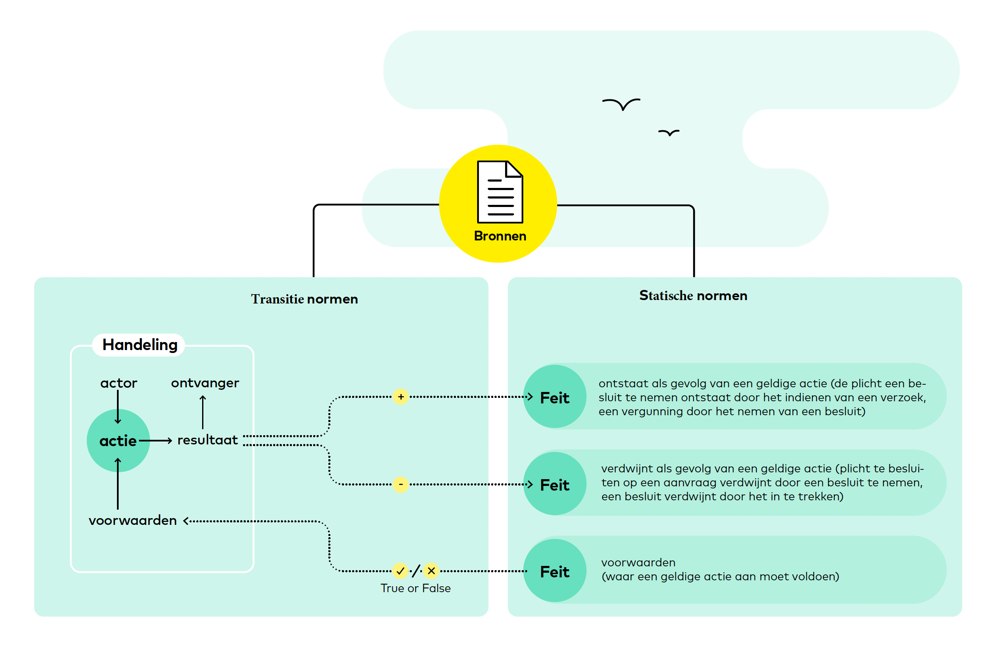

In de rechtswetenschap is in het begin van de twintigste eeuw gezocht naar de elementaire of fundamentele concepten van het recht. John Salmond (1902) onderscheidde vier verschillende typen recht, die hij *beneficial rights* (rechten waar je voordeel aan kunt ontlenen):
1. de claim of aanspraak (wat een ander voor jou moet doen)
2. de vrijheid (wat je voor jezelf kunt doen)
3. de bevoegdheid (wat je tegen een ander kunt doen)
4. de immuniteit (wat een ander niet tegen jou kan doen).

# Normatieve relaties
Al deze rechten bestaan niet op zichzelf, maar alleen in een relatie:
1. als iemand een claim heeft, moet er iemand zijn met een plicht
2. als iemand een vrijheid heeft, moet er iemand zijn die geen claim heeft
3. als iemand een bevoegdheid heeft moet er iemand zijn met een gehoudenheid (een vertaling van het Engelse woord *liability*)
4. als iemand een immuniteit heeft, moet er iemand zijn die geen bevoegdheid heeft.

# Elementaire normatieve relaties
Wesley Hohfeld (1913) introduceerde het idee dat deze vier relaties de  fundamentele normatieve relaties waren.

De verzameling elementaire of fundamentele concepten om normen mee te beschrijven zijn (Hohfeld 1913; Halpin 1985):
- volledig, in de zin dat er zijn alle normatieve posities en situaties die er bestaan met behulp van deze concepten uitgedrukt kunnen worden;
- voldoende, in de zin dat er geen andere concepten nodig zijn om een normatieve positie en situatie uit te drukken;
- niet te reduceren, in de zin dat een elementair normatief concept uitgedrukt kan worden met behulp een of meer van de andere elementaire concepten.

Albert Kocourek (1930) stelde dat er niet vier, maar twee fundamentele normatieve relaties zijn:
1. de aanspraak-plicht relatie, en
2. de bevoegdheid-gehoudenheid relatie.

Kocourek zag dat iemand alleen de vrijheid kan hebben iets te doen, als er de anderen geen claim hebben, maar dat de vrijheid om iets te doen niets anders is dan het ontbreken van de plicht om datgene wel of niet te doen. De vrijheid-geen claim relatie is dus niets anders dan het afwezig zijn van een claim-plicht relatie.

En het zelfde geld voor de immuniteit-onbevoegdheid relatie, dat is niets anders dan het afwezig zijn van een bevoegdheid-gehoudenheid relatie.

Het bovenstaande betekent dat er twee soorten fundamentele normatieve relaties zijn.

# Hoe druk je normatieve relaties uit met elementaire normatieve concepten?
De vraag is hoe we de twee soorten fundamentele normatieve relaties het best kunnen uitdrukken?

De bevoegdheid-gehoudenheid relatie gaat over wat iemand (de houder van de bevoegdheid) kan doen waarmee een ander (de gehoudene) aan gebonden is. Dit gaat over een handeling: een actie die iemand (een actor) verricht. Als die actie voldoet aan een aantal voorwaarden dan is deze geldig. een geldige actie heeft een resultaat en dat resultaat is voor iemand bestemd. Diegene is gebonden aan het resultaat. Een resultaat is iets dat wordt gecreëert of iets dat wordt getermineerd.

De aanspraak-plicht relatie gaat over wat iemand (de plichthouder) in de toekomst moet doen voor een ander (de aanspraakhouder). Dat iemand een aanspraak heeft op een ander die iets voor hem of haar moet doen, is het gevolg van een bevoegde handeling zoals die hierboven is beschreven. Om aan de plicht te voldoen moet een andere handeling worden verricht. Een plicht ontstaat als hij is gecreëerd door het verrichten van een handeling, en die weer verdwijnt als er aan is voldoen door het verrichten van een andere handeling. 

Flint is een taal die is ontwikkeld om normatieve relaties te beschrijven, zie de onderstaande figuur.

