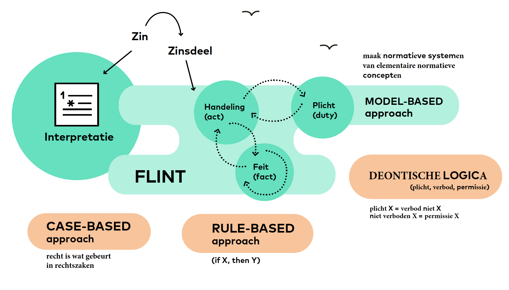

In 1995 beschreef André Valente vier benaderingen voor het beschrijven van normatieve systemen (Valente 1995):

1. Zaakgebaseerde methoden (*case-based*),
2. Regelgebaseerde methoden (*rule-based*),
3. Deontische logica (*deontic logic*),
4. Modelgerichte methoden (*modelling*).

Valente deed zijn onderzoek aan de Universiteit van Amsterdam. Hij beschreef de eerste drie methoden, met hun tekortkomingen, en introduceerde de vierde als een oplossing voor deze problemen. In hetzelfde jaar verdedigden Robert van Kralingen (1995) en Pepijn Visser (1995) proefschriften aan de Universiteit Leiden, waarbij zij een model-based oplossing introduceerden. Zij pasten hun methode toe de Werkloosheidswet.

Zowel de wetsanalyse aanpak van de Belastingdienst, als het norm engineering programma van TNO bouwen voort op dit werk. 

# Zaakgebaseerde methoden (*case-based*)

Zaakgerichte methoden worden vooral veel gebruikt in de USA en het UK. De zaakgerichte benadering past vooral goed bij sterk op precedentwerking gerichte rechtssystemen als het [common law](https://en.wikipedia.org/wiki/Common_law) systeem. 

De kern van de zaakgerichte benadering is dat in jurisprudentie wordt gezocht naar voorbeelden die kunnen worden gebruikt als argument in nieuwe rechtszaken. Zaakgerichte methoden zijn vooral geschikt ter ondersteuning van rechtszaken.

Voor toepassingen buiten de context van de rechtszaal zijn deze methoden niet geschikt.

# Regelgebaseerde methoden (*rule-based*)

De regelgestuurde methoden leggen juridische kennis vast in de vorm van regels: als X, dan Y. Dit is geschikt voor situaties die maar één mogelijke uitkomst hebben. De methode wordt dan ook vooral gebruikt voor het vastleggen van automatische besluitvorming. Zwakte van de aanpak is dat een theoretische grondslag voor het maken van regels ontbreekt. Daardoor zijn de regels van de ene organisatie niet direct te gebruiken door de andere organsatie.

Regelgestuurde methoden worden binnen de Nederlandse overheid veel gebruikt. Er zijn verschillende aanbieders op de markt. De RegelSpraak taal van de Belastingdienst is een poging om regels op een meer formele manier vast te leggen. Overheidsorganisaties zouden in principe in staat moeten zijn om tot een gezamenlijke standaard voor het maken van regels te komen. Tot nu toe is dat niet gelukt.

# Deontische logica (*logics approach*)

In deontische logica worden normen gezien als plichten (wat je hoort te doen of wat zo hoort te zijn), verboden (wat je niet hoort te doen of wat niet zo hoort te zijn) en permissies (wat niet verboden is). Deze concepten zijn formeel uitgewerkt in een logische modaliteit. De wetenschappelijke basis van deze benadering is zeer sterk. Nadeel is dat er zeer weinig aandacht is voor praktische bruikbaarheid.

De methode is vooral bruikbaar voor technische toepassingen. De methode is niet geschikt om in de dagelijkse praktijk voorkomende vraagstukken te behandelen. De gebruikte terminologie is alleen begrijpelijk voor experts.

# Modelgerichte methoden (*modelling approach*)

Modelgerichte methoden zijn geïntroduceerd door André Valente omdat daarin aandacht wordt besteed aan het maken van theoretisch kader, én aan praktische bruikbaarheid. André Valente pleit ervoor theoretische uitgangspunten te toetsen in de praktijk. Praktijkvoorbeelden die aantonen dat de theorie tekortschiet, moeten aanleiding zijn om de theoretische uitgangspunten te verbeteren of aan te passen.

Voorbeelden van de modelmatige benadering zijn Calculemus-Flint en Wetsanalyse.

