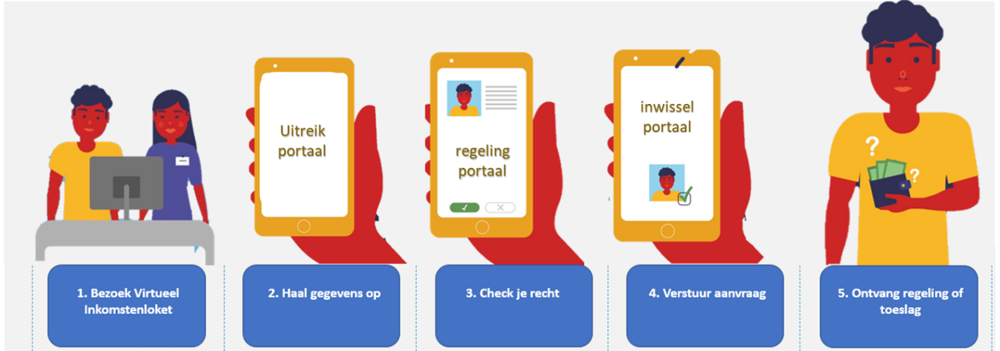
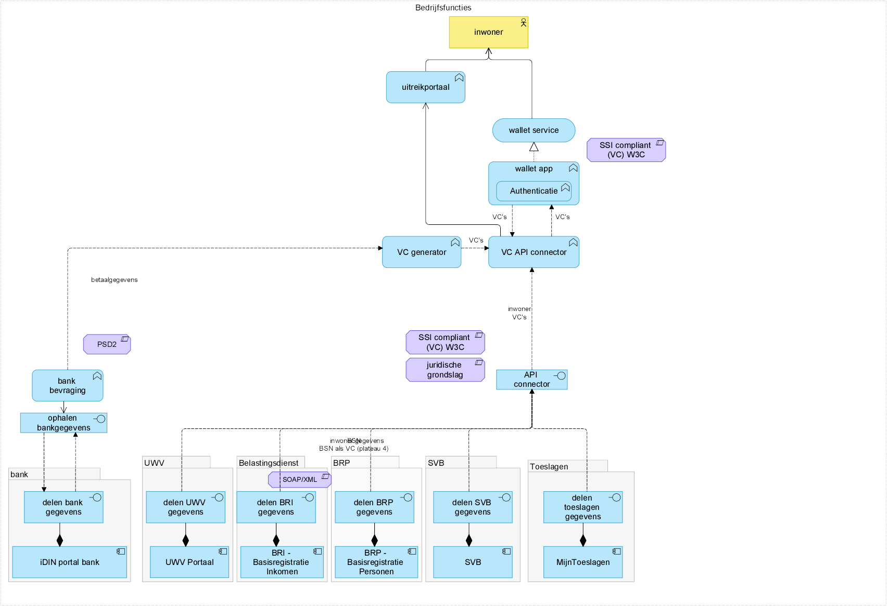
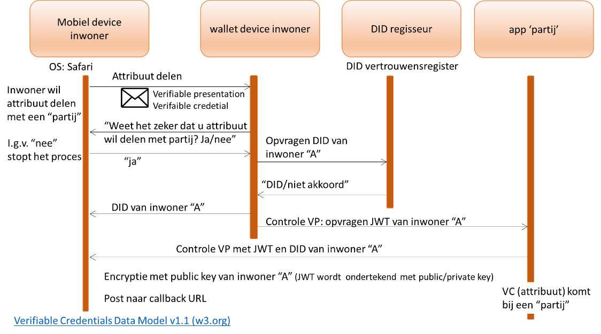
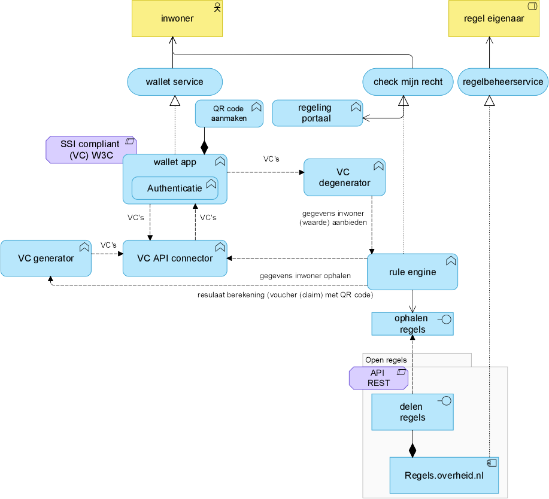
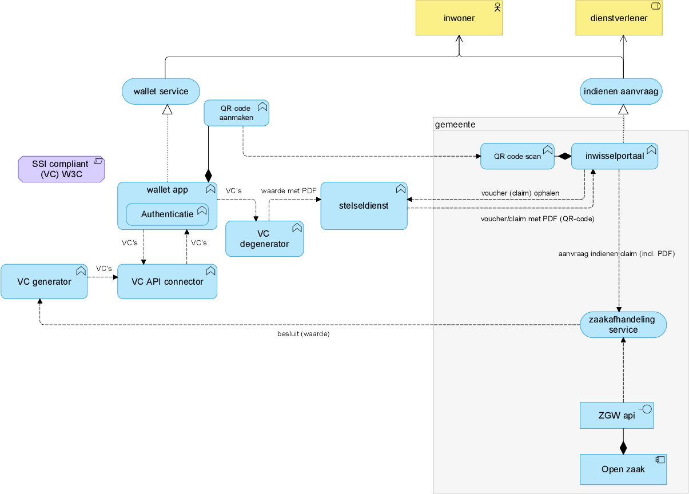

export const Highlight = ({children, color}) => (
  
    {children}
  
);

# Eind situatie “onze droom”

:::info

Vastgesteld door F. de Waal, Senior Data architect, Gemeente Utrecht, op 3 juni 2023, v 0.6

Wijzigingen t.o.v. de vorige versie zijn in <Highlight color="#25c2a0">groen</Highlight> weergegeven.
:::

Hoe ziet ons “droom loket” er uit?

Onderstaande stappen kunnen op elk moment uitgevoerd worden door de inwoner, wanneer het uitkomt

## Stap 2. Haal gegevens op in wallet
1. Inwoner haalt gegevens op in uitreik portaal. Inwoner drukt op “ophalen gegevens” in het uitreik portaal, er komt een QR code
2. <Highlight color="#25c2a0">Per bronsysteem</Highlight> QR code wordt gescand en <Highlight color="#25c2a0">in een aantal gevallen DigiD gebruiken</Highlight> de gegevens worden opgehaald middels de “VC API Connector”
3. De (nieuwe) gegevens (VC’s) van de inwoner worden met “VC API Connector” middels bankbevraging én bevraging basisadministraties (die VC’s aanbieden in plateau 4) opgehaald: 
   - Mijnbelastingdienst (VC)
   - MijnUWV (VC)
   - MijnToeslagen (VC)
   - SVB (VC)
   - BRP (VC)
   - Bankgegevens omgezet in VC’s met “VC generator”
4. De gegevens worden als VC (Verifiable Credential) opgeslagen in de IGS Wallet.
5. De inwoner kan in de wallet zien welke VC’s zijn opgehaald.

**In architectuur weergegeven**

## Stap 3. Check je recht
1. Inwoner checkt anoniem (niet kenbaar bij overheid) zijn recht in een regeling portaal (vergelijkbaar met een ‘app store’) <Highlight color="#25c2a0">kan op elk device</Highlight>
2. <Highlight color="#25c2a0">De inwoner bevindt zich in een vertrouwd regeling portaal en selecteert een regeling, reactie: ”wilt u weten of u voor deze regeling in aanmerking komt?” “ja”, “dan heb ik deze VC’s nodig die bij de regeling horen”, “wilt u dat deze gegevens opgehaald worden?” (</Highlight>Of de inwoner selecteert een regeling portaal een app met een regeling <Highlight color="#25c2a0">) . Optioneel: recommendation toepassing: aanbeveling regeling om te checken.</Highlight>Een regeling bevat de VC’s (zoals bijv ouder dan 18, woningbezit) die opgevraagd moeten worden. <Highlight color="#25c2a0">Foutpad: indien gegevens niet compleet zijn: nog uitwerken.</Highlight>
3. Op het moment dat de inwoner in het regeling portaal een regeling selecteert toont de rule engine de geselecteerde regeling en gaat de rule engine de bijhorende VC’s ophalen uit de wallet.
    - De inwoner krijgt een QR code <Highlight color="#25c2a0">(bevat link met geselecteerde regelingen waarvoor specifieke VC’s nodig zijn)</Highlight> om te scannen waarmee de uitvraag van VC’s in de wallet uitgevoerd kan worden
    - <Highlight color="#25c2a0">In geval van dat de inwoner een mobiel device heeft, vindt de uitwisseling op een andere manier plaats. Zie onderstaand proces met sequence diagram *)</Highlight>
4. De inwoner ziet dat voor de regeling bepaalde gegevens opgehaald moeten worden uit de wallet (tevens wordt lijst met voorwaarden getoond)
5. De **rule engine** stuurt een bericht naar de wallet om de VC’s (gegevens) van de inwoner uit de wallet op te halen.
6. De wallet stelt de opgevraagde VC’s beschikbaar aan de “VC degenerator”, die de ‘waarden’ uit de VC haalt en de ‘waarden’ beschikbaar stelt aan de rule engine. De “VC degenerator” heeft tevens een conversie functie om de ‘waarden’ in een PDF op te nemen.
7. De “rule engine” berekent het recht met de geselecteerde regel(s) op uit Regels.Overheid.nl en de aangeboden VC’s uit de wallet en biedt de voucher(s) met claim(s) als resultaat van de berekening, = waarden aan de “VC generator”. 
8. De rule engine biedt de voucher (claim) met een link aan de VC generator. De “VC generator” maakt van de waarde (claim) in de voucher een VC en stuurt deze naar de wallet (zodat de inwoner erover beschikt). 
9. De inwoner kan zien dat de voucher betrekking heeft op een claim en de organisatie waar deze ingediend kan worden, bijvoorbeeld bij de gemeente ingediend (geëffectueerd) worden of energiebedrijf.
10. De wallet biedt de voucher middels een QR-code aan die de inwoner kan gebruiken in het inwisselportaal in stap 3.

De vouchers hebben een geldigheid; een status: geldig; verlopen; al ingediend. Onderliggende technologie is een vertrouwensnetwerk SSI met o.a. blockchaintechnologie.

Op lange termijn is de rule engine óók SSI compliant en kan VC’s rechtstreeks inlezen, de VC degenerator komt daarmee te vervallen.

Een VC heeft een ID header (bijv. “AOW leeftijd”) , een inhoud (bijv. “ja”) en een signed source (bronsysteem waarvan afkomstig, bijv. “UWV”)

<Highlight color="#25c2a0">*) In geval dat de inwoner een mobiel device heeft kan niet met “QR codes” uitgewisseld worden. Hiervoor is andere techniek nodig. In onderstaand sequence diagram is het proces weergegeven in geval van een mobiel device.</Highlight>

**Sequence diagram**

**In architectuur weergegeven**

## Stap 4 uitwisselen gegevens
1. Inwoner kan de voucher (claim) effectueren in het **inwisselportaal**. Inwoner drukt op “inwisselen voucher” in het **inwisselportaal** <Highlight color="#25c2a0">van een organisatie op basis van de QR code van de voucher gegenereerd door de wallet.</Highlight>
2. De inwoner kan een aanvraag indienen op de gemeentelijke (of energiebedrijf) **inwisselportaal** (website) met de QR code om de claim te effectueren (met ‘waarden’ en eventueel een PDF). De claim (waarden) via de “app stelseldienst” ophalen uit de wallet en aanbieden aan de “zaak afhandelservice” van een gemeente (of een ‘afhandeladministratiesysteem’ van een energiebedrijf). De “app stelseldienst” doet een oproep aan de wallet om de VC (met voucher/claim) op te halen, deze wordt aangeboden aan de “VC degenerator”, die de waarde (claim) uit de VC haalt (eventueel samen met een PDF) beschikbaar stelt aan de “app stelseldienst”. De “app stelseldienst” biedt de voucher/claim met PDF aan de gemeentelijke website waar de inwoner de aanvraag kan indienen. De VC van de claim wordt uit de wallet verwijderd (zodat claim niet 2 keer aangevraagd worden).
3. Het besluit (waarde) én het bedrag (euro) op de aanvraag (claim) in de zaakafhandeling, wordt beschikbaar gesteld aan de “VC generator” waar het besluit én het bedrag omgezet wordt in een VC en wordt als een VC opgenomen in de wallet van de inwoner.

**In architectuur weergegeven**

**Vraagstuk:** hoe gaan we om claim die meerdere malen worden ingediend? Mogelijke oplossing is dat de VC van de claim in de wallet direct verwijderd wordt nadat deze gebruikt is voor een aanvraag.

**Audit trail inrichten:** welke gegevens zijn gebruikt voor een aanvraag en gemeente ambtenaar die aanvraag in behandeling neemt. Mogelijkheid onderzoeken opnemen in een afdelings-wallet (dit het reguliere zaakafhandel-proces met logging en auditing zoals het nu ingericht is
