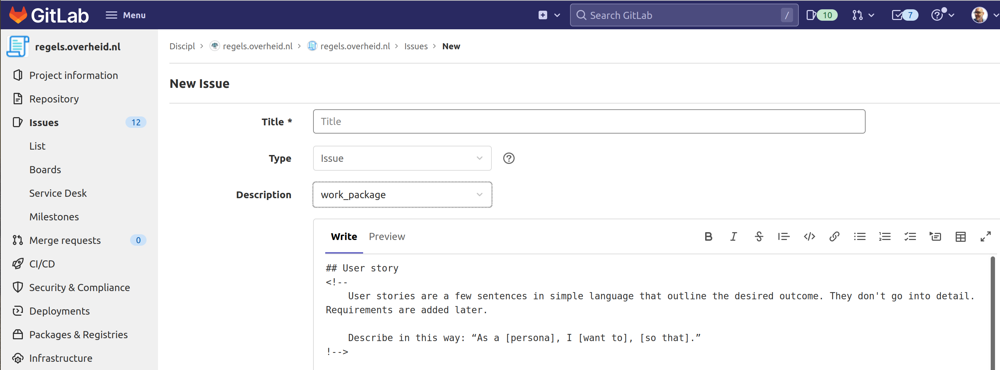

# Work package instructions

With regels.overheid.nl we are creating a public library that is accessible to everyone and that we are slowly but surely filling with legal analyses, rule specifications, software code and everything else that is needed and that can be used by public institutions. The intention is that it concerns open source software, and that therefore no property rights will accrue to anyone.

This filling is partly marketed in a public, transparent, equal and accessible manner for everyone. We want to provide access for all parties and/or persons who are interested in contributing to the renewal of the procurement market by the government in public-private partnerships (Open-Innovation coalition/community/ecosystem), while maneuvering within existing legal frameworks. The agreements are always small-scale and have a short-cycle realization process (cf. agile, CI/CD for software realization).

As a first step and phase, we start by defining work packages as issues in this repository. The idea is that the amount of work required does not exceed €5,000 per issue. For the time being, it is up to the provider of the work packages to limit themselves (or allow themselves to be limited to that limit).

With the first 4 to 6 work packages, these will be awarded to interested parties by the Product Owner. For all work packages after that, we develop a public, mutual award in which the voice of the Product Owner is no longer decisive.

## Creating a work package

Start a new issue in the repository and select the work_package template.

Carefully and thoughtfully describe the following parts:
- user story
- outline subtasks or task
- acceptance criteria
- proposed solution
- story points
- definition of "done"

Submit de work package by creating the issue

## Apply for a work package

Tbd