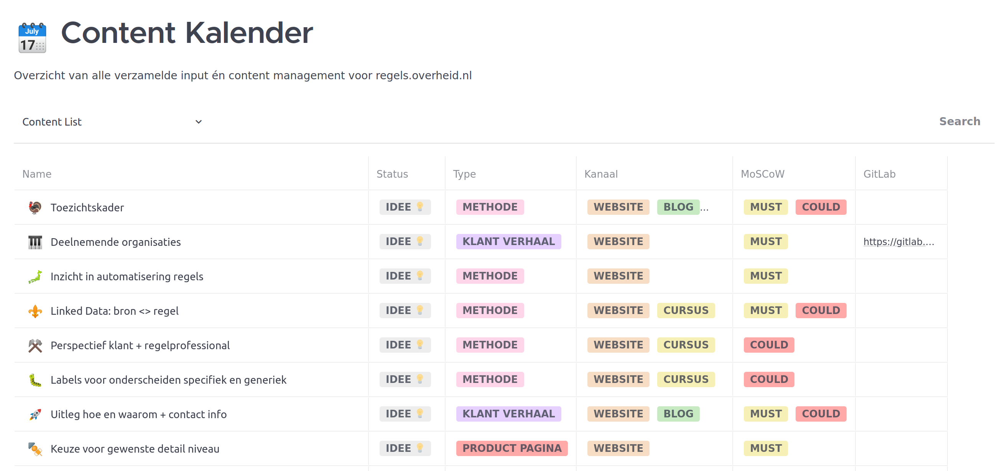

---
tags:
  - content calendar
  - focalboard
  - mattermost
  - regels.overheid.nl

hide:
  - tags
---
<!--
Hide the headline with some inline CSS
-->

## Boards

For the content management of this website we use [Focalboard](https://www.focalboard.com/), an open source, multilingual, self-hosted project management tool that is an alternative to Trello, Notion and Asana.

Focalboard is installed with [Mattermost](https://mattermost.com/), where it is called Boards. The installation has been made available on [https://mattermost-regel.nl](https://mattermost-regels.nl). The <a href="https://mattermost-regels.nl/plugins/focalboard/workspace/no5iepeewp8x3r3tassks1xacr/shared/bdp6g3zezkpbbief3m1qzmxykio/v8odynia61pn1bbmq1w7e7kkssc?r=kp7e7kch7gxdcx9bywurg68q16r" target="_blank">Live Board</a>:octicons-link-external-16: can be accessed without an account. A possibility to make new suggestions without an account is being worked on.

Do you have questions, do you want to make suggestions yourself or contribute and collaborate in another way? Please contact [Steven Gort](mailto:steven.gort@ictu.nl).

