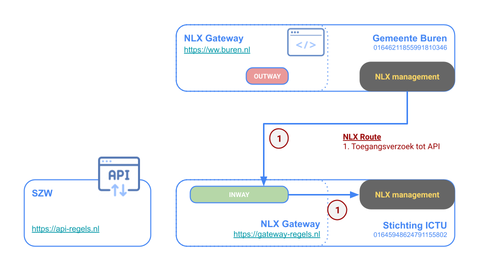
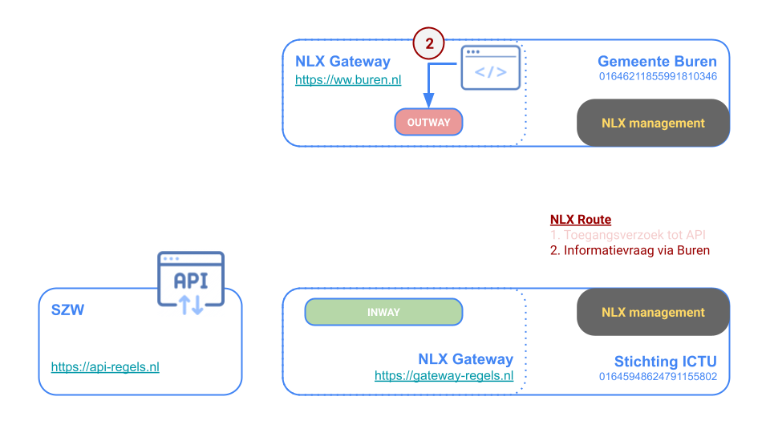

---
tags:
  - nlx
  - common ground
  - api

hide:
  - tags
---
<!--
Hide the headline with some inline CSS
-->
<style>
  .md-typeset h1 {
    opacity: 0; height: 0; margin: 0
  }
</style>


## Techniek

NLX biedt twee verschillende soorten gateways: de Inway en Outway. Via een Inway kan een organisatie diensten leveren aan het NLX ecosysteem en via een Outway kan een organisatie diensten opvragen op het NLX ecosysteem. De gateways worden meestal centraal binnen de organisatie ingezet, hoewel het voor één organisatie mogelijk is om meerdere instances van Inway en Outway op verschillende locaties in te zetten.


Hier zie je een volledig verzoek-antwoord patroon op NLX. Een applicatie voert een verzoek uit op de Outway binnen dezelfde organisatie. De Outway stuurt het verzoek naar de Inway van de organisatie die de dienst levert. De Inway stuurt het verzoek naar de service. De dienst reageert op het verzoek en dit antwoord wordt door het NLX landschap naar de Outway gerouteerd en komt bij de applicatie aan.

> Verder lezen over de techniek of zelf leren hoe je een testomgeving opzet, API's aanlevert en consumeert op het NLX netwerk kan via deze [Docs](https://docs.nlx.io/try-nlx/docker/introduction).

## Hosting

Voor de demo setup maken we gebruik van drie domeinnamen:

1. **open-regels.nl** met de Apache Web Server voor het hosten van deze website
2. **api-regels.nl** met de Apache Tomcat® software voor de (nu nog SOAP) Open Regels API's
3. **gateway-regels.nl** voor de Inway configuratie waarmee we de Open Regels API's leveren aan het NLX ecosysteem

1 en 2 draaien op dezelfde server. Voor 3 is vooralsnog een aparte server ingericht.

## Illustratie

Om de werking van het verzoek-antwoord patroon via deze Demo Setup te illustreren, introduceren we _**gemeente Buren**_ als organisatie die de Open Regels dienst via NLX wenst af te nemen, en _**SZW**_ als 'eigenaar' van de regelspecificaties. _**Stichting ICTU**_ tenslotte, introduceren we in dit voorbeeld als Shared Service Organisatie die gemandateerd namens SZW toegangsverzoeken tot de Open Regels dienst mag goed- of afkeuren.

NLX Management biedt een webinterface voor het werken met NLX. Via deze webinterface dient gemeente Buren eerst toegang te vragen tot de dienst.



In de audit log van NLX Management van gemeente Buren is dat als volgt zichtbaar:
```
admin@nlx.local heeft toegang verzocht tot Regels-voor-Individuele-Inkomens-Toeslag van 01645948624791155802
23 maart 2022 om 16:22   •   GNU/Linux   •   Firefox   •   NLX Management
```
Stichtig ICTU ziet dat Toegangsverzoek in haar NLX Management verschijnen en keurt dat in dit voorbeeld goed. In de audit log wordt dat eveneens netjes geregistreerd.
```
steven.gort@ictu.nl heeft het toegangsverzoek van Gemeente Buren (01646211855991810346) voor Regels-voor-Individuele-Inkomens-Toeslag goedgekeurd
24 maart 2022 om 18:33   •   GNU/Linux   •   Firefox   •   NLX Management
```
Nu de toegang geregeld is kan gemeente Buren een informatievraag vanaf bijv. haar interne MijnBuren omgeving via de Outway naar NLX sturen.



Alle datastromen die via het NLX ecosysteem lopen, zijn inzichtelijk. Ze worden weergegeven in begrijpelijke overzichten. Zo is deze informatievraag in de transactielog van gemeente Buren als volgt zichtbaar.
```
24 maart 2022 om 18:53:04.498	Uitgaand naar	01646211855991810346	Regels-voor-Individuele-Inkomens-Toeslag
```
Voor elke databevraging die via NLX wordt gedaan, wordt aan de leverende kant een controle gedaan op authenticatie en autorisatie. Pas als deze controle positief is, wordt een databevraging doorgelaten. De leverende kant wordt in dit voorbeeld ingevuld door Stichting ICTU die het antwoord via de Inway retourneert nadat is vastgesteld dat de legitimiteit van de bevraging klopte.


In de transactielog van Stichting ICTU tenslotte, verschijnt netjes de registratie van deze afgehandelde informatievraag.
```
24 maart 2022 om 18:53:04.577	Binnenkomend van	01646211855991810346	Regels-voor-Individuele-Inkomens-Toeslag
```

## Directory

De [NLX directory](https://directory.nlx.io/) geeft inzicht in het gehele NLX-stelsel. Het geeft een overzicht van alle deelnemende organisaties, de beschikbare API's en ook de status van die API's. Op die manier is duidelijk waar de juiste data vandaan moet komen en kunnen de nieuwe koppelingen gelegd worden.

Beiden [Live Demo API's](../methoden/ALEF.nl.md#live-demo-api) zijn daar nu ook te vinden.